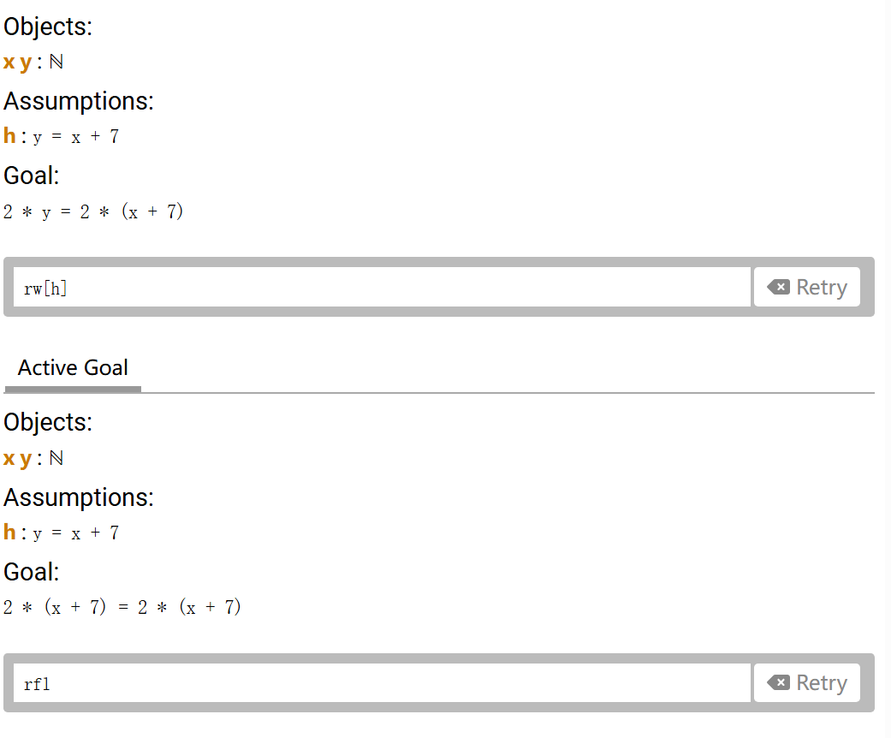

# 目的
上网冲浪看到lean4这个东西，发现玩这个自然数游戏好像比较容易入门：<https://adam.math.hhu.de/#/g/leanprover-community/nng4>，所以用一个文章记录一下。可能是一时兴起，不一定记录完全，看看后续有没有兴趣和精力。

goal：要证明的目标

tatic：使用tatic来证明goal

第一个tatic：rfl(reflexivity,自反性)，用于证明A=B，if A and B are identical

rw（rewrite）：用于使用一个假设或者定理来推导目标，直接看图很明了，使用rw后假设代入goal当中，目标发生了变化



定理：0是数字，如果n是数字，那么succ n也是数字

则：1 = succ 0（one_eq_succ_zero）， 2 = succ 1(two_eq_succ_one)，注意左右顺序是严格的，新得到的也可以直接当作定理使用，或者是是引理

如果想把succ 0 变为 1，即succ 0 = 1，需要使用←（\l），← one_eq_succ_zero即 succ 0 = 1。

add_zero-(a : ℕ) : a + 0 = a（引入加号）

We write add_zero x : x + 0 = x, so proof : statement


已知37 + p = q

则37 + succ p = succ q = succ (37 + p)

得到引理：x + succ d = succ (x + d)，使用add_succ x d表示

使用这个引理证明了：succ_eq_add_one：(n : ℕ) : MyNat.succ n = n + 1

第一个证明：2 + 2 = 4

自己写的：
```
rw[four_eq_succ_three]  --2 + 2 = succ 3
rw[succ_eq_add_one]     --2 + 2 = 3 + 1
rw[three_eq_succ_two]   --2 + 2 = succ 2 + 1
rw[succ_eq_add_one]     --2 + 2 = 2 + 1 + 1
nth_rewrite 3 [two_eq_succ_one]     --2 + 2 = succ 1 + 1 + 1
rw[succ_eq_add_one]     --2 + 2 = 1 + 1 + 1 + 1
nth_rewrite 1 [←succ_eq_add_one]    --2 + 2 = succ (1 + 1 + 1)
rw[←add_succ]           --2 + 2 = 1 + 1 + succ 1
rw[←two_eq_succ_one]    --2 + 2 = 1 + 1 + 2
rw[←succ_eq_add_one]    --2 + 2 = succ 1 + 2
rw[←two_eq_succ_one]    --2 + 2 = 2 + 2
rfl
```
网站：
```
nth_rewrite 2 [two_eq_succ_one]     --2 + succ 1 = 4
rw [add_succ]   --succ (2 + 1) = 4
rw [one_eq_succ_zero]   --succ (2 + succ 0) = 4
rw [add_succ, add_zero] --succ (succ 2) = 4
rw [← three_eq_succ_two]    --succ 3 = 4
rw [← four_eq_succ_three]   --4 = 4
rfl
```

感觉还是让东西越少越好，展开为很多1比较麻烦


