# 图像处理

复习图像处理期末，光看ppt也无聊，不如顺便写写博客记录一下。

## 第一章

图 —— 物体投射或反射光的分布，是客观存在；

像 —— 人的视觉系统对图的接收在大脑中形成的印象或认识，是人的感觉；

图像——图像是图和像的有机结合，既反映物体的客观存在，又体现人的心理因素；图像是对客观存在物体的一种相似性的生动模仿或描述。是客观和主观的结合。

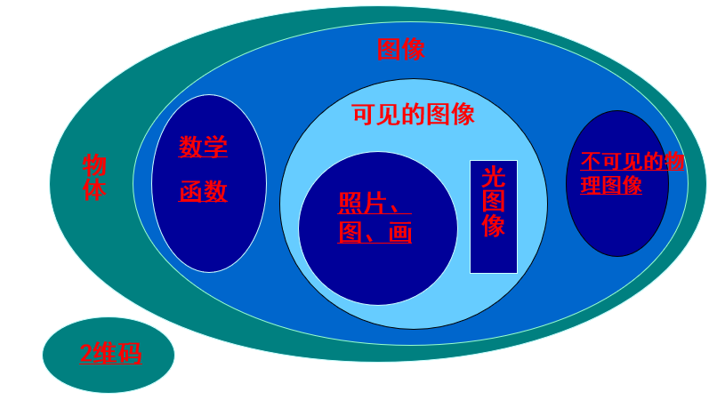

对图像信息进行加工(处理)和分析,以满足人的视觉、心理需要； 实际应用或某种目的（如机器识别）的要求。

图像变换：对图像信息进行变换以便于在频域对图像进行更有效的处理

图像增强：增强图像中的有用信息，削弱干扰和噪声，提高图像的清晰度，突出图像中感兴趣的部分。（增强对比度）

图像压缩编码： 对待处理图像进行压缩编码以减少描 述图像的数据量，以便节省图像传输、处理时间、减少存储空间。

图像复原：是寻找图像降质的起因，尽可能恢复图像本来面目。

图像分割：根据选定的特征将图像划分成若干个有意义的部分，这些选定的特征包括图像的边缘、区域等。 

图像分析与描述： 主要是对已经分割的或正在分割的图像各部分的属性及各部分之间的关系进行分析表述。
 
图像识别分类：根据从图像中提取的各目标物的特征，与目标物固有的特征进行匹配、识别，以识别出目标物。  

图像技术在广义上是各种与图像有关的技术的总称，目前主要指数字（计算机）图像技术，包括图像处理、图像分析（图像到数据）和图像理解三个层次。把这三个层次综合集成在一个整体框架上进行，这个框架就是图像工程。 

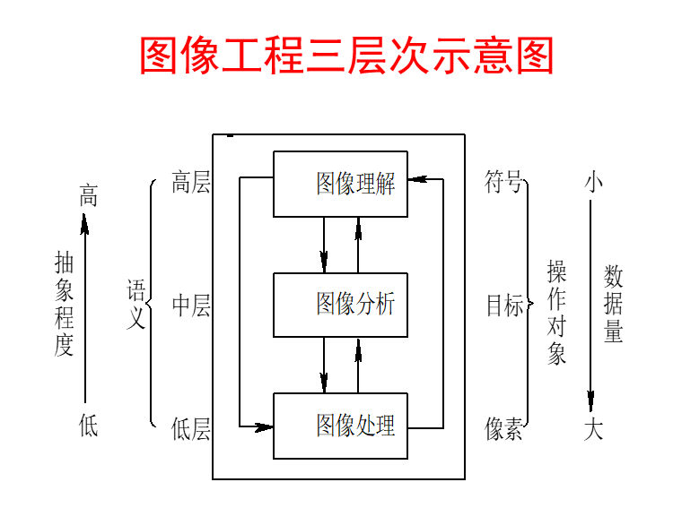

# 第二章

## 离散表达图像
矩阵中的每一个元素称为像元、像素或图像元素。而g (i, j)代表(i, j)点的灰度值，即亮度值。以上数字化有以下几点说明：
      （1） 由于g (i, j)代表该点图像的光强度，而光是能量的一种形式，故g (i, j)必须大于零，且为有限值，即： 0＜g (i, j)＜∞。 

以上是用g (i, j)的数值来表示(i, j)位置点上灰度级值的大小，即只反映了黑白灰度的关系， 如果是一幅彩色图像， 各点的数值还应当反映色彩的变化，可用g (i, j, λ)表示，其中λ是波长。如果图像是运动的，还应是时间t的函数，即可表示为g (i, j, λ, t)。 

## 采样

图像在空间上的离散化称为采样。

一维采样定理，若一维信号g(t)的最大频率为ω， 以T≤1/2ω为间隔进行采样，则能够根据采样结果g(iT) (i=…, -1, 0, 1， …)完全恢复g(t)， 即 

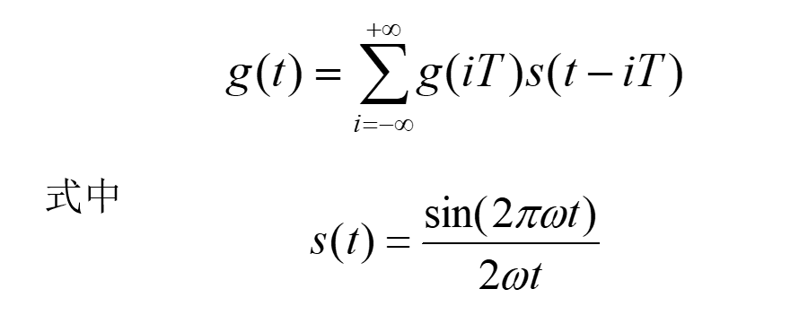

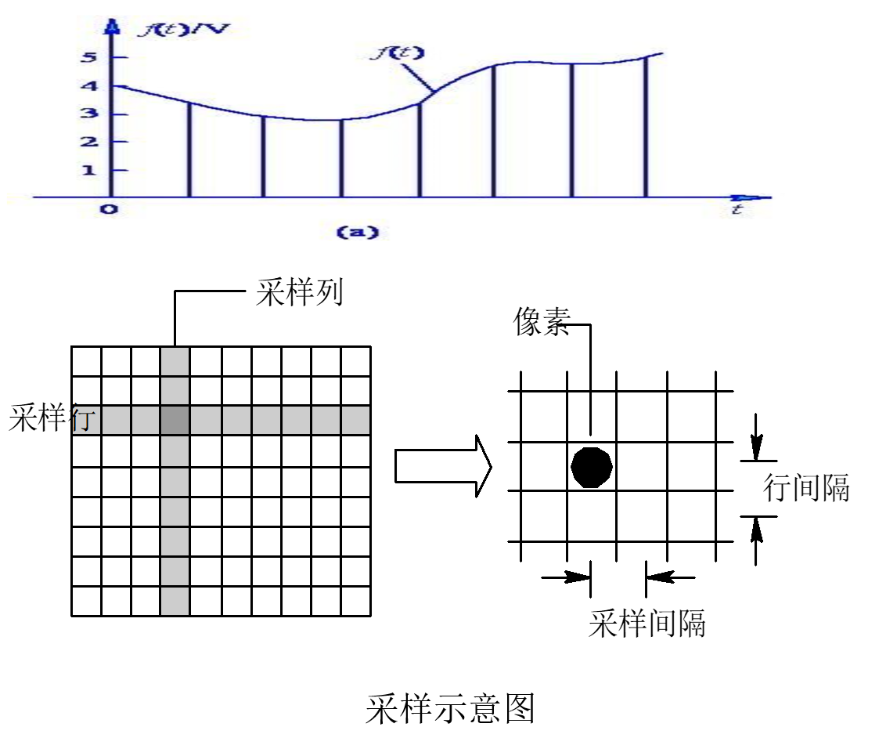

## 量化

把采样后所得的各像素的灰度值从模拟量到离散量的转换称为图像灰度的量化。

等间隔量化就是简单地把采样值的灰度范围等间隔地分割并进行量化。对于像素灰度值在黑—白范围较均匀分布的图像，这种量化方法可以得到较小的量化误差。该方法也称为均匀量化或线性量化。

为了减小量化误差，引入了非均匀量化的方法。非均匀量化是依据一幅图像具体的灰度值分布的概率密度函数，按总的量化误差最小的原则来进行量化。具体做法是对图像中像素灰度值频繁出现的灰度值范围，量化间隔取小一些，而对那些像素灰度值极少出现的范围，则量化间隔取大一些。
实用上一般都采用等间隔量化。 

采样点数越多，图像质量越好； 当采样点数减少时，图上的块状效应就逐渐明显。

量化级数越多，图像质量越好，当量化级数越少时，图像质量越差，量化级数最小的极端情况就是二值图像， 图像出现假轮廓。 

## 图像类型
静态图像可分为矢量图(Vector) 和位图（Bitmap）

矢量图是用一系列绘图指令来表示一幅图这种方法的本质是用数学(更准确地说是几何学)公式描述一幅图像。图像中每一个形状都是一个完整的公式，称为一个对象。对象是一个封闭的整体，所以定义图像上对象的变化和对象与其他对象的关系对计算机来说是简单的， 所有这些变化都不会影响到图像中的其他对象。 

公式化表示图像使得矢量图具有两个优点：一是它的文件数据量很小；二是图像质量与分辨率无关，这意味着无论将图像放大或缩小了多少次，图像总是以显示设备允许的最大清晰度显示。

矢量图有一个明显的缺点，就是不易制作色调丰富或色彩变化太多的图像，而且绘出来的图像不是很逼真，同时也不易在不同的软件间交换文件。

位图是通过许多像素点表示一幅图像，每个像素具有颜色属性和位置属性。

在真彩色图像中，每一个像素由红、绿和蓝三个字节组成， 每个字节为8 bit，表示0到255之间的不同的亮度值，这三个字节组合可以产生1670万种不同的颜色。 

在显示器上的这些点（光的单元）称为像素。

分辨率决定了扫描仪从源图像里每英寸取多少个样点。扫描仪将源图像看成由大量的网格组成，然后在每一个网格里取出一点，用该点的颜色值来代表这一网格里所有点的颜色值，这些被选中的点就是样点。扫描仪的分辨率单位为dpi（每英寸点数，Dot Per Inch），但激光打印机的dpi与扫描仪的dpi（样点）是不同的。

图像分辨率是指每英寸图像含有多少个点或像素， 分辨率的单位为dpi。例如，250 dpi表示的就是该图像每英寸含有250个点或像素。

## 图像格式

BMP文件格式是Windows操作系统的标准文件格式

JPEG（Joint Photographer’s Experts Group）主要是为了解决专业摄影师所遇到的图像信息过于庞大的问题
静止图像压缩采用有损编码方式
是一种变换编码
对高频、低频信号区别对待

GIF（Graphics Interchange Format），目的是在不同的系统平台上交流和传输图像。

## 各种颜色表示方法

RGB

HSI模型是Munseu提出的， 它反映了人的视觉系统观察彩色的方式，在艺术上经常使用HSI模型。HSI模型中，H表示色调(Hue)，S表示饱和度(Saturation)， I表示亮度(Intensity，对应成像亮度和图像灰度)。

# 第三章

## 像素空间关系

邻域：

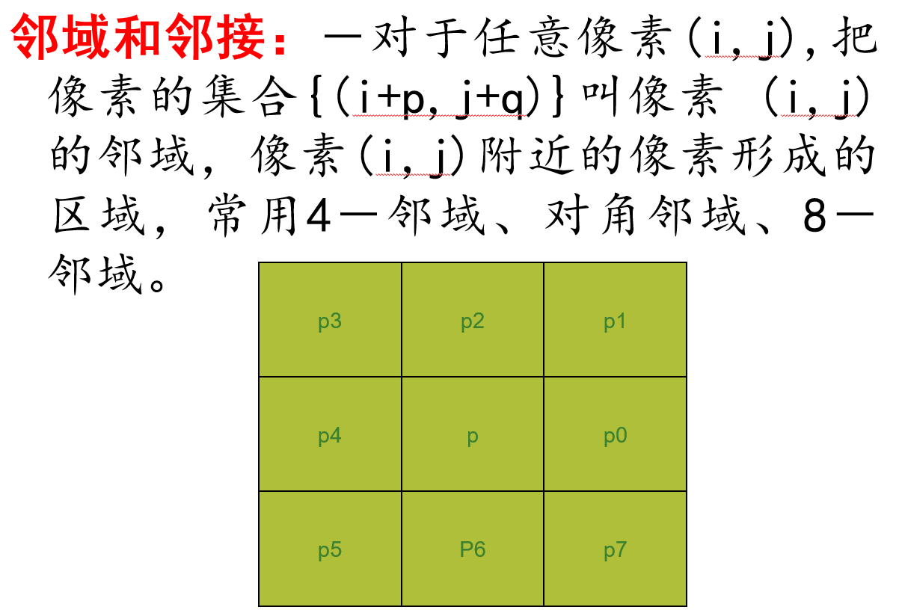

4-邻域：

对角邻域

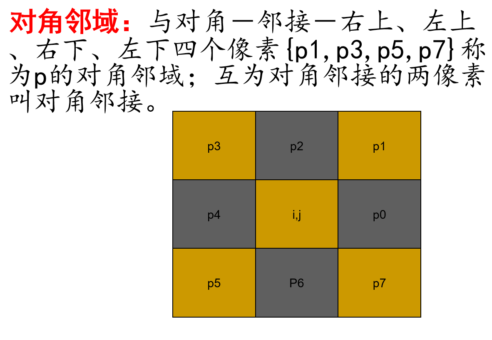

8-邻域

连接-两个像素在一个邻域内，且灰度值也在一个集合里面（比如相等）

m-连接优先采用4连接，m-连接的引入目的之一就是消除8-连接的多路问题(二义性）。8-连接在像素距离的选择时有多种路径，引发歧义，而m-连接则没有。

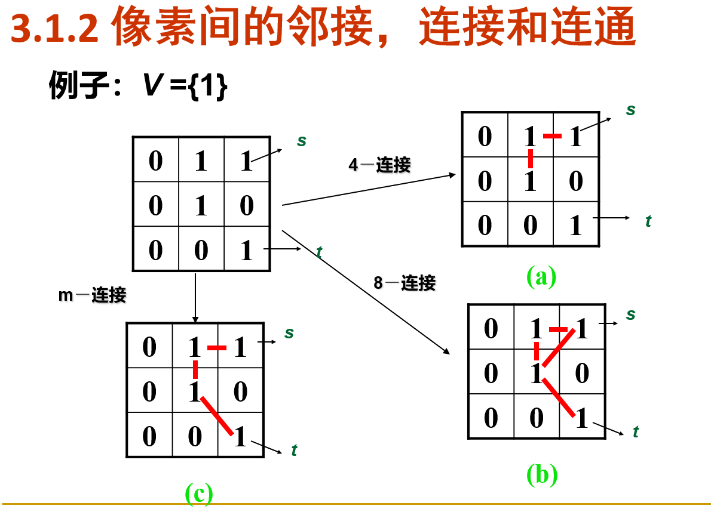

通路

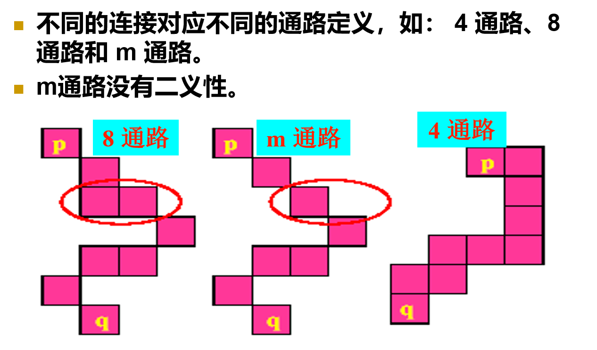

p到q有通路那么就是p和q在图像s上是连通的

区域和边界
令 R 是图像中的像素子集。如果 R 是连通集，则称 R 为一个区域。
一个区域 R 的边界是区域中像素的集合，该区域有一个或多个不在 R 中的邻点。 
当R是整幅图像，图像边界没有邻点。
正常情况下，一个区域指的是一幅图像的子集，并且区域边界的任何像素都作为区域边界部分全部包含在其中。

距离度量

欧式：

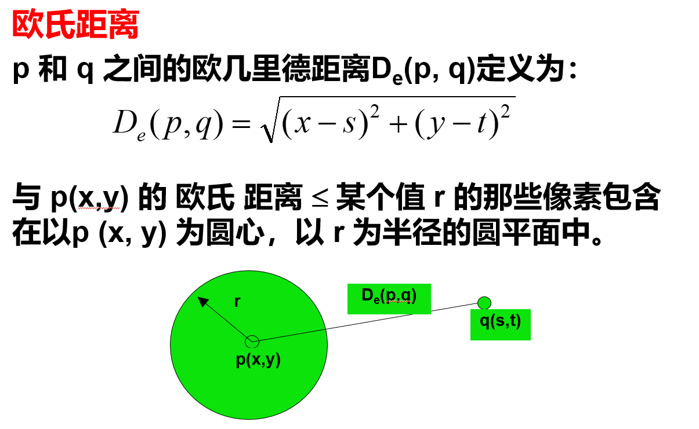

D4：

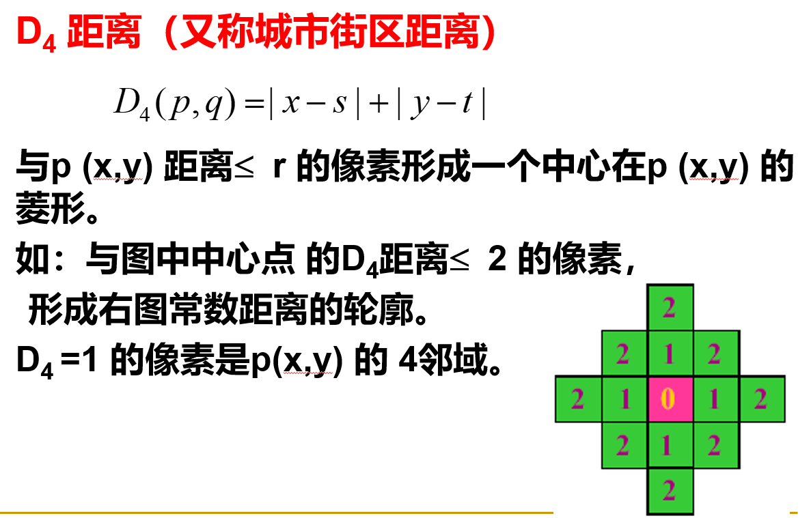

棋盘：

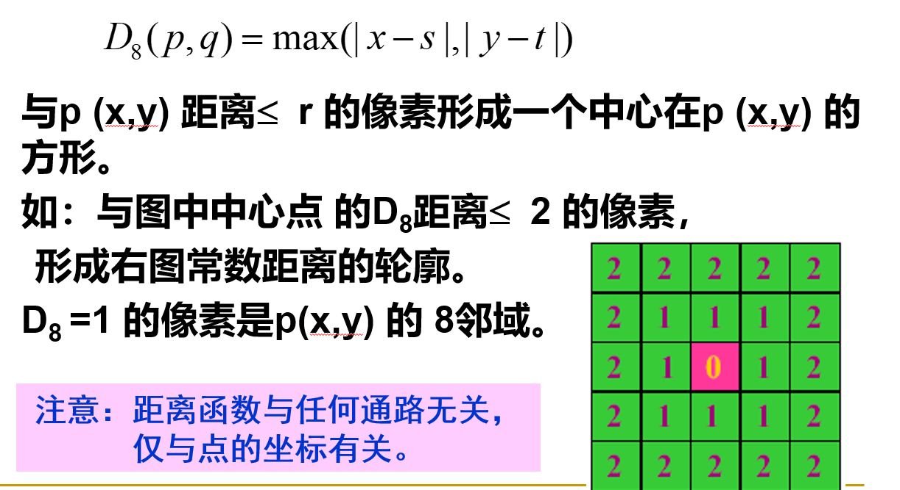

## 基本坐标变换

26页

