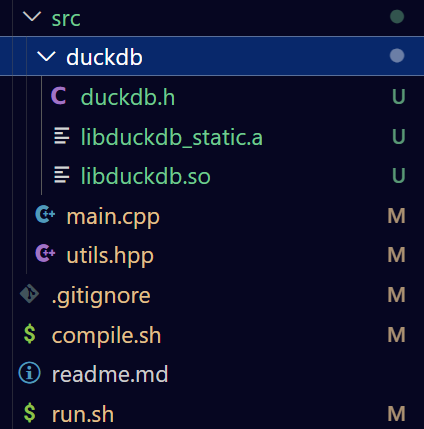

# 实现1

这个是第一个记录各种实现的东西，算是自身遇到问题，分析问题，解决问题的故事记录

## bat创建文件夹与md文件并使用vscode打开md文件

目的：每次要新写一篇博客的时候要在posts文件夹里面创造一个存储md文件的文件夹方便粘贴图片这样图片和md文件在同一个文件夹下面就很舒服，同时要写前面的统一配置文字，所以搞一个bat脚本来实现

流程：

设置为utf-8->使用延迟拓展来使用"!!"包裹的变量而不是直接写死的"%%"全局替代变量->输入文件名字后->创建文件夹->创建md文件->获取日期->把前面配置的内容写入md文件->使用vscode打开

@echo off：
echo off: 默认情况下，命令行会显示每一条正在执行的命令。echo off 会关闭这个功能，使脚本的输出更干净，只显示 echo 命令输出的内容。

把脚本和用户输入变为UTF-8：chcp 65001 >nul （nul是为了不显示这个命令的结果）
把变量变为可变的，而不是直接替代，因为有一个输入的过程：setlocal EnableDelayedExpansion

标准扩展（%variable%）：在命令执行之前，整个代码块（如 if 语句或 for 循环）中的所有 %variable% 会被一次性替换为其当前值。
延迟扩展（!variable!）：变量 !variable! 的值会在执行时才被替换。


输入变量并判断为空直接跳转到文件结尾结束，这里要更完美的话可能还要避免输入文件名中不给用的符号，不过先不管那么多：

```
set /p "folder_name=请输入文件夹名称: "
if "!folder_name!"=="" (
    echo 取消：未输入文件夹名称
    goto :eof
)
```

获取日期方式：
循环执行 in ('')里面的内容赋值给i，然后把i赋值current_date
powershell（打开ps） -NoProfile（不配置） -Command（执行命令） "Get-Date -Format yyyy-MM-dd（获取日期）
```
for /f %%i in ('powershell -NoProfile -Command "Get-Date -Format yyyy-MM-dd"') do set "current_date=%%i"
```

写入文件方式，用'>'：

```
> "!file_path!" (
    echo ---
    echo title: !folder_name!
    echo date: !current_date!
    echo author: anaouse
    echo layout: doc
    echo ---
)
```

执行code打开文件
```
code "!file_path!" || (
    echo 打开 VS Code 失败；请确认 VS Code 安装并已把 ^"code^" 加入 PATH。
    goto :eof
)
```

前面打开失败的话就会执行||后面的内容

## NHK news easy hide furigana js
```
javascript:(function() {
  let style = document.createElement('style');
  document.head.appendChild(style);
  style.sheet.insertRule('ruby rt { visibility: hidden; }', 0);
  style.sheet.insertRule('ruby:hover rt { visibility: visible; }', 0);
}())
```
come from:https://www.reddit.com/r/LearnJapanese/comments/7hhde2/comment/dqsvmdu/

```
<ruby>
  漢字
  <rt>かんじ</rt>
</ruby>
```
make ruby->rt invisible except mouse hover on it.

em.... in the website, it has its own method:


## read a japanese article

let's learn japanese by reading article, i give you ariticle you give me words and grammar explanation:

ok lets learn deeply, please give me more examples about these grammar:

https://www3.nhk.or.jp/news/easy/ne2025070412090/ne2025070412090.html

words:

|熊本県(kumamotokenn-kumamoto prefecture)|球磨川(kumagawa-kumagawa river)|溢れる(afureru-overflow)-溢れて|多くの(ookuno-many)|

|入る(hairu-enter)　入りました|亡くなる(nakunaru-die)　なくなりました|なる(become)　なりました|4日(yokka-the 4th day of the month)|

|球磨村(kumamura-kuma village)|について(about)|||

|説明(setumei-explanation)|被害(higai-damage)|受ける(ukeru-to receive)　受けた|ため(benifit sake purpose)|

|祈る(inoru-pray)　祈りました XXXのためにいのる(pray for XXX)|歩く(aruku-walk)　歩いて|避難する(hinansuru-evacuate)　避難した|覚える(oboeru-remenber)　覚えています|

|変える(kaeru-change)　変えたい|と思う(toomou-i think that)　と思います|曇(kumo-cloud)|自分たち(jibunntachi-we ourselves)|

grammar:

te-form　squantial actions:
Plain Verb (Group 1: う→っ, く→いっ, ぐ→いっ, す→し, つ→っ, ぬ→ん, ぶ→ん, む→ん, る→っ) + て
Plain Verb (Group 2: る→) + て
Irregular Verbs: する→して, 来る (くる)→来て (きて)

朝起きて、ご飯を食べました。
I woke up in the morning, and then ate breakfast. (Sequential actions)

駅まで走って、電車に乗りました。
I ran to the station, and then got on the train. (Sequential actions)

バスに乗って、学校に行きます。
I will go to school by riding the bus. (Means/Method)

疲れって、すぐに寝ました。
I got tired, and immediately went to sleep. (Tiredness is the reason for sleeping immediately)

なる-become：

い-Adjective (drop い) + く + なる
な-Adjective (drop な)　or .n + に + なる

彼は医者になりました。

寒くなりましたね。

日本語が上手になりました。

もう大人(otona)になりました。

ta-kei+Noun:

昨日、私が食べたケーキは美味しかったです。

この前に会った人は元気でしたか。
Was the person you met before well? (会った describes 人)

先週、読んだほんはとても面白かったです。

について：

日本の文化について話しましょう。
Let's talk about Japanese culture.

この問題についてどう思いますか。
What do you think about this problem?

新しいプロジェクトについての会議があります。
There is a meeting regarding the new project.

verb-ta + toki:

V-る とき (dictionary form + とき): "When (I) do V" or "When (I) am about to do V." (Action is ongoing or about to start)

V-た とき (ta-form + とき): "When (I) did V" or "When V completed." (Action has finished)

こどもだったとき、よくこの公園で遊びました。

家に着いた(tuita)とき、彼から電話がありました。
When I arrived home, I got a call from him.

卒業したとき、泣きました(nakimashita)。

tari... tari suru:

週末は映画を見たり、本を読んだりします。
On weekends, I do things like watching movies and reading books. (Implies these are some of the activities, not all.)

彼はいつも歌ったり、踊ったり(odottari)しています。
He is always singing and dancing, among other things.

昨日は友達とレストランに行ったり、買い物に行ったりしました。
Yesterday, I did things like going to a restaurant with friends and going shopping.

verb+koto:

こと is a nominalizer. It turns a verb or a clause into a noun phrase

日本語を話すことができます。
I can speak Japanese. (Literally: "The act of speaking Japanese is possible.")

毎朝、運動することは健康にいいです。
Exercising every morning is good for your health. 

彼女が結婚したことを知っていますか。
Do you know that she got married?

旅行に行くのが好きです。
(Note: の is also a nominalizer, often used when the nominalized phrase is the subject or object of a liking/disliking verb, or for more general, concrete actions. こと is generally more abstract or for stating facts.)

verb-tai:

The ～たい form expresses a desire or wish to perform an action.

ラーメンがたべたいです。

疲れたから、ねたいです。

と思います：

～と思います means "I think that..." or "I believe that...".

明日は雨が降ると思います。
I think that it will rain tomorrow.

この本は面白いと思います。
I think that this book is interesting. 

彼は日本人と思います。
I think that he is Japanese. 

## read a japanese article2

https://www3.nhk.or.jp/news/easy/ne2025070311539/ne2025070311539.html

**words**:

|うなぎ　鰻(umagi-eel)|愛知県(aichikenn-aichi prefecture)　西尾市(nishioshi-nishio city)|育てる(sodateru-raise, bring up)|盛ん(sakann-thriving,prosperous, popular na-adjective)|

|東海地方(toukaitihou-tokai region, central japan)|関東地方(kanntotihou-kannto region)|届ける(todokeru-deliver)|準備をする(junbiwosuru-prepare)　準備をしています(preparing)|

|予定です(yoteidesu-plan to, is scheduled to)|栄養(eiyou-nutrition)|あつさ(heat-noum of atui)　暑さ|負ける(makeru-lose)　負けない|

**grammar**:

**verb + noun**

昨日買った本--book I bought yesterday

会議に来るひと--the person who will come to the meeting

私が住んでいる町--city i am living

**A　や　B　など**

A　と　B　is complete lists

机の上にペンと本があります。--There is a pan and a book on the desk.

A　や　B　is incomplete lists

机の上にペンや本があります。-- There things like pens and books on the desk. 

など　means there's more

寿司などが好きです。--I like thing like sushi.

**noun より　adjective**

A は　B　より　adjective

東京は大阪より大きいです。--Tokyo is bigger than osaka.

**ので**

indicate reason more formal and softer than から

危ない(abunai)から、触らない(sawaranai)でください。--do not touch it, because it is dangerous

電車が遅れた(okureta)ので、遅刻(chikoku)しました。--Because the train was late, I was late.

**ように**

indicate the state or goal you want to achieve by performing an action

verb + youuni, action

日本語が話せるように、毎日練習します。--I practice everyday so that I can speak Japanese.

忘れないように、メモを書きます。--I write memo so that i will not forget that.

**て　ほうし**

want someone else do something

私は鰻を食べたいです--i want to eat eel.

彼に早く来てほうしです--i want him to come quickly.

静かにしてほしい--I want you to be quiet. 


## 在cpp中使用duckdb

参考：https://dev.to/marcosplusplus/how-to-connect-to-duckdb-with-c-82g

去 https://duckdb.org/docs/installation/?version=stable&environment=cplusplus&platform=linux&download_method=direct&architecture=x86_64 选择linux操作系统的网址

然后 wget https://github.com/duckdb/duckdb/releases/download/v1.3.1/libduckdb-linux-amd64.zip

unzip libduckdb-linux-amd64.zip -d libduckdb-linux-amd64

curl https://install.duckdb.org | sh 安装命令行版本的duckdb，然后按照它的提示导入环境变量并激活

duckdb terminalroot.db 在当前所在文件夹创建一个数据库并进入duckdb模式

创建表：
CREATE TABLE terminalroot (id INTEGER, name STRING);
INSERT INTO terminalroot VALUES(1, 'Marcos Oliveira');
INSERT INTO terminalroot VALUES(2, 'Mark Raasveldt');
INSERT INTO terminalroot VALUES(3, 'Hannes Muhleisen');
SELECT * FROM terminalroot;
.exit 退出duckdb命令都是“.”开头

把刚刚解压得到的放在src里面的话：



编译的时候要指明include 和 lib的地址，并说明有这个库：

```
# Directories
INCLUDE_DIR="./src"
LIB_DIR="./src/duckdb"

INCLUDE_PATHS="-I${INCLUDE_DIR}"
LIBRARY_PATHS="-L${LIB_DIR}"

LIBRARIES="-lduckdb -lpthread -lboost_system -lssl -lcrypto"

$CXX $SOURCES -o $EXECUTABLE $INCLUDE_PATHS $LIBRARY_PATHS $R_PATH $LIBRARIES
```

运行的时候也要指明去哪里找这个库：

```
#!/bin/bash
EXECUTABLE="./build/bin/app"
LIBRARY_PATH="./src/duckdb"
echo "Running..."
echo "--------------------------------"
LD_LIBRARY_PATH=$LIBRARY_PATH $EXECUTABLE
echo "--------------------------------"
echo "Program finished."
```

具体代码可以参考网站

## 创建个人的.so 库并用起来

```
// mymath.hpp
#pragma once

int add(int a, int b);
int subtract(int a, int b);
```
```
// mymath.cpp
#include "mymath.hpp"

int add(int a, int b) {
    return a + b;
}

int subtract(int a, int b) {
    return a - b;
}
```
```
// main.cpp
#include <iostream>
#include "mymath.hpp"
int main() 
{
    int x = 10;
    int y = 5;

    std::cout << x << " + " << y << " = " << add(x, y) << std::endl;
    std::cout << x << " - " << y << " = " << subtract(x, y) << std::endl;

    return 0;
}
```

g++ -c -fPIC mymath.cpp -o mymath.o: .cpp->.o, -c: Compile only; do not link. This generates the object file. -fPIC: Position-Independent Code. This is essential for shared libraries. It generates code that can be loaded at any memory address, which is required for dynamic linking.

g++ -shared -o libmymath.so mymath.o: .cpp->.so, The lib prefix and .so suffix are a standard convention on Linux. 

g++ main.cpp -L. -lmymath -o main: -L. means compiler check system lib dir and "." for lib. -lmymath means use libmath.so

LD_LIBRARY_PATH=. ./main to let main get the lib in runtime. Compile time and runtime the lib is different.

## 使用手机浏览器而不是软件

软件现在充满了开屏广告，但是可以通过手机浏览器上电脑版的网站来避免开屏广告

edge浏览器在随便进入一个网站或者搜索一个东西后，点三条杠后选择查看桌面网站即可，然后在经常玩的网站上，也是点三条杠然后左右滑动一下找到添加至手机即可把网页加到桌面（这里可能需要给edge浏览器加东西到桌面的权限）

## leetcode 58 Length of Last Word

从后面开始，跳过所有空格，到具体的字母的时候开始一个个字符往左边移动直到遇到空格或者超界，这个过程就是得到了最后一个词的长度

```
int last_length = 0;
int back_p = s.length() - 1;
while(back_p >= 0 && s[back_p] == ' ')
    back_p --;
while(back_p >= 0 && s[back_p] != ' ')
{
    back_p --;
    last_length ++;
}
return last_length;
```

## vim in vscode 

just download the most popularest extension

vscode setting:

"vim.useSystemClipboard": true

make vim use system clipboard

https://stackoverflow.com/questions/58306002/vs-code-vim-extension-copy-and-paste

## use ctrl+f and ctrl+enter to surf

in brower, use ctrl+f to select the website you want and press ctrl+enter to enter the website

## 使用数字鼠标

控制面板-》更易用-》设置键盘-》数字鼠标

感觉可以做一些不太精细的按键操作，ctrl+alt＋num lock打开，再按一次就是关闭。

ctrl加速，按数字5是鼠标左键，按“-”后5变为右键，按“/”5变为左键

这个数字5是左键还挺不错，如果要点的按钮位置不变的话放上去然后就可以经常使用了

感觉还是用处不大，但是5是点击这个确实不错

## 键盘操作

win + up arrow就是放大当前窗口，win + down就是缩小

alt+f4 close current window

alt+d select current browser tab's url

## write a bat to move file to another dir

set source path and destination path and use COPY /Y to overwrite an existing file and rename the file at the same time.

## enjoy the data flow

data flow through mind is the fun of the internet.

## todo 

I hide a daily todo here.

todo:

change server to volumn test and message when 8-23


interview:

CV I send: 

声网：https://app.mokahr.com/campus_apply/agora/4789#/candidateHome/applications

BOSS: 商汤科技

D:\QT\Tools\mingw1310_64\bin
