# 深入理解Linux网络

想看一本网络相关的书，然后找到了张彦飞的这本《深入理解Linux网络：修炼底层内功，掌握高性能原理》，边看边做些笔记，本文的内容和图片都来自原书，可能附带一些自己的话。

## 前言
换句话说，他们并不是有七⼋年经验，⽽是把两三年的经验⽤了七⼋年⽽已。

## 绪论
各种问题，感觉很真实，但是没遇到过，也没有遇到的背景

## 内核是如何接收⽹络包的
Linux下数据是如何从⽹卡⼀步步地到达你的进程⾥的，这中间都需要哪⼏个内核组件进⾏协同？

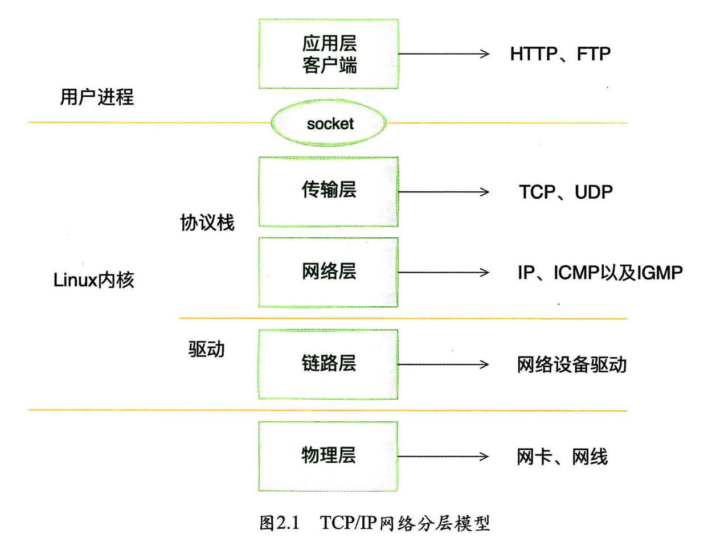

有消息来-CPU引脚电压发生变化告诉CPU-2.4以后的Linux内核版本采⽤的下半部实现⽅式是软中断，由ksoftirqd（kernel software interrupt request daemon）内核线程全权处理。硬中断是通过给CPU物理引脚施加电压变化实现的，⽽软中断是通过给内存中的⼀个变量赋予⼆进制值以标记有软中断发⽣。

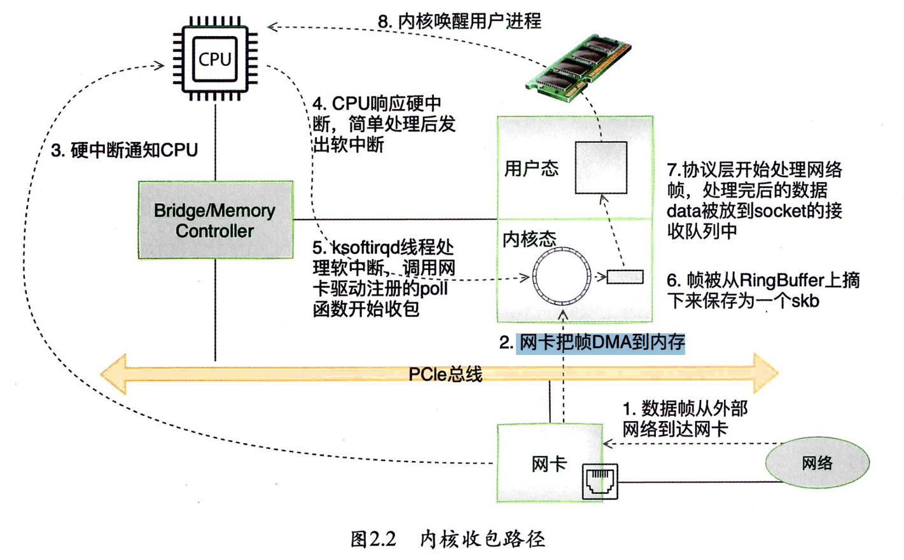

ksoftir线程数量不是1个，⽽是N个，其中N等于你的机器的核数。

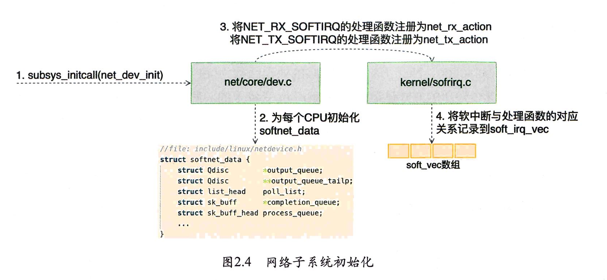

struct softnet_data *sd = &per_cpu(softnet_data, i);//给每个cpu一个结构体存储⽹卡驱动程序的poll函数等
open_softirg(NET_TX_SOFTIRQ, net_tx_action);
open_softirg(NET_RX_SOFTIRO, net_rx_action);//给软中断注册对应执行函数，不同软中断是不同int值，都存在softirq_vec当中，动作函数存储在action当作
void open_softirg(int nr, void (*action)(struct softirg_action *))
{
    softirq_vec[nr].action = action;
}
 
嗯，感觉差不多懂这些就行，之后可能更多记录流程与思路而不是太具体的实现

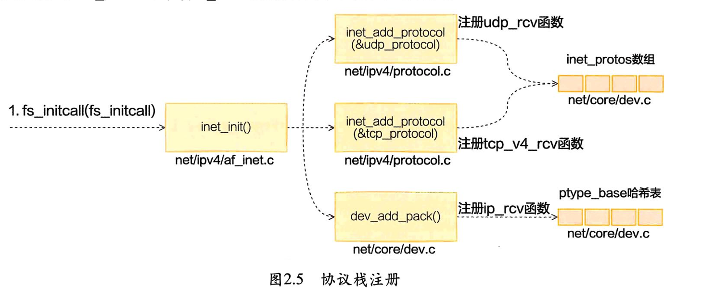

注册的想法，把函数和数据连接起来

inet_protos记录着UDP、TCP的处理函数地址，ptype_base存储着ip_rev函数的处理地址。即TCP，UDP，IP等不同数据包的处理函数

每⼀个驱动程序（不仅仅包括⽹卡驱动程序）会使⽤module_init向内核注册⼀个初始化函数，当驱动程序被加载时，内核会调⽤这个函数。

驱动连接内核和硬件

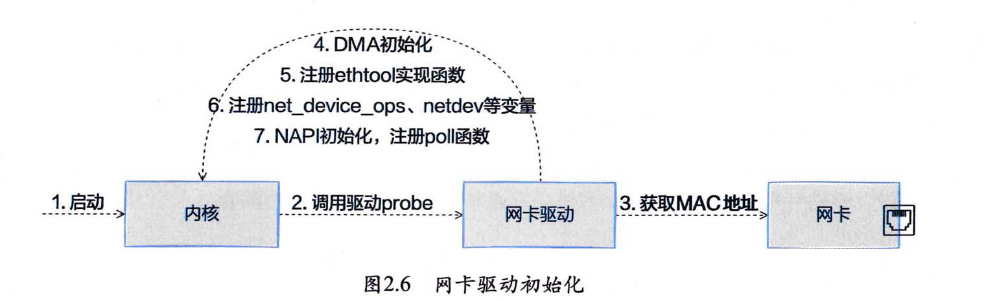

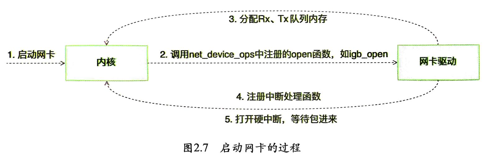

skb是struct sk_buff对象的简称。struct sk buff是Linux⽹络模块中的核⼼结构体，各个层⽤到的数据包都是存在这个结构体⾥的。

网卡与内核都要接受所有都有这样的队列

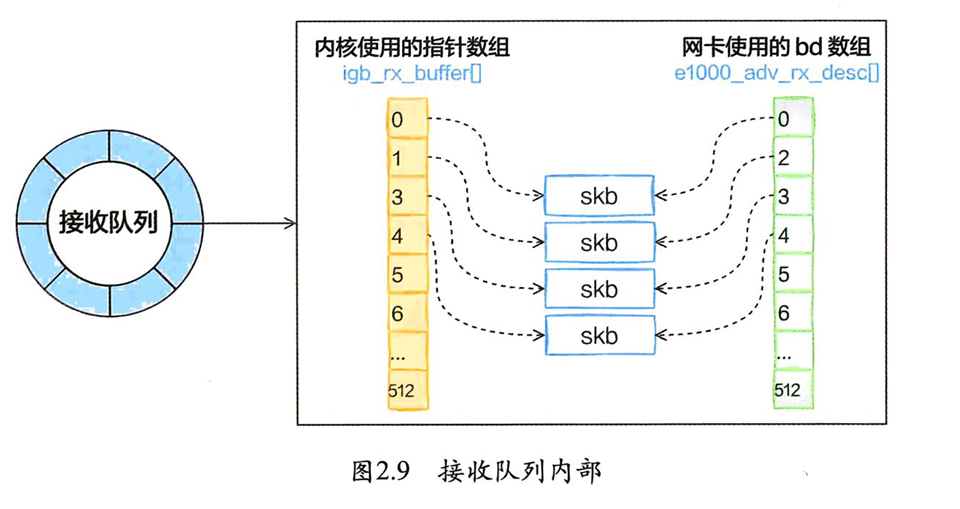

对于多队列的⽹卡，为每⼀个队列都注
册了中断，其对应的中断处理程序是igb_msix_ring。

MSI|MSIx：MSI是Message Signal Interrupt的⾸字母缩写，是⼀种触发CPU中断的⽅式。

DMA：Direct Memory Access

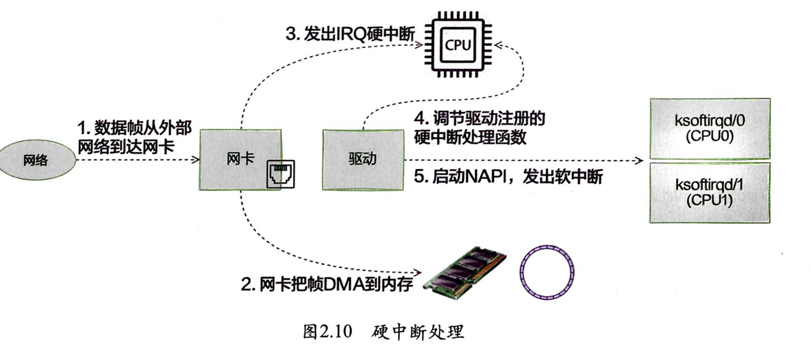

当RingBuffer满的时候，新来的数据包将被丢弃。

数据-网卡（发硬中断给CPU，把数据存到内存）-驱动发-CPU当中添加一个驱动传来的poll函数，发出软中断

低流量时：中断模式 (Interrupt Mode)
当网卡空闲或流量较低时，NAPI 保持在中断模式。当有第一个数据包到达时，网卡触发一个硬件中断。硬件中断处理程序会被执行。

高流量时：轮询模式 (Polling Mode)
硬件中断处理程序不再立即处理所有数据包，而是做两件事：禁用当前网卡队列的接收中断。调度一个软中断（通常是 NET_RX_SOFTIRQ）或将处理工作添加到 NAPI poll list，等待软中断处理程序来执行。

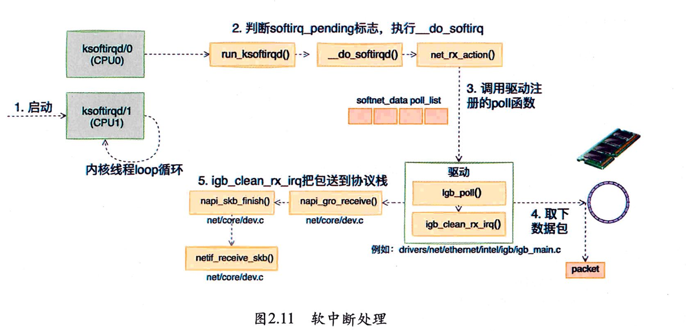

硬中断在哪个CPU上被响应，那么软中断也是在这个CPU上处理的。所以说，如果你发现Linux软中断的CPU消耗都集中在⼀个核上，正确的做法应该是调整硬中断的CPU亲和性，将硬中断打散到不同的CPU核上去。

抓不同协议的包给用户程序

用户程序：执⾏完recvifrom调⽤后，⽤户进程就通过系统调⽤进⾏到内核态⼯作了。如果接收队列没有数据，进程就进⼊睡眠状态被操作系统挂起。

Linux收包前：
创建ksottirqd线程，为它设置好它⾃⼰的线程函数，后⾯指望着它来处理软中断
呢。

协议栈注册，Linux要实现许多协议，⽐如ARP、ICMP、IP、UDP和TCP，每⼀个协
议都会将⾃⼰的处理函数注册⼀下，⽅便包来了迅速找到对应的处理函数。

⽹卡驱动初始化，每个驱动都有⼀个初始化函数，内核会让驱动也初始化⼀下。

在这个初始化过程中，把⾃⼰的DMA准备好，把NAPI的poll函数地址告诉内核。

启动⽹卡，分配RX、TX队列，注册中断对应的处理函数。

受到数据后：

⽹卡将数据帧DMA到内存的RingBuffer中，然后向CPU发起中断通知。

CPU响应中断请求，调⽤⽹卡启动时注册的中断处理函数。中断处理函数⼏乎没⼲什么，只发起了软中断请求。

内核线程ksoftirqd发现有软中断请求到来，先关闭硬中断。

ksoftirqd线程开始调⽤驱动的poll函数收包。

poll函数将收到的包送到协议栈注册的ip_rcv函数中。

ip_rcv函数将包送到udp_rcv函数中（对于TCP包是送到tcp_rcv_v4）。

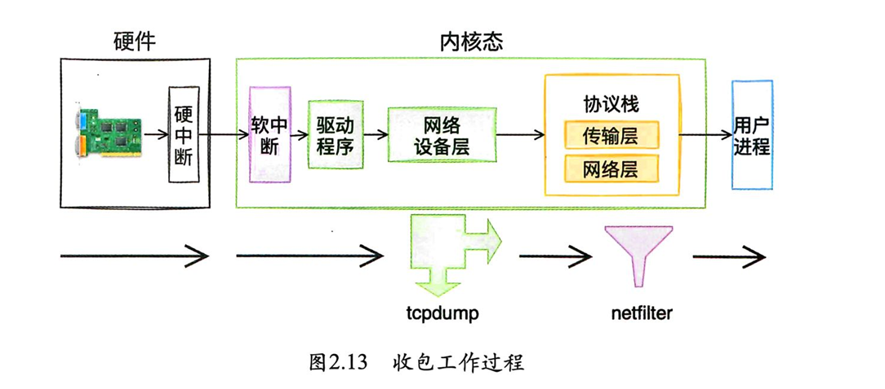

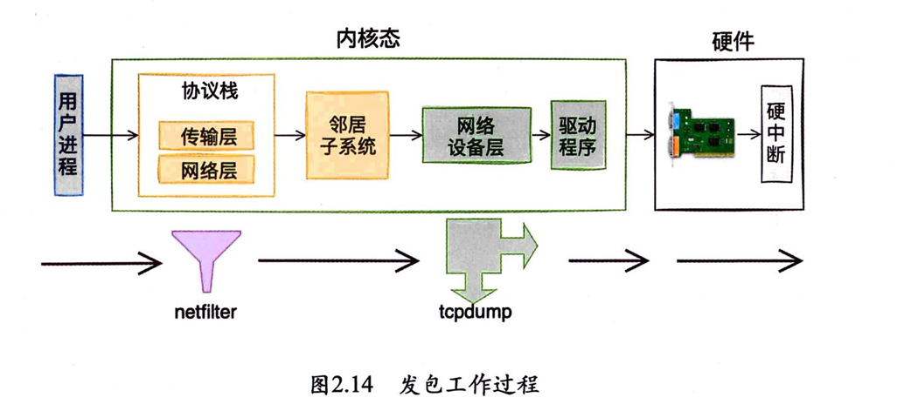

DPDK即绕过各种协议栈，用户态核心态，直接从网卡到程序，程序到网卡，所以肯定更快

## 内核是如何与⽤户进程协作的

用户创建一个socket的时候得到int型socket句柄，但是内部创建了很多东西

看不太懂，反正各种分配创建啥的：

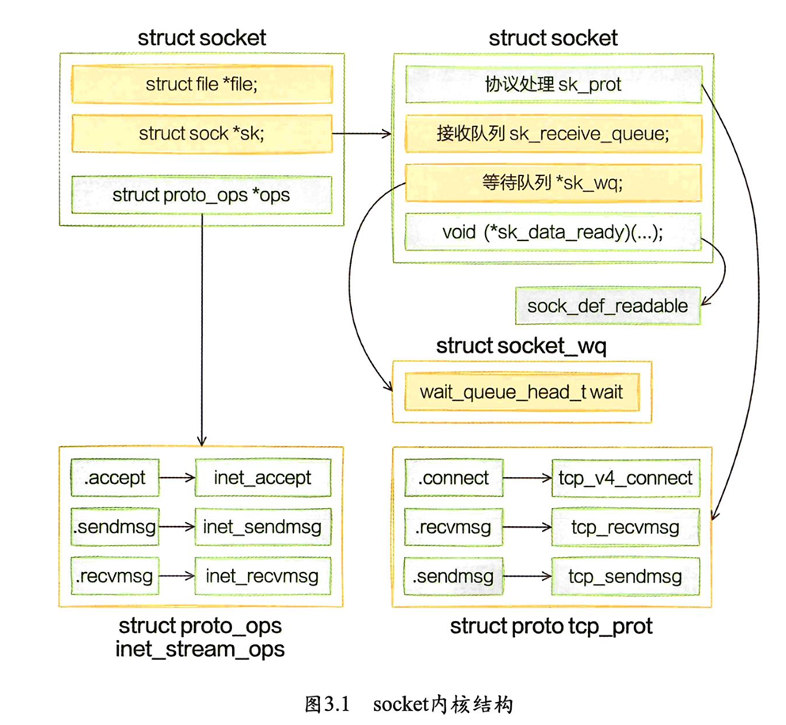

清晰明了的同步阻塞工作流程：

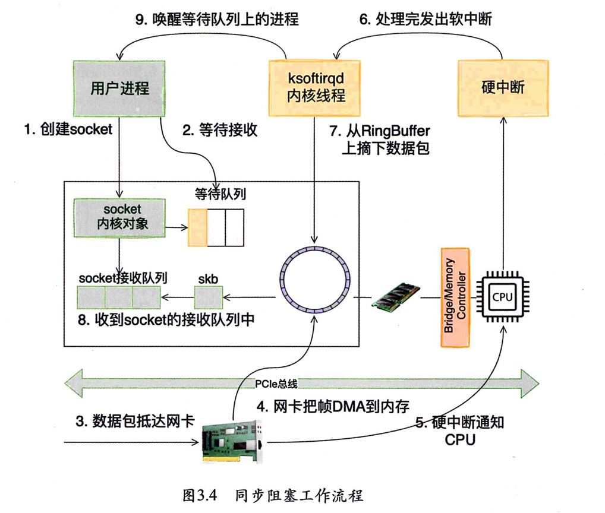

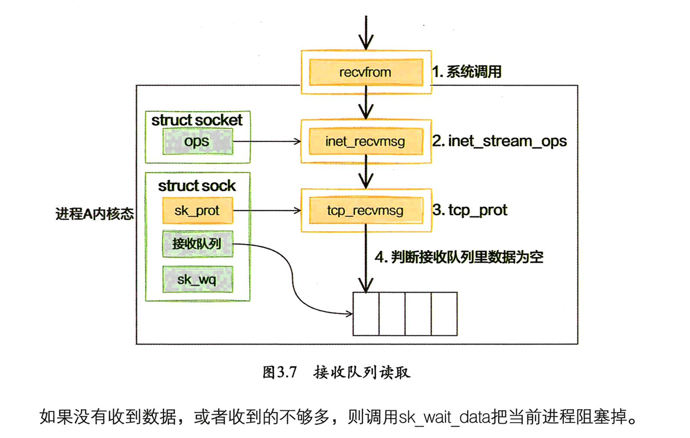

没有消息那么就等待，这个程序在等待就相当于阻塞了

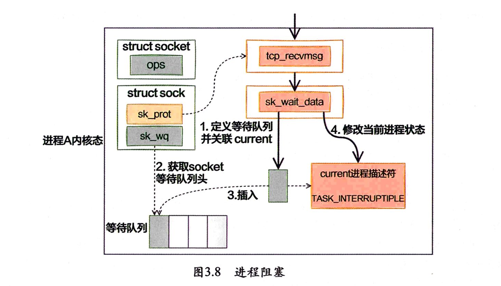

唤醒等待队列后给数据到接收队列

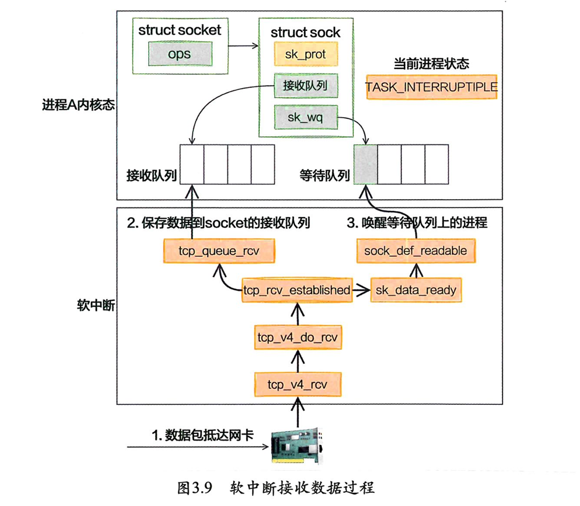

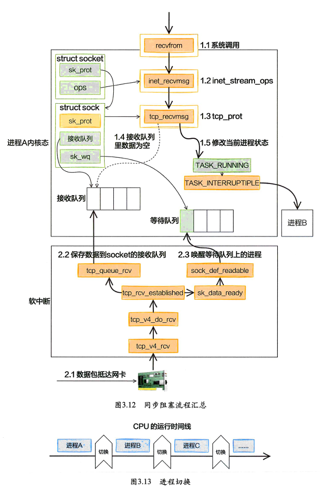

以上这种给每个进程创建一个socket会频繁切换上下文，肯定是不实用的，所以要有一个进程可以处理很多的TCP连接，这是IO多路复用，epoll是其中的一种实现

⽤户进程调⽤epoll_create时，内核会创建⼀个struct eventepoll的内核对象，并把它关联到当前进程的已打开⽂件列表中

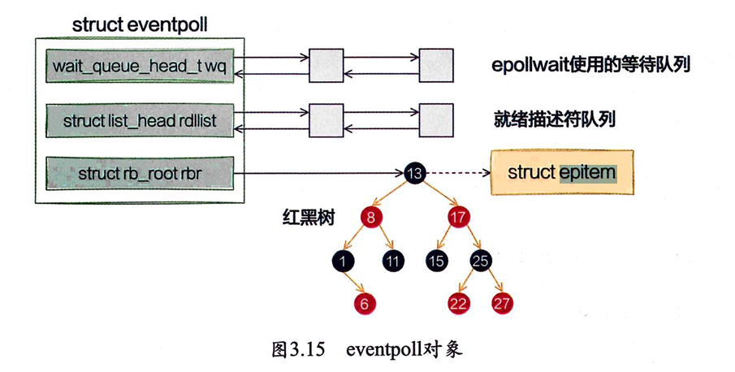

wq：等待队列链表。软中断数据就绪的时候会通过wq来找到阻塞在epoll对象上的⽤户进程。

rbr：⼀棵红⿊树。为了⽀持对海量连接的⾼效查找、插⼊和删除，eventpoll内部使⽤了⼀棵红⿊树。通过这棵树来管理⽤户进程下添加进来的所有socket连接。

rdlist：就绪的描述符的链表。当有连接就绪的时侯，内核会把就绪的连接放到rdlist链表⾥。这样应⽤进程只需要判断链表就能找出就绪连接，⽽不⽤去遍历整棵树。

使用epoll_ctl注册socket，一切都是文件的形式：

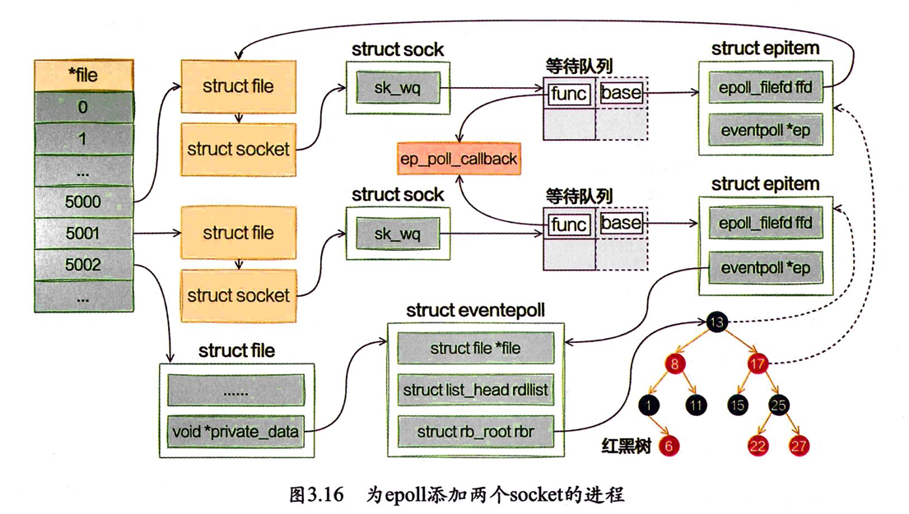

接受到数据的时候就各种回调

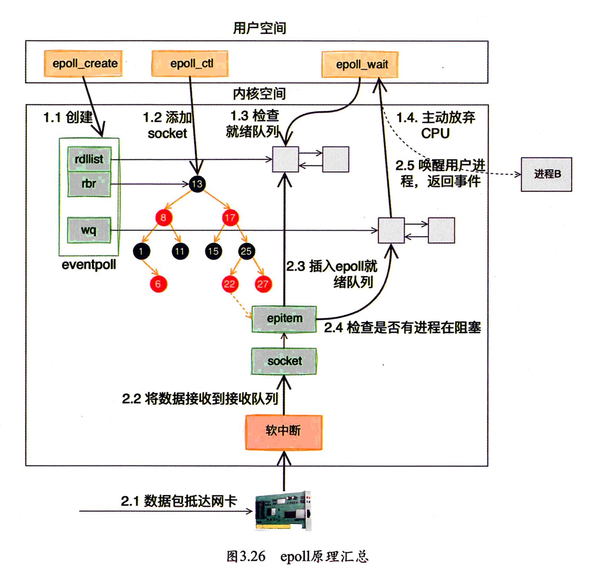

epoll的好处不在于避免了进程的唤醒，而在于它保证了每一次唤醒都是“物有所值”的。进程一旦被唤醒，可以直接获得socket数据，原本一个进程一个socket进程被阻塞到read上面，数据来的时候还要处理这个阻塞式的read，而epoll知道有数据的socket才read，是非阻塞的。阻塞的会等待数据到来，非阻塞的直接阅读，没有就返回空

红黑树记录了各个socket，rdllist记录有信息的socket，有人在等rdllist那么就唤醒它然后给它。其实就是把所有socket放到一个进程来管理，避免创建太多进程浪费内存，避免太多进程间切换浪费时间。

假设一个场景：有5个客户端会连接到服务器，并向服务器发送消息。

运行一个监听程序，一个连接一个进程的话就会fork出5个进程来对待每个客户端，使用epoll的话这个监听程序会把5个连接注册下来。有消息来的时候如果一个连接一个进程那么就要找到那个进程加载到CPU再读取，如果是epoll，当有消息来时，内核会唤醒那个唯一的、正在epoll_wait上睡眠的监听进程。epoll_wait函数会返回一个列表，明确告知是哪些socket准备好了。然后这个监听进程被加载到CPU，执行它自己的代码逻辑——一个循环，遍历这个返回的列表，并对每一个就绪的socket执行read操作。

在⽤户进程中，通过调⽤epoll wait来查看就绪链表中是否有事件到达，如果有，直接取⾛进⾏处理。处理完毕再次调⽤epoll_ wait。 在⾼并发的实践中，只要活⼉⾜够多，epoll wait根本不会让进程阻塞。⽤户进程会⼀直⼲活⼉，⼀直⼲活⼉，直到epoll waiy⾥实在没活⼉可⼲的时候才主动让出CPU。这就是epoll⾼效的核⼼原因所在！⾄于红⿊树，仅仅是提⾼了epoll查找、添加、删除socket时的效率⽽已，不算epoll在⾼并发场景⾼性能的根本原因。

Redis的主要业务逻辑就是在本机内存上的数据结构的读写，⼏乎没有⽹络IO和磁盘IO，单个请求处理起来很快。所以它把主服务端程序就做成了单进程的，这样省去了多进程之问协作的负担，也更⼤程度减少了进程切换。进程主要的⼯作过程就是调⽤epoll wait等待事件，有了事件以后处理，处理完之后再调⽤epoll wait⼀直⼯作，直⼯作，直到实在没有请求需要处理，或者进程时间⽚到的时候才让出CPU。⼯作效率发挥到了极致

## 内核是如何发送网络包的

100页
