# 课程电子信息数学基础的笔记
简单的课选不上，只能修这种数学课，主要这还是算各种东西的数学课。学分又必须得修够，又没有足够多的专业选修课来给我们选，容易的课又不可能人人都选得上，最后一些课其实暗中成为了部分学生的必修课。

和AI一起复习，知识点加例题，能全部过一遍就算成功😄

复习prompt：一起复习数学上的xxx，我给你知识点你说明这个知识点是什么以及给出一些例题，其中的公式要求给我“$\lim_{x \to 2} (x^2 + 3x - 1)$”这样的markdown格式，先重复这点说明你知道这个不要渲染markdown文本的要求了。第一个知识点：xxx

看例题prompt：一起从解决数学题中学习知识点，我给你一道题你说明解决这题需要的知识点有什么并给我这道题的解答过程，其中的公式要求给我“$\lim_{x \to 2} (x^2 + 3x - 1)$”这样的markdown格式，这样未经渲染的有$符号的markdown格式，先重复这点说明你知道你要给我未经渲染的markdown文本的要求。

# 期末考内容
考试范围：所有讲过的。第二类曲面积分只考格林公式
傅里叶级数没讲到，应该不考

# 极限与连续

## 初等方法求极限

在那个点直接是有意义的，那么直接代入：

$\lim_{x \to 2} (x^2 + 3x - 1) = (2)^2 + 3(2) - 1 = 4 + 6 - 1 = 9$

因式分解与约分：

$\lim_{x \to 1} \frac{x^2 - 1}{x - 1} = \lim_{x \to 1} \frac{(x - 1)(x + 1)}{x - 1}= \lim_{x \to 1} (x + 1) = 1 + 1 = 2$

分子或分母有理化：

$\lim_{x \to 0} \frac{\sqrt{x + 1} - 1}{x} = \lim_{x \to 0} \frac{(\sqrt{x + 1} - 1)(\sqrt{x + 1} + 1)}{x(\sqrt{x + 1} + 1)}= \lim_{x \to 0} \frac{x}{x(\sqrt{x + 1} + 1)}= \lim_{x \to 0} \frac{1}{\sqrt{x + 1} + 1} = \frac{1}{\sqrt{0 + 1} + 1} = \frac{1}{1 + 1} = \frac{1}{2}$

$\lim_{x \to 4} \frac{x - 4}{\sqrt{x} - 2} = \lim_{x \to 4} \frac{(x - 4)(\sqrt{x} + 2)}{(\sqrt{x} - 2)(\sqrt{x} + 2)}= \lim_{x \to 4} \frac{(x - 4)(\sqrt{x} + 2)}{x - 4}= \lim_{x \to 4} (\sqrt{x} + 2) = \sqrt{4} + 2 = 2 + 2 = 4$

$\frac{1}{x} - \frac{1}{x^2 + x} = \frac{1}{x} - \frac{1}{x(x + 1)}= \frac{x + 1 - 1}{x(x + 1)} = \frac{x}{x(x + 1)}$

$\lim_{x \to 0} \left(\frac{1}{x} - \frac{1}{x^2 + x}\right) = \lim_{x \to 0} \frac{x}{x(x + 1)} = \lim_{x \to 0} \frac{1}{x + 1}= \frac{1}{0 + 1} = 1$

## 两个准则求极限

夹逼准则：设函数 f(x)、g(x)、h(x) 在 U(a) (点 a 的某个去心邻域) 内满足不等式 $f(x) \le g(x) \le h(x)$。
如果 $\lim_{x \to a} f(x) = L$ 且 $\lim_{x \to a} h(x) = L$，
那么 $\lim_{x \to a} g(x) = L$。

求 $\lim_{x \to 0} x^2 \sin(\frac{1}{x})$

$-x^2 \le x^2 \sin(\frac{1}{x}) \le x^2$

$\lim_{x \to 0} (-x^2) = 0$

$\lim_{x \to 0} x^2 = 0$

所以，$\lim_{x \to 0} x^2 \sin(\frac{1}{x}) = 0$

单调有界准则：这个定理专门针对数列的收敛性。它指出，如果一个数列是单调的（即总是非递减或总是非递增）并且是有界的（即存在一个上限和/或一个下限，使得数列的所有项都位于这个范围之内），那么这个数列必然收敛。

证明:由 $a_1 = 1$ 和 $a_{n+1} = \sqrt{2 + a_n}$ 定义的数列 ${a_n}$ 收敛，并求其极限。

$a_1 = 1$，
$a_2 = \sqrt{2 + a_1} = \sqrt{2 + 1} = \sqrt{3} \approx 1.732$，
显然 $a_2 > a_1$。

数学归纳法：假设 $a_k \le a_{k+1}$(归纳假设)。
我们想证明 $a_{k+1} \le a_{k+2}$。
$a_{k+1} = \sqrt{2 + a_k}$
$a_{k+2} = \sqrt{2 + a_{k+1}}$
因为 $a_k \le a_{k+1}$，所以 $2 + a_k \le 2 + a_{k+1}$。
又因为开方函数是增函数，所以 $\sqrt{2 + a_k} \le \sqrt{2 + a_{k+1}}$。
即 $a_{k+1} \le a_{k+2}$。
由数学归纳法可知，数列 ${a_n}$ 是单调递增的。

我们猜测极限可能为 $L$。如果极限存在，那么 $L = \sqrt{2+L}$。
$L^2 = 2 + L$，
$L^2 - L - 2 = 0$，
$(L - 2)(L + 1) = 0$
解得 $L = 2$ 或 $L = -1$。由于数列的各项都是正数，所以极限不可能是 $-1$。因此，我们猜测 $L = 2$，并尝试证明 2 是数列的上界。

比较第一项：$a_1 = 1 \le 2$，成立。

使用数学归纳法：
假设 $a_k \le 2$ (归纳假设)。
我们想证明 $a_{k+1} \le 2$。
$a_{k+1} = \sqrt{2 + a_k}$
根据归纳假设 $a_k \le 2$，我们有 $2 + a_k \le 2 + 2 = 4$。
所以 $\sqrt{2 + a_k} \le \sqrt{4} = 2$。
即 $a_{k+1} \le 2$。
由数学归纳法可知，数列 ${a_n}$ 是有上界的，上界为 2。单调有界所以极限是2。

## 两个重要极限

$\lim_{x \to 0} \frac{\sin x}{x} = 1$

推论：

$\lim_{x \to 0} \frac{x}{\sin x} = 1$

$\lim_{x \to 0} \frac{\tan x}{x} = \lim_{x \to 0} \frac{\sin x}{x} \cdot \frac{1}{\cos x} = 1$

例：计算 $\lim_{x \to 0} \frac{\sin(3x)}{x}$

$\lim_{x \to 0} \frac{\sin(3x)}{x} = \lim_{x \to 0} \frac{\sin(3x)}{3x} \cdot 3$
由于当 $x \to 0$ 时，$3x$ 也趋近于 0，所以 $\lim_{3x \to 0} \frac{\sin(3x)}{3x} = 1$。
因此，原极限为：$1 \cdot 3 = 3$

第二个重要极限定义了自然对数的底数 e。它有两种常见的等价形式：

$\lim_{x \to 0} (1 + x)^{\frac{1}{x}} = e$

$\lim_{x \to \infty} (1 + \frac{1}{x})^x = e$

例： 计算 $\lim_{x \to 0} (1 + 2x)^{\frac{1}{x}}$

$\lim_{x \to 0} (1 + 2x)^{\frac{1}{x}} = \lim_{x \to 0} (1 + 2x)^{\frac{1}{2x} \cdot 2}$
$= \left(\lim_{x \to 0} (1 + 2x)^{\frac{1}{2x}}\right)^2$

由于当 $x \to 0$ 时，2x 也趋近于 0，所以$\lim_{2x \to 0} (1 + 2x)^{\frac{1}{2x}} = e$

因此，原极限为：$e^2$

例： 计算 $\lim_{x \to \infty} \left(\frac{x+3}{x-1}\right)^x$

$\lim_{x \to \infty} \left(\frac{x+3}{x-1}\right)^x = \lim_{x \to \infty} \left(\frac{x-1+4}{x-1}\right)^x$
$= \lim_{x \to \infty} \left(1 + \frac{4}{x-1}\right)^x$

现在，令 y = x-1。当 $x \to \infty$ 时，$y \to \infty$，并且 x = y+1。

$= \lim_{y \to \infty} \left(1 + \frac{4}{y}\right)^{y+1}$
$= \lim_{y \to \infty} \left(1 + \frac{4}{y}\right)^y \cdot \left(1 + \frac{4}{y}\right)^1$
$= \lim_{y \to \infty} \left(\left(1 + \frac{4}{y}\right)^{\frac{y}{4}}\right)^4 \cdot \lim_{y \to \infty} \left(1 + \frac{4}{y}\right)$

$\lim_{y \to \infty} \left(1 + \frac{4}{y}\right)^{\frac{y}{4}} = e$

$\lim_{y \to \infty} \left(1 + \frac{4}{y}\right) = 1 + 0 = 1$

因此，原极限为：$e^4 \cdot 1 = e^4$

## 等价无穷小

如果有两个无穷小 f(x) 和 g(x)，当 $x \to a$ 时，它们二者的比值的极限是1，那么我们就称这两个无穷小是等价的。这个替换法则通常只适用于乘除运算。
记作：$f(x) \sim g(x)$ (当 $x \to a$ 时)。
定义式：$\lim_{x \to a} \frac{f(x)}{g(x)} = 1$。

$\sin x \sim x$

$\tan x \sim x$

$\arcsin x \sim x$

$\arctan x \sim x$

$1 - \cos x \sim \frac{1}{2}x^2$

$e^x - 1 \sim x$

$\ln(1+x) \sim x$

$a^x - 1 \sim x \ln a$ (其中 $a > 0, a \neq 1$)

$(1+x)^\alpha - 1 \sim \alpha x$

$x - \ln(1 + x) \sim \frac{1}{2} x^2$

$\tan x - x \sim \frac{1}{3} x^3$

$\tan x - \sin x \sim \frac{1}{2} x^3$

$x - \sin x \sim \frac{1}{6} x^3$

$x - \arctan x \sim \frac{1}{3} x^3$.

例：求极限： $\lim_{x \to 0} \frac{\tan x - \sin x}{x^3}$

这是一个 $\frac{0}{0}$ 型的极限。
注意：这里不能直接用 $\tan x \sim x$ 和 $\sin x \sim x$ 来替换，因为这是减法运算。如果替换，会得到 $\lim_{x \to 0} \frac{x - x}{x^3} = 0$，这是错误的结果。
正确的做法是先对表达式进行代数变形，将其变成乘积的形式，再使用等价无穷小。

$\tan x - \sin x = \frac{\sin x}{\cos x} - \sin x = \sin x (\frac{1}{\cos x} - 1) = \sin x \frac{1 - \cos x}{\cos x}$
所以，原极限变为：
$\lim_{x \to 0} \frac{\sin x (1 - \cos x)}{x^3 \cos x}$
现在，分子是两个无穷小 $\sin x$ 和 $1-\cos x$ 的乘积，我们可以使用等价无穷小替换了。
$\sin x \sim x$，
$1 - \cos x \sim \frac{1}{2}x^2$
另外，当 $x \to 0$ 时，$\cos x \to \cos(0) = 1$，可以直接代入。
替换后得到：
原式 $= \lim_{x \to 0} \frac{x \cdot (\frac{1}{2}x^2)}{x^3 \cdot 1} = \lim_{x \to 0} \frac{\frac{1}{2}x^3}{x^3} = \frac{1}{2}$

## 洛必达法则求极限
核心思想：当一个极限呈现为两个无穷小之比（$0/0$ 型）或两个无穷大之比（$\infty/\infty$ 型）时，这个极限的计算可以转化为计算它们的导数之比的极限。

洛必达法则不能随意使用，必须满足以下严格的条件：
极限的形式是分数 $\frac{f(x)}{g(x)}$。
当 $x \to a$（这里的 a 可以是具体数值，也可以是 $\infty$ 或 $-\infty$）时，分子和分母的极限必须同时趋向于 0，或者同时趋向于无穷大。即：
$\lim_{x \to a} f(x) = 0$ 且 $\lim_{x \to a} g(x) = 0$ （$0/0$ 型）
或者 $\lim_{x \to a} f(x) = \pm\infty$ 且 $\lim_{x \to a} g(x) = \pm\infty$ （$\infty/\infty$ 型）
在点 a 的某个去心邻域内，$f(x)$ 和 $g(x)$ 都可导，并且 $g'(x) \ne 0$。
极限 $\lim_{x \to a} \frac{f'(x)}{g'(x)}$ 存在（或者是 $\infty$）。
如果以上条件全部满足，那么：
$$\lim_{x \to a} \frac{f(x)}{g(x)} = \lim_{x \to a} \frac{f'(x)}{g'(x)}$$

例：求极限： $\lim_{x \to 1} \frac{\ln(x)}{x^2 - 1}$

检查类型：当 $x \to 1$ 时，分子 $\ln(1) = 0$，分母 $1^2 - 1 = 0$。这是 $0/0$ 型，满足使用条件。
分别求导：
分子 $f(x) = \ln(x)$ 的导数是 $f'(x) = \frac{1}{x}$。
分母 $g(x) = x^2 - 1$ 的导数是 $g'(x) = 2x$。
应用法则：
$$\lim_{x \to 1} \frac{\ln(x)}{x^2 - 1} = \lim_{x \to 1} \frac{1/x}{2x}$$
计算新极限：这个新的极限已经不是未定式了，可以直接代入 $x=1$。
$$\frac{1/1}{2(1)} = \frac{1}{2}$$
所以，原极限的值是 1/2。

## 用定积分求极限

这个方法主要依赖于将极限表达式凑成以下标准形式：
$\lim_{n \to \infty} \sum_{i=1}^{n} f(x_i) \Delta x = \int_{a}^{b} f(x) dx$
在解决具体问题时，我们最常用的是其在 $[0, 1]$ 区间上的特例形式：
$\lim_{n \to \infty} \frac{1}{n} \sum_{i=1}^{n} f(\frac{i}{n}) = \int_{0}^{1} f(x) dx$

如何转化：
提出因子 $\frac{1}{n}$：想办法从和式 $\sum$ 中提出一个 $\frac{1}{n}$ 作为积分中的 $\Delta x \to dx$。
替换变量 $\frac{i}{n}$：将和式中所有 $\frac{i}{n}$ 的项看作是变量 $x$。
确定函数 $f(x)$：替换后，$\sum$ 后面的表达式就是被积函数 $f(x)$。
确定积分区间：在最常见的形式中，$i$ 从 1 到 $n$，$\frac{i}{n}$ 的取值范围近似于 $(0, 1]$。当 $n \to \infty$ 时，这个范围就变成了积分区间 $[0, 1]$。

例：求极限：$\lim_{n \to \infty} (\frac{n}{n^2+1^2} + \frac{n}{n^2+2^2} + \dots + \frac{n}{n^2+n^2})$

将展开式写成和式 $\sum$ 的形式：
观察规律，通项为 $\frac{n}{n^2+i^2}$，其中 $i$ 从 1 变化到 $n$。

原式 $=$ $\lim_{n \to \infty} \sum_{i=1}^{n} \frac{n}{n^2+i^2}$

变形以凑出标准形式：
$\sum_{i=1}^{n} \frac{n}{n^2+i^2} = \sum_{i=1}^{n} \frac{n}{n^2(1 + \frac{i^2}{n^2})} = \sum_{i=1}^{n} \frac{1}{n} \frac{1}{1+(\frac{i}{n})^2} = \frac{1}{n} \sum_{i=1}^{n} \frac{1}{1+(\frac{i}{n})^2}$

识别函数和积分区间：
因子：$\frac{1}{n}$。
变量：$\frac{i}{n} \to x$。
函数：$f(x) = \frac{1}{1+x^2}$。

区间：$[0, 1]$。
将极限转化为定积分：
原极限 $=$ $\int_{0}^{1} \frac{1}{1+x^2} dx$
计算定积分：
$\int_{0}^{1} \frac{1}{1+x^2} dx = [\arctan(x)]_{0}^{1} = \arctan(1) - \arctan(0) = \frac{\pi}{4} - 0 = \frac{\pi}{4}$

所以，最终答案是 $\frac{\pi}{4}$。

## 泰勒公式求极限

用泰勒公式求极限的核心思想是“化繁为简”。当一个极限是“0/0”型或“∞/∞”型的未定式时，我们常常会遇到一些复杂的函数（如 $\sin(x)$, $\ln(1+x)$ 等）。泰勒公式允许我们在一个点的附近，用一个简单的多项式函数来近似代替这个复杂的函数。当求 $x \to 0$ 的极限时，这个多项式近似变得非常精确，从而使我们能够通过简化多项式来求出原极限。
这可以看作是洛必达法则的“升级版”或更本质的体现。洛必达法则是通过求导来比较分子分母趋近于0的“速度”，而泰勒展开则直接将这个“速度”（即各阶导数信息）以多项式系数的形式展现出来。

在使用泰勒公式求极限时，我们通常使用它在 $x=0$ 处的展开，即麦克劳林公式。你需要记住以下几个关键的展开式，并理解皮亚诺余项 $o(x^n)$ 的含义（表示一个比 $x^n$ 更高阶的无穷小）。

$e^x = 1 + x + \frac{x^2}{2!} + \frac{x^3}{3!} + \dots + o(x^n)$

$\sin(x) = x - \frac{x^3}{3!} + \frac{x^5}{5!} - \dots + o(x^{2n+1})$

$\cos(x) = 1 - \frac{x^2}{2!} + \frac{x^4}{4!} - \dots + o(x^{2n})$

$\ln(1+x) = x - \frac{x^2}{2} + \frac{x^3}{3} - \dots + o(x^n)$

$(1+x)^\alpha = 1 + \alpha x + \frac{\alpha(\alpha-1)}{2!}x^2 + \dots + o(x^n)$

$\tan(x) = x + \frac{x^3}{3} + o(x^3)$

$\arcsin(x) = x + \frac{x^3}{6} + o(x^3)$

例：求极限：$\lim_{x \to 0} \frac{e^x \cos(x) - 1 - x}{x^2}$

这也是 “0/0” 型。分母是 $x^2$，所以我们需要将分子中的函数展开，并保留到 $x^2$ 项。
写出 $e^x$ 和 $\cos(x)$ 的展开式（到 $x^2$ 项）：

$e^x = 1 + x + \frac{x^2}{2} + o(x^2)$

$\cos(x) = 1 - \frac{x^2}{2} + o(x^2)$

计算乘积 $e^x \cos(x)$。在相乘时，我们只关心常数项、$x$ 项和 $x^2$ 项，任何高于 $x^2$ 的项都可以归入 $o(x^2)$。
$e^x \cos(x) = (1 + x + \frac{x^2}{2} + o(x^2)) \cdot (1 - \frac{x^2}{2} + o(x^2))$
$= 1 \cdot (1 - \frac{x^2}{2}) + x \cdot (1 - \frac{x^2}{2}) + \frac{x^2}{2} \cdot (1 - \frac{x^2}{2}) + o(x^2)$
$= (1 - \frac{x^2}{2}) + (x - \frac{x^3}{2}) + (\frac{x^2}{2} - \frac{x^4}{4}) + o(x^2)$
$= 1 + x + (-\frac{x^2}{2} + \frac{x^2}{2}) - \frac{x^3}{2} - \frac{x^4}{4} + o(x^2)$
（注意 $x^3$ 和 $x^4$ 都是比 $x^2$ 更高阶的无穷小，所以它们也被吸收到 $o(x^2)$ 中）
$= 1 + x + 0 \cdot x^2 + o(x^2) = 1 + x + o(x^2)$
将结果代入原极限的分子：
$e^x \cos(x) - 1 - x = (1 + x + o(x^2)) - 1 - x = o(x^2)$
计算极限：
$\lim_{x \to 0} \frac{o(x^2)}{x^2}$
这里我们发现一个问题：分子化简后只剩下高阶无穷小，这意味着 $x^2$ 的系数是0。这提示我们，展开的精度不够，需要展开到更高阶才能确定极限。我们应该将所有项展开到比分母更高一阶，即 $x^3$，或者至少保证乘积的精度到 $x^2$。

重新计算（更精确地）：
$e^x = 1 + x + \frac{x^2}{2!} + \frac{x^3}{3!} + o(x^3)$

$\cos(x) = 1 - \frac{x^2}{2!} + \frac{x^4}{4!} + o(x^4)$

我们只需要乘积到 $x^2$ 项，所以：
$e^x \cos(x) = (1 + x + \frac{x^2}{2} + \dots) \cdot (1 - \frac{x^2}{2} + \dots)$

常数项: $1 \cdot 1 = 1$

$x$ 项: $x \cdot 1 = x$

$x^2$ 项: $1 \cdot (-\frac{x^2}{2}) + \frac{x^2}{2} \cdot 1 = -\frac{x^2}{2} + \frac{x^2}{2} = 0$
啊，$x^2$ 项的系数确实是0。这说明我第一次的计算 $e^x \cos(x) = 1 + x + o(x^2)$ 是正确的。
那极限 $\lim_{x \to 0} \frac{o(x^2)}{x^2}$ 意味着什么？它意味着分子是比 $x^2$ 更高阶的无穷小。

让我们用洛必达法则验证一下：
分子求导：$e^x\cos(x) - e^x\sin(x) - 1$
分母求导：$2x$
极限为 $\lim_{x \to 0} \frac{e^x(\cos(x) - \sin(x)) - 1}{2x}$ (仍然是 0/0)
再次求导：
分子求导：$e^x(\cos(x) - \sin(x)) + e^x(-\sin(x) - \cos(x)) = -2e^x\sin(x)$
分母求导：$2$
极限为 $\lim_{x \to 0} \frac{-2e^x\sin(x)}{2} = \lim_{x \to 0} -e^x\sin(x) = -1 \cdot 0 = 0$
所以极限确实是0。泰勒公式的结果 $\lim_{x \to 0} \frac{o(x^2)}{x^2} = 0$ 是正确的。这个例子很好地说明了，当展开后的主要项相互抵消时，极限值由更高阶的项（或余项）决定。

例：求极限：$\lim_{x \to 1} \frac{\ln(x)}{x-1}$

这是一个 $x \to 1$ 的极限，不方便直接用上面的公式。我们做个变量代换。

令 $t = x - 1$。当 $x \to 1$ 时，$t \to 0$。并且 $x = 1 + t$。

代换原极限：
$\lim_{t \to 0} \frac{\ln(1+t)}{t}$
现在变成了 $t \to 0$ 的情况，可以使用泰勒公式了。分母是 $t$，所以分子展开到 $t$ 项即可。
$\ln(1+t) = t + o(t)$
代入并求解：
$\lim_{t \to 0} \frac{t + o(t)}{t} = \lim_{t \to 0} (1 + \frac{o(t)}{t}) = 1 + 0 = 1$

## 阶的概念  高阶  同阶  同阶非等价  等价  低阶

“阶”的概念是用来精确描述和比较两个无穷小量（或无穷大量）趋向于极限的速度的。通常我们主要讨论的是无穷小的阶。

假设在同一个极限过程（例如 $x \to 0$ 或 $x \to \infty$）中，$\alpha(x)$ 和 $\beta(x)$ 都是无穷小，即 $\lim \alpha(x) = 0$ 且 $\lim \beta(x) = 0$。

我们通过计算它们的比值的极限 $\lim \frac{\alpha(x)}{\beta(x)}$ 来判断它们的阶。这个比值的极限结果决定了它们之间的关系。

说明: 如果 $\alpha(x)$ 比 $\beta(x)$更快地趋近于0，我们就说 $\alpha(x)$ 是 $\beta(x)$ 的高阶无穷小。

数学定义: $\lim \frac{\alpha(x)}{\beta(x)} = 0$
记法: $\alpha(x) = o(\beta(x))$ (读作 "alpha 是 beta 的小 o")

例题:
问题: 在 $x \to 0$ 的过程中，比较 $x^2$ 和 $x$ 的阶。

我们计算它们的比值的极限：
$\lim_{x \to 0} \frac{x^2}{x} = \lim_{x \to 0} x = 0$
因为结果是 0，所以 $x^2$ 是 $x$ 的高阶无穷小。这意味着当 x 越来越接近0时，$x^2$ 会比 $x$ 快得多的速度减小到0。

说明: 如果 $\alpha(x)$ 比 $\beta(x)$更慢地趋近于0，我们就说 $\alpha(x)$ 是 $\beta(x)$ 的低阶无穷小。

数学定义: $\lim \frac{\alpha(x)}{\beta(x)} = \infty$
例题:
问题: 在 $x \to 0$ 的过程中，比较 $x$ 和 $x^2$ 的阶。

我们计算它们的比值的极限：
$\lim_{x \to 0} \frac{x}{x^2} = \lim_{x \to 0} \frac{1}{x} = \infty$
因为结果是 $\infty$，所以 $x$ 是 $x^2$ 的低阶无穷小。这其实就是高阶无穷小的反向描述。

说明: 如果 $\alpha(x)$ 和 $\beta(x)$ 以差不多的速度趋近于0，我们就说它们是同阶无穷小。

数学定义: $\lim \frac{\alpha(x)}{\beta(x)} = C$ (其中 $C$ 是一个不为零的常数)

例题:
问题: 在 $x \to 0$ 的过程中，比较 $\sin(2x)$ 和 $x$ 的阶。

我们计算它们的比值的极限，这里需要用到重要极限 $\lim_{u \to 0} \frac{\sin u}{u} = 1$：
$\lim_{x \to 0} \frac{\sin(2x)}{x} = \lim_{x \to 0} \frac{\sin(2x)}{2x} \cdot 2 = 1 \cdot 2 = 2$
因为结果是 2 (一个不为零的常数)，所以 $\sin(2x)$ 和 $x$ 是同阶无穷小。

说明: 这是同阶无穷小的一种特殊情况。如果两个无穷小不仅速度差不多，而且比值极限恰好为1，我们就说它们是等价无穷小。等价无穷小在求极限时可以互相替换，是极为有用的工具。

数学定义: $\lim \frac{\alpha(x)}{\beta(x)} = 1$
记法: $\alpha(x) \sim \beta(x)$

例题:
问题: 在 $x \to 0$ 的过程中，证明 $\tan x$ 和 $x$ 是等价无穷小。

我们计算它们的比值的极限：
$\lim_{x \to 0} \frac{\tan x}{x} = \lim_{x \to 0} \frac{\sin x}{x \cos x} = (\lim_{x \to 0} \frac{\sin x}{x}) \cdot (\lim_{x \to 0} \frac{1}{\cos x}) = 1 \cdot \frac{1}{1} = 1$
因为结果是 1，所以 $\tan x$ 和 $x$ 是等价无穷小，记为 $\tan x \sim x$ (当 $x \to 0$ 时)。

说明: 这个概念就是指满足同阶无穷小的定义，但不满足等价无穷小定义的那些情况。

数学定义: $\lim \frac{\alpha(x)}{\beta(x)} = C$ (其中 $C$ 是一个不为零且不为1的常数)

例题:
我们上面 (3) 同阶无穷小 的例子就是最好的说明。
在 $x \to 0$ 时，$\sin(2x)$ 和 $x$ 是同阶无穷小，因为它们的比值极限是 2。由于极限不是 1，所以它们是同阶但非等价的。

## 间断点的分类

首先，我们回顾一下函数连续的定义。一个函数 $f(x)$ 在点 $x = a$ 处是连续的，必须同时满足以下三个条件：
$f(a)$ 有定义（即 $a$ 在函数的定义域内）。
极限 $\lim_{x \to a} f(x)$ 存在。
极限值等于函数值，即 $\lim_{x \to a} f(x) = f(a)$。

如果以上三个条件中至少有一个不满足，那么点 $x = a$ 就被称为函数 $f(x)$ 的间断点。通俗地讲，间断点就是函数图像上“断开”的点。

定义：如果函数 $f(x)$ 在点 $x = a$ 处的左极限 $\lim_{x \to a^-} f(x)$ 和右极限 $\lim_{x \to a^+} f(x)$ 都存在（即都是有限值），那么 $x = a$ 就是一个第一类间断点。

第一类间断点又可以细分为两种：
A. 可去间断点 (Removable Discontinuity)
特征：左极限等于右极限，即 $\lim_{x \to a^-} f(x) = \lim_{x \to a^+} f(x)$。这意味着整体极限 $\lim_{x \to a} f(x)$ 是存在的。
导致间断的原因：要么是 $f(a)$ 没有定义，要么是 $f(a) \neq \lim_{x \to a} f(x)$。
为什么叫“可去”：因为我们可以通过补充或修改 $f(a)$ 的定义，使其等于极限值，从而让函数在这个点变得连续。这就像给函数图像上的一个“小洞”打上补丁。

例题 1：
找出函数 $f(x) = \frac{x^2 - 4}{x - 2}$ 的间断点并分类。
分析：函数在 $x = 2$ 处分母为零，没有定义，所以 $x = 2$ 是一个间断点。

计算极限：
$\lim_{x \to 2} \frac{x^2 - 4}{x - 2} = \lim_{x \to 2} \frac{(x-2)(x+2)}{x-2} = \lim_{x \to 2} (x+2) = 4$

结论：由于在 $x=2$ 处的极限存在（等于4），但函数在该点无定义，所以 $x=2$ 是一个可去间断点。

B. 跳跃间断点 (Jump Discontinuity)
特征：左极限不等于右极限，即 $\lim_{x \to a^-} f(x) \neq \lim_{x \to a^+} f(x)$。
为什么叫“跳跃”：因为函数图像在这一点从一个值“跳”到了另一个值。左右极限的差 $|\lim_{x \to a^+} f(x) - \lim_{x \to a^-} f(x)|$ 被称为“跳跃度”。

例题 2：
找出函数 $f(x) = \begin{cases} x+1, & x < 1 \\ 3-x, & x \ge 1 \end{cases}$ 的间断点并分类。

分析：函数的分段点在 $x = 1$，我们需要检查该点的连续性。
计算左极限：$\lim_{x \to 1^-} f(x) = \lim_{x \to 1^-} (x+1) = 2$
计算右极限：$\lim_{x \to 1^+} f(x) = \lim_{x \to 1^+} (3-x) = 2$
计算函数值：$f(1) = 3 - 1 = 2$

结论：左极限 = 右极限 = 函数值，所以函数在 $x=1$ 处是连续的，没有间断点。

我们修改一下题目来构造一个跳跃间断点：
设 $g(x) = \begin{cases} x+1, & x < 1 \\ 4-x, & x \ge 1 \end{cases}$。
计算左极限：$\lim_{x \to 1^-} g(x) = \lim_{x \to 1^-} (x+1) = 2$
计算右极限：$\lim_{x \to 1^+} g(x) = \lim_{x \to 1^+} (4-x) = 3$
结论：左、右极限都存在但并不相等 ($2 \neq 3$)，所以 $x=1$ 是一个跳跃间断点。

定义：如果函数 $f(x)$ 在点 $x = a$ 处的左极限 $\lim_{x \to a^-} f(x)$ 和右极限 $\lim_{x \to a^+} f(x)$ 中，至少有一个不存在或为无穷大，那么 $x = a$ 就是一个第二类间断点。

常见的第二类间断点包括：
A. 无穷间断点 (Infinite Discontinuity)
特征：至少有一个单侧极限是 $\infty$ 或 $-\infty$。这通常与垂直渐近线有关。

例题 3：
找出函数 $f(x) = \frac{1}{x-1}$ 的间断点并分类。
分析：函数在 $x = 1$ 处分母为零，无定义，所以 $x = 1$ 是一个间断点。

计算极限：
$\lim_{x \to 1^+} \frac{1}{x-1} = +\infty$

$\lim_{x \to 1^-} \frac{1}{x-1} = -\infty$

结论：由于单侧极限是无穷大，所以 $x=1$ 是一个无穷间断点（属于第二类间断点）。

B. 振荡间断点 (Oscillating Discontinuity)
特征：当 $x$ 趋近于 $a$ 时，函数值在多个值之间无限次地来回振荡，导致极限不存在。

例题 4：
找出函数 $f(x) = \sin(\frac{1}{x})$ 的间断点并分类。
分析：函数在 $x = 0$ 处无定义，所以 $x = 0$ 是一个间断点。
计算极限：当 $x \to 0$ 时，$\frac{1}{x} \to \infty$。$\sin$ 函数的自变量趋于无穷时，它的值会在 $-1$ 和 $1$ 之间无限次地振荡，不会收敛于任何一个确定的值。因此，$\lim_{x \to 0} \sin(\frac{1}{x})$ 不存在（左、右极限也都不存在）。

结论：由于极限不存在（且不是无穷），所以 $x=0$ 是一个振荡间断点（属于第二类间断点）。

## 闭区间上连续函数的性质

主要有以下两个核心性质（定理）：
最大值-最小值定理 (Extreme Value Theorem)
介值定理 (Intermediate Value Theorem)

最大值-最小值定理 (The Extreme Value Theorem)
定理内容：如果函数 $f(x)$ 在闭区间 $[a, b]$ 上连续，那么 $f(x)$ 在这个区间上必定能取得一个最大值 $M$ 和一个最小值 $m$。

也就是说，存在数 $c_1, c_2 \in [a, b]$，使得对于区间 $[a, b]$ 内的任意 $x$，都有 $f(c_1) \le f(x) \le f(c_2)$。

直观理解：想象一下你在一段封闭的、没有断裂的山路上行走（从起点a到终点b）。因为路是连续的，而且起点和终点都确定了，那么这段路程中必然有一个最高点和一个最低点。你不可能无限地往上走或者往下走。

为什么“闭区间”和“连续”很重要？
如果区间不是闭的，例如 $f(x) = x$ 在开区间 $(0, 1)$ 上，它无限接近1但永远取不到1，所以没有最大值。
如果函数不连续，例如 $f(x) = \begin{cases} x, & 0 \le x < 1 \\ 0, & x=1 \end{cases}$ 在闭区间 $[0, 1]$ 上，它在 $x=1$ 处不连续，它的值无限趋近于1，但也取不到1作为最大值。

例题
题目：求函数 $f(x) = x^3 - 3x^2 + 5$ 在闭区间 $[-1, 3]$ 上的最大值和最小值。

验证定理条件：
函数 $f(x)$ 是一个多项式函数，因此它在任何地方都是连续的，所以在闭区间 $[-1, 3]$ 上也必然连续。

根据最大值-最小值定理，该函数在此区间上必有最大值和最小值。
寻找候选点：最大值和最小值只可能出现在区间的端点或者区间内部的临界点（即导数为0或不存在的点）。

求导数：$f'(x) = 3x^2 - 6x$。
令导数为0：$3x^2 - 6x = 0$，解得 $3x(x - 2) = 0$，所以临界点为 $x=0$ 和 $x=2$。这两个点都在区间 $[-1, 3]$ 内。
比较候选点函数值：
我们需要比较区间端点 ($x=-1, x=3$) 和临界点 ($x=0, x=2$) 的函数值。
$f(-1) = (-1)^3 - 3(-1)^2 + 5 = -1 - 3 + 5 = 1$
$f(0) = (0)^3 - 3(0)^2 + 5 = 5$
$f(2) = (2)^3 - 3(2)^2 + 5 = 8 - 12 + 5 = 1$
$f(3) = (3)^3 - 3(3)^2 + 5 = 27 - 27 + 5 = 5$
得出结论：
比较这四个值 {1, 5, 1, 5}，最大值是 5。
最小值是 1。
所以，在区间 $[-1, 3]$ 上，$f(x)$ 的最大值为5，最小值为1。

介值定理 (The Intermediate Value Theorem, IVT)
定理内容：如果函数 $f(x)$ 在闭区间 $[a, b]$ 上连续，并且 $N$ 是介于 $f(a)$ 和 $f(b)$ 之间的任意一个数（即 $f(a) < N < f(b)$ 或 $f(b) < N < f(a)$），那么在开区间 $(a, b)$ 内至少存在一点 $c$，使得 $f(c) = N$。
直观理解：还是那条连续的山路。如果你从海拔 $f(a)=100$ 米的地方走到海拔 $f(b)=500$ 米的地方，那么途中你必然会经过海拔200米、300米、400米等任何一个在100米和500米之间的高度。你不可能“跳”过任何一个中间的高度。
一个重要的推论：零点定理 (Zero Existence Theorem)
这是介值定理最常用的一个特例。如果 $f(x)$ 在 $[a, b]$ 上连续，且 $f(a)$ 和 $f(b)$ 异号（即 $f(a) \cdot f(b) < 0$），那么在开区间 $(a, b)$ 内至少存在一点 $c$，使得 $f(c) = 0$。这个点 $c$ 就是方程 $f(x)=0$ 的一个根（或称为函数的零点）。

例：证明方程 $e^x + x - 2 = 0$ 在区间 $[0, 1]$ 内至少有一个实数根。

设函数 $f(x) = e^x + x - 2$。
$e^x$ 是连续函数，$x-2$ 是连续函数，它们的和 $f(x)$ 也是连续函数。因此 $f(x)$ 在闭区间 $[0, 1]$ 上是连续的。

计算区间两个端点的函数值：
当 $x=0$ 时，$f(0) = e^0 + 0 - 2 = 1 - 2 = -1$。
当 $x=1$ 时，$f(1) = e^1 + 1 - 2 = e - 1$。我们知道 $e \approx 2.718$，所以 $f(1) = e - 1 > 0$。

我们看到 $f(0) = -1 < 0$ 且 $f(1) > 0$。

这意味着 $f(0)$ 和 $f(1)$ 异号，即 $f(0) \cdot f(1) < 0$。

根据零点定理，必然在开区间 $(0, 1)$ 内至少存在一点f(c)=0。
这就证明了原方程 $e^x + x - 2 = 0$ 在区间 $[0, 1]$ 内至少有一个实数根。

## 例题

感觉时间不够了，直接开始轮流看例题算了

### 例1
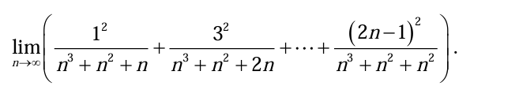

夹逼准则

自然数和公式：$\sum_{k=1}^{n} k = \frac{n(n+1)}{2}$

自然数平方和公式：$\sum_{k=1}^{n} k^2 = \frac{n(n+1)(2n+1)}{6}$

前 n 个奇数的平方和公式（可由上述公式推导）：$\sum_{k=1}^{n} (2k-1)^2 = \frac{n(2n-1)(2n+1)}{3} = \frac{n(4n^2-1)}{3}$

对于求和的每一项 $\frac{(2k-1)^2}{n^3+n^2+kn}$，分子 $(2k-1)^2$ 是正数。我们来放缩分母。

当 k 在 $[1, n]$ 区间变化时：
分母的最小值出现在 $k=1$ 时，为 $n^3+n^2+n$。

分母的最大值出现在 $k=n$ 时，为 $n^3+n^2+n^2$。
因为分母越大，分数值越小；分母越小，分数值越大。所以我们有以下不等式：

$\frac{(2k-1)^2}{n^3+n^2+n^2} \le \frac{(2k-1)^2}{n^3+n^2+kn} \le \frac{(2k-1)^2}{n^3+n^2+n}$

将这个不等式对 k 从 1 到 n 求和，我们得到：

$\sum_{k=1}^{n} \frac{(2k-1)^2}{n^3+n^2+n^2} \le \sum_{k=1}^{n} \frac{(2k-1)^2}{n^3+n^2+kn} \le \sum_{k=1}^{n} \frac{(2k-1)^2}{n^3+n^2+n}$

即：
$\frac{\sum_{k=1}^{n} (2k-1)^2}{n^3+n^2+n^2} \le S_n \le \frac{\sum_{k=1}^{n} (2k-1)^2}{n^3+n^2+n}$

现在我们来计算分子部分的和 $\sum_{k=1}^{n} (2k-1)^2$。
$\sum_{k=1}^{n} (2k-1)^2 = \sum_{k=1}^{n} (4k^2 - 4k + 1)$

$= 4\sum_{k=1}^{n}k^2 - 4\sum_{k=1}^{n}k + \sum_{k=1}^{n}1$

使用前面提到的求和公式：
$= 4\left(\frac{n(n+1)(2n+1)}{6}\right) - 4\left(\frac{n(n+1)}{2}\right) + n$

$= \frac{2n(n+1)(2n+1)}{3} - 2n(n+1) + n$

$= \frac{2n(2n^2+3n+1)}{3} - (2n^2+2n) + n$

$= \frac{4n^3+6n^2+2n}{3} - 2n^2 - n$

$= \frac{4n^3+6n^2+2n - 6n^2 - 3n}{3}$

$= \frac{4n^3-n}{3} = \frac{4}{3}n^3 - \frac{1}{3}n$
（这与公式 $\frac{n(4n^2-1)}{3}$ 的结果一致）

计算下界的极限：
$\lim_{n\to\infty} \frac{\sum_{k=1}^{n} (2k-1)^2}{n^3+n^2+n^2} = \lim_{n\to\infty} \frac{\frac{4}{3}n^3 - \frac{1}{3}n}{n^3+2n^2}$

这是一个多项式分式的极限，分子分母的最高次幂都是 3。极限值等于最高次项系数之比：
$= \frac{4/3}{1} = \frac{4}{3}$

计算上界的极限：
$\lim_{n\to\infty} \frac{\sum_{k=1}^{n} (2k-1)^2}{n^3+n^2+n} = \lim_{n\to\infty} \frac{\frac{4}{3}n^3 - \frac{1}{3}n}{n^3+n^2+n}$

同样，分子分母的最高次幂都是 3。极限值等于最高次项系数之比：
$= \frac{4/3}{1} = \frac{4}{3}$

然后夹逼准则可得

### 例2
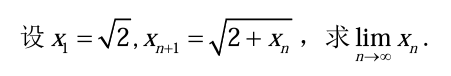

单调有界必定收敛

两边同时取极限

我们猜测数列有一个上界。我们来计算前几项：
$x_1 = \sqrt{2} \approx 1.414$

$x_2 = \sqrt{2 + x_1} = \sqrt{2 + \sqrt{2}} \approx \sqrt{3.414} \approx 1.848$

$x_3 = \sqrt{2 + x_2} = \sqrt{2 + \sqrt{2 + \sqrt{2}}} \approx \sqrt{3.848} \approx 1.962$

看起来数列的项都小于 2。我们用数学归纳法证明 $x_n < 2$ 对所有 $n \ge 1$ 成立。
奠基: 当 $n=1$ 时，$x_1 = \sqrt{2} < 2$。命题成立。

归纳: 假设当 $n=k$ 时命题成立，即 $x_k < 2$。
我们需要证明当 $n=k+1$ 时命题也成立，即 $x_{k+1} < 2$。
根据递推公式：$x_{k+1} = \sqrt{2 + x_k}$。
因为我们假设了 $x_k < 2$，所以 $2 + x_k < 2 + 2 = 4$。
两边开平方根，得到 $\sqrt{2 + x_k} < \sqrt{4}$，即 $x_{k+1} < 2$。
所以，当 $n=k+1$ 时命题也成立。

根据数学归纳法，我们证明了 $x_n < 2$ 对所有 $n \ge 1$ 成立。同时，$x_1 = \sqrt{2} > 0$，且如果 $x_n > 0$，则 $x_{n+1} = \sqrt{2+x_n} > 0$，所以数列有下界 0。因此，数列 $\{x_n\}$ 是有界的。

我们用数学归纳法证明 $x_{n+1} > x_n$ 对所有 $n \ge 1$ 成立。
奠基: 当 $n=1$ 时，我们比较 $x_2$ 和 $x_1$。

$x_2 = \sqrt{2 + \sqrt{2}}$，$x_1 = \sqrt{2}$。

因为 $2 + \sqrt{2} > 2$，所以 $\sqrt{2+\sqrt{2}} > \sqrt{2}$，即 $x_2 > x_1$。命题成立。

归纳: 假设当 $n=k$ 时命题成立，即 $x_{k+1} > x_k$。
我们需要证明当 $n=k+1$ 时命题也成立，即 $x_{k+2} > x_{k+1}$。

由归纳假设 $x_{k+1} > x_k$，两边同时加 2，得 $2 + x_{k+1} > 2 + x_k$。

因为两边都是正数，所以开平方根后不等号方向不变：$\sqrt{2 + x_{k+1}} > \sqrt{2 + x_k}$。
根据递推公式的定义，这就是 $x_{k+2} > x_{k+1}$。
所以，当 $n=k+1$ 时命题也成立。

根据数学归纳法，我们证明了数列 $\{x_n\}$ 是单调递增的。
结论: 因为数列 $\{x_n\}$ 是单调递增且有上界，根据单调收敛定理，该数列必定收敛，即极限 $\lim_{n \to \infty} x_n$ 存在。

假设 $\lim_{n \to \infty} x_n = L$。
根据极限的性质，我们有 $\lim_{n \to \infty} x_{n+1} = L$。
对递推关系式 $x_{n+1} = \sqrt{2 + x_n}$ 两边同时取极限：

$\lim_{n \to \infty} x_{n+1} = \lim_{n \to \infty} \sqrt{2 + x_n}$

$L = \sqrt{\lim_{n \to \infty} (2 + x_n)}$

$L = \sqrt{2 + \lim_{n \to \infty} x_n}$

$L = \sqrt{2 + L}$
现在我们解这个关于 L 的方程。两边平方（因为 $L \ge x_1 = \sqrt{2} > 0$，所以平方是等价变形）：
$L^2 = 2 + L$

$L^2 - L - 2 = 0$

因式分解得到：
$(L-2)(L+1) = 0$
这给出了两个可能的解：$L=2$ 或 $L=-1$。
因为数列的所有项都是正数（$x_n > 0$），所以它的极限不可能是负数。因此，我们舍去 $L=-1$。
最终的极限值是 $L=2$。

所以，$\lim_{n \to \infty} x_n = 2$。

### 例3

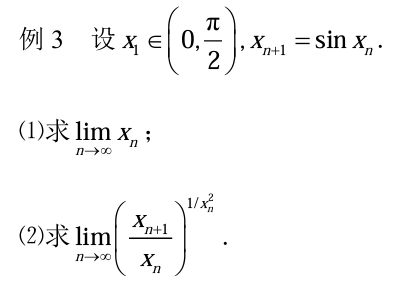

单调收敛定理

两边取对数

$\sin x$ 函数的重要性质:
在区间 $(0, \pi/2)$ 内，有重要不等式 $\sin x < x$。这个不等式是证明数列单调性的关键。

方程 $\sin x = x$ 的唯一实数解是 $x=0$。
极限的性质与求解:
如果 $\lim_{n \to \infty} x_n = L$，则 $\lim_{n \to \infty} x_{n+1} = L$。
函数极限与数列极限的关系：如果 $\lim_{x \to a} f(x) = M$ 且 $\lim_{n \to \infty} x_n = a$ ($x_n \neq a$)，则 $\lim_{n \to \infty} f(x_n) = M$。

重要极限和不定式:
$1^\infty$ 型不定式: 第 (2) 问的极限是典型的 $1^\infty$ 型。
求解 $1^\infty$ 型极限的常用方法是取对数，或者利用重要极限 $\lim_{u \to 0} (1+u)^{1/u} = e$。

泰勒级数展开 (Taylor Series Expansion): 这是解决第 (2) 问最有效的方法。当变量趋于0时，将复杂函数展开为多项式可以极大地简化极限的计算。需要用到：
$\sin x = x - \frac{x^3}{3!} + \frac{x^5}{5!} - \cdots = x - \frac{x^3}{6} + o(x^3)$
$\ln(1+u) = u - \frac{u^2}{2} + \cdots = u + o(u)$

证明有界性 (Boundedness):
题目给出 $x_1 \in (0, \frac{\pi}{2})$。

那么 $x_2 = \sin x_1$。因为 $x_1$ 在第一象限，所以 $\sin x_1 > 0$。同时，$\sin x_1 \le 1$。因为 $1 < \frac{\pi}{2} \approx 1.57$，所以 $x_2 = \sin x_1 \in (0, 1) \subset (0, \frac{\pi}{2})$。

以此类推，只要 $x_n \in (0, \frac{\pi}{2})$，那么 $x_{n+1} = \sin x_n \in (0, 1) \subset (0, \frac{\pi}{2})$。

通过数学归纳法可知，对所有 $n \ge 1$，都有 $x_n \in (0, \frac{\pi}{2})$。
这说明数列 $\{x_n\}$ 是有界的，其下界为 0，上界为 $\frac{\pi}{2}$。

证明单调性 (Monotonicity):
在微积分中有一个重要的不等式：当 $x > 0$ 时，$\sin x < x$。
因为我们已经证明了对所有 n，$x_n > 0$，所以我们可以应用这个不等式：
$x_{n+1} = \sin x_n < x_n$
这表明数列 $\{x_n\}$ 是一个严格单调递减的数列。
结论:
因为数列 $\{x_n\}$ 单调递减且有下界 0，根据单调收敛定理，其极限存在。

假设 $\lim_{n \to \infty} x_n = L$。
对递推关系式 $x_{n+1} = \sin x_n$ 两边取极限：
$\lim_{n \to \infty} x_{n+1} = \lim_{n \to \infty} \sin x_n$

由于 $\sin x$ 是连续函数，我们可以将极限移入函数内部：
$L = \sin(\lim_{n \to \infty} x_n)$

$L = \sin L$

我们需要解这个方程。通过画出函数 $y=x$ 和 $y=\sin x$ 的图像，我们可以看到它们唯一的交点是在原点。因此，方程 $L = \sin L$ 的唯一实数解是 $L=0$。
所以，$\lim_{n \to \infty} x_n = 0$。

(2) 求 $\lim_{n\to\infty} \left(\frac{x_{n+1}}{x_n}\right)^{1/x_n^2}$

第一步：代入并识别极限类型
将 $x_{n+1} = \sin x_n$ 代入表达式：
$\lim_{n\to\infty} \left(\frac{\sin x_n}{x_n}\right)^{1/x_n^2}$
由第 (1) 问可知 $\lim_{n\to\infty} x_n = 0$。
当 $n \to \infty$ 时，$x_n \to 0$。
底数部分：$\lim_{n\to\infty} \frac{\sin x_n}{x_n} = 1$ (这是一个重要极限)。
指数部分：$\lim_{n\to\infty} \frac{1}{x_n^2} = \infty$。
所以，这是一个 $1^\infty$ 型的不定式极限。

第二步：使用对数和泰勒展开求解
设所求极限为 Y。
$Y = \lim_{n\to\infty} \left(\frac{\sin x_n}{x_n}\right)^{1/x_n^2}$

两边取自然对数：
$\ln Y = \ln \left[ \lim_{n\to\infty} \left(\frac{\sin x_n}{x_n}\right)^{1/x_n^2} \right]$
由于对数函数是连续的，我们可以交换极限和对数的顺序：
$\ln Y = \lim_{n\to\infty} \ln \left[ \left(\frac{\sin x_n}{x_n}\right)^{1/x_n^2} \right]$

$\ln Y = \lim_{n\to\infty} \frac{1}{x_n^2} \ln\left(\frac{\sin x_n}{x_n}\right)$
现在，我们处理 $\ln\left(\frac{\sin x_n}{x_n}\right)$。因为 $x_n \to 0$，我们使用泰勒展开。
$\sin x_n = x_n - \frac{x_n^3}{6} + o(x_n^3)$
$\frac{\sin x_n}{x_n} = 1 - \frac{x_n^2}{6} + o(x_n^2)$
现在，使用 $\ln(1+u)$ 的泰勒展开：$\ln(1+u) = u + o(u)$。
令 $u = -\frac{x_n^2}{6} + o(x_n^2)$。当 $n \to \infty$ 时，$u \to 0$。
$\ln\left(\frac{\sin x_n}{x_n}\right) = \ln\left(1 - \frac{x_n^2}{6} + o(x_n^2)\right) = \left(-\frac{x_n^2}{6} + o(x_n^2)\right) = -\frac{x_n^2}{6} + o(x_n^2)$

第三步：代回并计算极限
将这个展开式代回到 $\ln Y$ 的表达式中：
$\ln Y = \lim_{n\to\infty} \frac{1}{x_n^2} \left( -\frac{x_n^2}{6} + o(x_n^2) \right)$
$\ln Y = \lim_{n\to\infty} \left( -\frac{1}{6} + \frac{o(x_n^2)}{x_n^2} \right)$
根据高阶无穷小的定义，$\lim_{n\to\infty} \frac{o(x_n^2)}{x_n^2} = 0$。
所以，$\ln Y = -\frac{1}{6}$。

第四步：得出最终结果
既然 $\ln Y = -1/6$，那么 $Y = e^{-1/6}$。
最终答案是 $e^{-1/6}$，也可以写作 $\frac{1}{\sqrt[6]{e}}$。

# 一元函数微分学

## 例题

### 例1

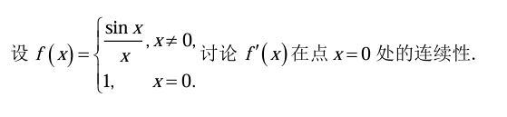

函数在一点的连续性定义 (Definition of Continuity at a Point):
要讨论函数 $f'(x)$ 在 $x=0$ 处的连续性，我们需要验证是否满足连续性的三个条件：
$f'(0)$ 有定义 (the function is defined at the point)。
$\lim_{x \to 0} f'(x)$ 存在 (the limit of the function as it approaches the point exists)。
$\lim_{x \to 0} f'(x) = f'(0)$ (the limit equals the function value)。
核心是计算出 $f'(0)$ 的值和 $\lim_{x \to 0} f'(x)$ 的值，并比较它们是否相等。

导数的定义 (Definition of the Derivative):
对于在某点处函数形式特殊的点（如本题中的分段点 $x=0$），求该点的导数必须使用导数的定义式：
$f'(a) = \lim_{h \to 0} \frac{f(a+h) - f(a)}{h}$
在本题中，即为 $f'(0) = \lim_{x \to 0} \frac{f(x) - f(0)}{x - 0}$。

导数的计算法则 (Differentiation Rules):
对于 $x \neq 0$ 的部分，$f(x) = \frac{\sin x}{x}$ 是一个常规函数，我们可以使用求导法则来计算其导数。这里主要用到商的求导法则 (Quotient Rule):
若 $h(x) = \frac{u(x)}{v(x)}$，则 $h'(x) = \frac{u'(x)v(x) - u(x)v'(x)}{[v(x)]^2}$。

洛必达法则 

重要极限 (Important Limits):
本题的计算过程中会用到一些基础且重要的极限：
$\lim_{x \to 0} \frac{\sin x}{x} = 1$

$\lim_{x \to 0} \frac{1 - \cos x}{x^2} = \frac{1}{2}$ (这是一个常用结论，可以由洛必达法则推导)

为了讨论 $f'(x)$ 在 $x=0$ 处的连续性，我们需要进行以下三步：
求出当 $x \neq 0$ 时 $f'(x)$ 的表达式。
利用导数定义求出 $f'(0)$ 的值。
求 $x \to 0$ 时 $f'(x)$ 的极限，并与 $f'(0)$ 的值进行比较。

第一步：求当 $x \neq 0$ 时的 $f'(x)$
当 $x \neq 0$ 时，$f(x) = \frac{\sin x}{x}$。我们使用商的求导法则：
$f'(x) = \frac{(\sin x)' \cdot x - \sin x \cdot (x)'}{x^2}$
$= \frac{\cos x \cdot x - \sin x \cdot 1}{x^2}$
$= \frac{x \cos x - \sin x}{x^2}$
所以，当 $x \neq 0$ 时，$f'(x) = \frac{x \cos x - \sin x}{x^2}$。

第二步：利用导数定义求 $f'(0)$
根据导数的定义式：
$f'(0) = \lim_{x \to 0} \frac{f(x) - f(0)}{x - 0}$
将 $f(x) = \frac{\sin x}{x}$ 和 $f(0) = 1$ 代入：
$f'(0) = \lim_{x \to 0} \frac{\frac{\sin x}{x} - 1}{x}$
$= \lim_{x \to 0} \frac{\sin x - x}{x^2}$
这个极限是 $\frac{0}{0}$ 型的未定式，我们可以使用洛必达法则。对分子分母同时求导：
$f'(0) = \lim_{x \to 0} \frac{(\sin x - x)'}{(x^2)'}$
$= \lim_{x \to 0} \frac{\cos x - 1}{2x}$
这个极限仍然是 $\frac{0}{0}$ 型，再次使用洛必达法则：
$f'(0) = \lim_{x \to 0} \frac{(\cos x - 1)'}{(2x)'}$
$= \lim_{x \to 0} \frac{-\sin x}{2}$
$= \frac{-\sin 0}{2} = \frac{0}{2} = 0$
因此，我们得到 $f'(0) = 0$。

第三步：求 $\lim_{x \to 0} f'(x)$ 并与 $f'(0)$ 比较
现在我们来计算 $f'(x)$ 在 $x \to 0$ 时的极限。利用第一步得到的结果：
$\lim_{x \to 0} f'(x) = \lim_{x \to 0} \frac{x \cos x - \sin x}{x^2}$
这个极限是 $\frac{0 \cdot \cos 0 - \sin 0}{0^2} = \frac{0 - 0}{0}$，是 $\frac{0}{0}$ 型的未定式。我们使用洛必达法则。
对分子分母同时求导 (注意分子是乘积形式，需要用乘积法则)：
$\lim_{x \to 0} f'(x) = \lim_{x \to 0} \frac{(x \cos x - \sin x)'}{(x^2)'}$
$= \lim_{x \to 0} \frac{(1 \cdot \cos x + x \cdot (-\sin x)) - \cos x}{2x}$
$= \lim_{x \to 0} \frac{\cos x - x \sin x - \cos x}{2x}$
$= \lim_{x \to 0} \frac{-x \sin x}{2x}$
当 $x \to 0$ 但 $x \neq 0$ 时，我们可以消去 $x$：
$= \lim_{x \to 0} \frac{-\sin x}{2}$
$= \frac{-\sin 0}{2} = \frac{0}{2} = 0$
所以，$\lim_{x \to 0} f'(x) = 0$。

结论
我们已经计算出：
$f'(0) = 0$ (函数在 $x=0$ 点的导数值)
$\lim_{x \to 0} f'(x) = 0$ (函数在 $x=0$ 点的导数的极限)
因为 $\lim_{x \to 0} f'(x) = f'(0)$，所以根据函数连续性的定义，函数 $f'(x)$ 在点 $x=0$ 处是连续的。

### 例2

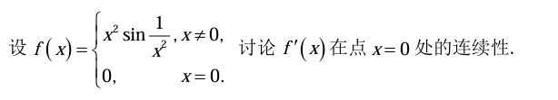

函数在一点连续的定义

夹逼准则

导数定义

第一步：求当 $x \neq 0$ 时的 $f'(x)$
当 $x \neq 0$ 时，$f(x) = x^2 \sin\frac{1}{x^2}$。我们同时使用乘法法则和链式法则来求导：
$f'(x) = (x^2)' \cdot \sin\frac{1}{x^2} + x^2 \cdot (\sin\frac{1}{x^2})'$
计算各部分的导数：
$(x^2)' = 2x$
对于 $(\sin\frac{1}{x^2})'$，使用链式法则。令 $u = \frac{1}{x^2} = x^{-2}$，则 $u' = -2x^{-3} = -\frac{2}{x^3}$。
$(\sin u)' = \cos u \cdot u' = \cos\frac{1}{x^2} \cdot (-\frac{2}{x^3})$
将它们代回原式：
$f'(x) = 2x \sin\frac{1}{x^2} + x^2 \left( \cos\frac{1}{x^2} \cdot (-\frac{2}{x^3}) \right)$
$f'(x) = 2x \sin\frac{1}{x^2} - \frac{2}{x} \cos\frac{1}{x^2}$
所以，当 $x \neq 0$ 时，$f'(x) = 2x \sin\frac{1}{x^2} - \frac{2}{x} \cos\frac{1}{x^2}$。

第二步：利用导数定义求 $f'(0)$
根据导数的定义式：
$f'(0) = \lim_{x \to 0} \frac{f(x) - f(0)}{x - 0}$
将 $f(x) = x^2 \sin\frac{1}{x^2}$ 和 $f(0) = 0$ 代入：
$f'(0) = \lim_{x \to 0} \frac{x^2 \sin\frac{1}{x^2} - 0}{x}$
$= \lim_{x \to 0} x \sin\frac{1}{x^2}$
这是一个“无穷小量 × 有界函数”类型的极限。因为 $-1 \le \sin\frac{1}{x^2} \le 1$，所以：
$-|x| \le x \sin\frac{1}{x^2} \le |x|$
由于 $\lim_{x \to 0} (-|x|) = 0$ 和 $\lim_{x \to 0} |x| = 0$，根据夹逼定理，我们有：
$\lim_{x \to 0} x \sin\frac{1}{x^2} = 0$
因此，我们得到 $f'(0) = 0$。函数在 $x=0$ 处是可导的，且导数值为0。

第三步：求 $\lim_{x \to 0} f'(x)$ 并判断其是否存在
现在我们来计算 $f'(x)$ 在 $x \to 0$ 时的极限。利用第一步得到的结果：
$\lim_{x \to 0} f'(x) = \lim_{x \to 0} \left( 2x \sin\frac{1}{x^2} - \frac{2}{x} \cos\frac{1}{x^2} \right)$
我们分别看极限的两个部分：
$\lim_{x \to 0} 2x \sin\frac{1}{x^2}$
这一部分与计算 $f'(0)$ 时的情况类似。根据夹逼定理，$\lim_{x \to 0} 2x \sin\frac{1}{x^2} = 0$。
$\lim_{x \to 0} \frac{2}{x} \cos\frac{1}{x^2}$
当 $x \to 0$ 时，$\frac{1}{x^2} \to \infty$，所以 $\cos\frac{1}{x^2}$ 在 -1 和 1 之间无限次地快速振荡。同时，$\frac{2}{x}$ 趋向于 $\infty$。这是一个振荡项乘以一个趋于无穷的项，其结果会以越来越大的振幅在正负无穷大之间振荡，因此这个极限不存在。
由于 $\lim_{x \to 0} \frac{2}{x} \cos\frac{1}{x^2}$ 不存在，所以整个极限 $\lim_{x \to 0} f'(x)$ 也不存在。

结论
我们已经得到：
$f'(0) = 0$ (导数在 $x=0$ 点存在)。
$\lim_{x \to 0} f'(x)$ 不存在。
因为函数在一点连续的必要条件是该点的极限必须存在，而 $\lim_{x \to 0} f'(x)$ 不存在，所以 $f'(x)$ 在点 $x=0$ 处不连续。

### 例3

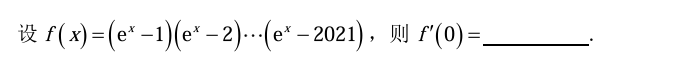

$\lim_{x \to 0} \frac{e^x - 1}{x} = 1$

第一步：计算 $f(0)$
将 $x=0$ 代入函数表达式：
$f(0) = (e^0 - 1)(e^0 - 2)\dots(e^0 - 2021)$
$= (1 - 1)(1 - 2)\dots(1 - 2021)$
$= (0)(-1)(-2)\dots(-2020)$
$= 0$

第二步：应用导数定义
根据导数的定义：
$f'(0) = \lim_{x \to 0} \frac{f(x) - f(0)}{x - 0}$
将 $f(x)$ 的表达式和 $f(0) = 0$ 代入：
$f'(0) = \lim_{x \to 0} \frac{(e^x - 1)(e^x - 2)\dots(e^x - 2021) - 0}{x}$
$= \lim_{x \to 0} \frac{(e^x - 1)(e^x - 2)\dots(e^x - 2021)}{x}$
为了求解这个极限，我们可以将 $(e^x - 1)$ 和 $x$ 组合在一起，因为我们知道它们的极限：
$f'(0) = \lim_{x \to 0} \left( \frac{e^x - 1}{x} \right) \cdot \lim_{x \to 0} \left( (e^x - 2)(e^x - 3)\dots(e^x - 2021) \right)$

第三步：分别计算极限
对于第一部分，我们使用重要极限：
$\lim_{x \to 0} \frac{e^x - 1}{x} = 1$
对于第二部分，由于函数 $(e^x - 2)(e^x - 3)\dots(e^x - 2021)$ 在 $x=0$ 处是连续的，我们可以直接代入 $x=0$ 来求极限：
$\lim_{x \to 0} \left( (e^x - 2)\dots(e^x - 2021) \right) = (e^0 - 2)(e^0 - 3)\dots(e^0 - 2021)$
$= (1 - 2)(1 - 3)\dots(1 - 2021)$
$= (-1)(-2)\dots(-2020)$
这个乘积共有 $2020 - 1 + 1 = 2020$ 项。因为有偶数个负数相乘，所以结果为正：
$= 1 \times 2 \times \dots \times 2020$
$= 2020!$

# 一元函数积分学

## 例题

### 例1

换元

部分分式分解

第一步：
直接看这个积分式会觉得很复杂。关键在于观察分母中的 $x^2e^{2x}$ 项。我们可以将其改写为 $(xe^x)^2$。这个形式提示我们，也许可以尝试使用与 $xe^x$ 相关的换元。
为了凑出 $d(xe^x)$ 的形式，我们先对 $xe^x$ 求导：
$\frac{d}{dx}(xe^x) = 1 \cdot e^x + x \cdot e^x = (x+1)e^x$
我们发现，这个导数 $(x+1)e^x$ 和原式的分子 $(x+1)$ 非常接近，只差一个 $e^x$。因此，我们可以将被积函数的分子和分母同时乘以 $e^x$，为换元做准备。
$$ I = \int \frac{x+1}{x(1+x^2e^{2x})}dx = \int \frac{e^x(x+1)}{e^x \cdot x(1+(xe^x)^2)}dx $$
整理一下分母：
$$ I = \int \frac{e^x(x+1)}{xe^x(1+(xe^x)^2)}dx $$

第二步：进行换元积分
令 $u = xe^x$。
那么，它的微分是 $du = e^x(x+1)dx$。
现在，我们可以将原积分式中的 $x$ 和 $dx$ 全部替换为 $u$ 和 $du$：
分子 $(e^x(x+1)dx)$ 替换为 $du$。
分母中的 $xe^x$ 替换为 $u$。
分母中的 $(xe^x)^2$ 替换为 $u^2$。
积分式变为：
$$ I = \int \frac{1}{u(1+u^2)}du $$

第三步：使用部分分式分解
现在我们得到了一个关于 $u$ 的有理函数积分。我们需要将 $\frac{1}{u(1+u^2)}$ 分解。设：
$$ \frac{1}{u(1+u^2)} = \frac{A}{u} + \frac{Bu+C}{1+u^2} $$
两边同乘以 $u(1+u^2)$ 得：
$$ 1 = A(1+u^2) + (Bu+C)u $$
$$ 1 = A + Au^2 + Bu^2 + Cu $$
$$ 1 = (A+B)u^2 + Cu + A $$
通过比较等式两边同次幂的系数，我们得到一个方程组：
$u^2$ 的系数：$A+B = 0$
$u$ 的系数：$C = 0$
常数项：$A = 1$
解得：$A=1$, $B=-1$, $C=0$。
所以，部分分式分解的结果是：
$$ \frac{1}{u(1+u^2)} = \frac{1}{u} - \frac{u}{1+u^2} $$

第四步：积分
将分解后的式子代回积分：
$$ I = \int (\frac{1}{u} - \frac{u}{1+u^2})du = \int \frac{1}{u}du - \int \frac{u}{1+u^2}du $$
分别对这两部分进行积分：
$\int \frac{1}{u}du = \ln|u|$
对于 $\int \frac{u}{1+u^2}du$，我们可以再次使用换元法（或者直接看出形式）。令 $v = 1+u^2$，则 $dv = 2udu$，所以 $udu = \frac{1}{2}dv$。
$\int \frac{u}{1+u^2}du = \int \frac{1}{v} \cdot \frac{1}{2}dv = \frac{1}{2}\int \frac{1}{v}dv = \frac{1}{2}\ln|v| = \frac{1}{2}\ln(1+u^2)$ (因为 $1+u^2$ 恒为正，所以可以去掉绝对值符号)。
合并结果：
$$ I = \ln|u| - \frac{1}{2}\ln(1+u^2) + C $$

第五步：换回原变量
最后一步，将 $u = xe^x$ 代回到结果中：
$$ I = \ln|xe^x| - \frac{1}{2}\ln(1+(xe^x)^2) + C $$

第六步：简化结果（可选但推荐）
利用对数的性质 $\ln(ab) = \ln a + \ln b$ 和 $\ln(e^x) = x$ 来简化第一项：
$$ \ln|xe^x| = \ln|x| + \ln|e^x| = \ln|x| + x $$
所以，最终答案是：
$$ I = x + \ln|x| - \frac{1}{2}\ln(1+x^2e^{2x}) + C $$

### 例2

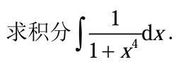

部分分式分解然后积分得ln

arctan积分：

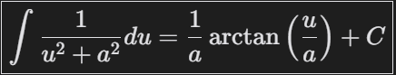

第一步：因式分解分母 $1+x^4$
我们使用配方法来分解它：
$$ 1+x^4 = (x^4 + 2x^2 + 1) - 2x^2 $$
$$ = (x^2+1)^2 - (\sqrt{2}x)^2 $$
利用平方差公式 $A^2 - B^2 = (A-B)(A+B)$，我们得到：
$$ 1+x^4 = (x^2 - \sqrt{2}x + 1)(x^2 + \sqrt{2}x + 1) $$

第二步：进行部分分式分解
我们将被积函数写成部分分式的形式：
$$ \frac{1}{1+x^4} = \frac{Ax+B}{x^2 - \sqrt{2}x + 1} + \frac{Cx+D}{x^2 + \sqrt{2}x + 1} $$
两边同乘以 $(x^2 - \sqrt{2}x + 1)(x^2 + \sqrt{2}x + 1)$ 得：
$$ 1 = (Ax+B)(x^2 + \sqrt{2}x + 1) + (Cx+D)(x^2 - \sqrt{2}x + 1) $$
展开并按 $x$ 的幂次整理：
$$ 1 = (A+C)x^3 + (A\sqrt{2}+B-C\sqrt{2}+D)x^2 + (A+B\sqrt{2}+C-D\sqrt{2})x + (B+D) $$
比较等式两边同次幂的系数，得到方程组：
$x^3$: $A+C = 0 \implies C = -A$

$x^2$: $(A-C)\sqrt{2} + B+D = 0$

$x^1$: $A+C + (B-D)\sqrt{2} = 0 \implies (B-D)\sqrt{2} = 0 \implies B=D$

$x^0$: $B+D = 1$
由 (3) 和 (4) 可得 $2B=1 \implies B=D=\frac{1}{2}$。
将 $C=-A$ 和 $B+D=1$ 代入 (2) 可得 $2A\sqrt{2} + 1 = 0 \implies A = -\frac{1}{2\sqrt{2}}$。
因此，$C = -A = \frac{1}{2\sqrt{2}}$。
所以，部分分式分解的结果是：
$$ \frac{1}{1+x^4} = \frac{-\frac{1}{2\sqrt{2}}x + \frac{1}{2}}{x^2 - \sqrt{2}x + 1} + \frac{\frac{1}{2\sqrt{2}}x + \frac{1}{2}}{x^2 + \sqrt{2}x + 1} $$

第三步：分别计算两个积分
令 $I = \int \frac{1}{1+x^4}dx = I_1 + I_2$，其中：
$I_1 = \int \frac{-\frac{1}{2\sqrt{2}}x + \frac{1}{2}}{x^2 - \sqrt{2}x + 1} dx$

$I_2 = \int \frac{\frac{1}{2\sqrt{2}}x + \frac{1}{2}}{x^2 + \sqrt{2}x + 1} dx$

计算 $I_1$:
分子的导数是 $2x - \sqrt{2}$。我们把分子凑成 $k(2x - \sqrt{2}) + m$ 的形式。
$-\frac{1}{2\sqrt{2}}x + \frac{1}{2} = -\frac{1}{4\sqrt{2}}(2x - \sqrt{2}) + \frac{1}{4}$

$I_1 = -\frac{1}{4\sqrt{2}}\int \frac{2x - \sqrt{2}}{x^2 - \sqrt{2}x + 1} dx + \frac{1}{4}\int \frac{1}{x^2 - \sqrt{2}x + 1} dx$

第一个积分是对数形式：$-\frac{1}{4\sqrt{2}}\ln(x^2 - \sqrt{2}x + 1)$

第二个积分需要配方：$x^2 - \sqrt{2}x + 1 = (x - \frac{\sqrt{2}}{2})^2 + \frac{1}{2} = (x - \frac{1}{\sqrt{2}})^2 + (\frac{1}{\sqrt{2}})^2$

$\frac{1}{4}\int \frac{1}{(x - \frac{1}{\sqrt{2}})^2 + (\frac{1}{\sqrt{2}})^2} dx = \frac{1}{4} \cdot \frac{1}{1/\sqrt{2}}\arctan\left(\frac{x-1/\sqrt{2}}{1/\sqrt{2}}\right) = \frac{\sqrt{2}}{4}\arctan(\sqrt{2}x-1)$

所以，$I_1 = -\frac{1}{4\sqrt{2}}\ln(x^2 - \sqrt{2}x + 1) + \frac{\sqrt{2}}{4}\arctan(\sqrt{2}x-1)$

计算 $I_2$:
过程完全类似。分子的导数是 $2x + \sqrt{2}$。
$\frac{1}{2\sqrt{2}}x + \frac{1}{2} = \frac{1}{4\sqrt{2}}(2x + \sqrt{2}) + \frac{1}{4}$
$I_2 = \frac{1}{4\sqrt{2}}\int \frac{2x + \sqrt{2}}{x^2 + \sqrt{2}x + 1} dx + \frac{1}{4}\int \frac{1}{x^2 + \sqrt{2}x + 1} dx$
第一个积分是对数形式：$\frac{1}{4\sqrt{2}}\ln(x^2 + \sqrt{2}x + 1)$
第二个积分需要配方：$x^2 + \sqrt{2}x + 1 = (x + \frac{\sqrt{2}}{2})^2 + \frac{1}{2} = (x + \frac{1}{\sqrt{2}})^2 + (\frac{1}{\sqrt{2}})^2$
$\frac{1}{4}\int \frac{1}{(x + \frac{1}{\sqrt{2}})^2 + (\frac{1}{\sqrt{2}})^2} dx = \frac{\sqrt{2}}{4}\arctan(\sqrt{2}x+1)$
所以，$I_2 = \frac{1}{4\sqrt{2}}\ln(x^2 + \sqrt{2}x + 1) + \frac{\sqrt{2}}{4}\arctan(\sqrt{2}x+1)$

第四步：合并结果
$I = I_1 + I_2 + C$
将对数项和反正切项分别合并：
$I = \frac{1}{4\sqrt{2}}[\ln(x^2 + \sqrt{2}x + 1) - \ln(x^2 - \sqrt{2}x + 1)] + \frac{\sqrt{2}}{4}[\arctan(\sqrt{2}x-1) + \arctan(\sqrt{2}x+1)] + C$
利用对数性质 $\ln A - \ln B = \ln(A/B)$ 简化：
$$ I = \frac{1}{4\sqrt{2}}\ln\left(\frac{x^2 + \sqrt{2}x + 1}{x^2 - \sqrt{2}x + 1}\right) + \frac{\sqrt{2}}{4}(\arctan(\sqrt{2}x-1) + \arctan(\sqrt{2}x+1)) + C $$

### 例3

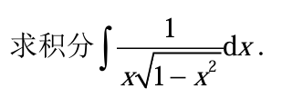

三角换元法 (Trigonometric Substitution): 这是解决此题最核心的技巧。当被积函数中含有 $\sqrt{a^2-x^2}$、$\sqrt{a^2+x^2}$ 或 $\sqrt{x^2-a^2}$ 这样的根式时，通常使用三角换元来消除根号。对于本题中的 $\sqrt{1-x^2}$（即 $a=1$ 的情况），最适合的换元是 $x = \sin(\theta)$。

三角恒等式 (Trigonometric Identities): 进行三角换元后，需要使用基本的三角恒等式来化简表达式。最关键的是 $\sin^2(\theta) + \cos^2(\theta) = 1$，由此可得 $\sqrt{1-\sin^2(\theta)} = \sqrt{\cos^2(\theta)} = |\cos(\theta)|$。

第一步：选择并进行三角换元
被积函数中含有 $\sqrt{1-x^2}$，这是典型的使用三角换元的标志。我们令：
$$ x = \sin(\theta) $$
为了保证换元是单射的，我们通常限制 $\theta$ 的范围为 $\left[-\frac{\pi}{2}, \frac{\pi}{2}\right]$。在这个范围内，$\cos(\theta) \ge 0$。
对 $x = \sin(\theta)$ 求微分，得到：
$$ dx = \cos(\theta)d\theta $$
同时，我们替换根式部分：
$$ \sqrt{1-x^2} = \sqrt{1-\sin^2(\theta)} = \sqrt{\cos^2(\theta)} = \cos(\theta) $$
(因为 $\theta \in \left[-\frac{\pi}{2}, \frac{\pi}{2}\right]$，所以 $\cos(\theta)$ 是非负的，可以直接去掉绝对值符号)。

第二步：代入原积分式并化简
将 $x$, $dx$ 和 $\sqrt{1-x^2}$ 的表达式全部代入原积分中：
$$ \int \frac{1}{x\sqrt{1-x^2}}dx = \int \frac{1}{\sin(\theta) \cdot \cos(\theta)} \cos(\theta)d\theta $$
化简上式，$\cos(\theta)$ 被约掉：
$$ = \int \frac{1}{\sin(\theta)}d\theta $$
我们知道 $\frac{1}{\sin(\theta)} = \csc(\theta)$，所以积分变为：
$$ = \int \csc(\theta)d\theta $$

第三步：积分
使用 $\csc(\theta)$ 的标准积分公式：
$$ \int \csc(\theta)d\theta = \ln|\csc(\theta) - \cot(\theta)| + C $$

第四步：反向替换回变量 $x$
现在我们需要将 $\csc(\theta)$ 和 $\cot(\theta)$ 用 $x$ 来表示。我们从初始的换元关系 $x = \sin(\theta)$ 出发，可以将其看作 $x/1$。
我们可以构造一个直角三角形：
$\sin(\theta) = \frac{\text{对边}}{\text{斜边}} = \frac{x}{1}$
所以，对边为 $x$，斜边为 $1$。
根据勾股定理，邻边为 $\sqrt{\text{斜边}^2 - \text{对边}^2} = \sqrt{1^2 - x^2} = \sqrt{1-x^2}$。
根据这个三角形，我们可以得到：
$\csc(\theta) = \frac{1}{\sin(\theta)} = \frac{\text{斜边}}{\text{对边}} = \frac{1}{x}$
$\cot(\theta) = \frac{\cos(\theta)}{\sin(\theta)} = \frac{\text{邻边}}{\text{对边}} = \frac{\sqrt{1-x^2}}{x}$
将这些表达式代入积分结果：
$$ \ln|\csc(\theta) - \cot(\theta)| + C = \ln\left|\frac{1}{x} - \frac{\sqrt{1-x^2}}{x}\right| + C $$

第五步：简化结果
合并分母，得到最终答案：
$$ \int \frac{1}{x\sqrt{1-x^2}}dx = \ln\left|\frac{1-\sqrt{1-x^2}}{x}\right| + C $$

# 微分方程

## 一阶线性微分方程
一阶线性微分方程是指可以写成以下标准形式的方程：
$y' + P(x)y = Q(x)$

如何求解 (Solution Method: 积分因子法 Integrating Factor Method)
求解一阶线性微分方程的标准方法是积分因子法。其核心思想是找到一个特殊的函数，称为积分因子 (Integrating Factor)，用它乘以整个方程，使得方程的左边可以凑成一个乘积的导数形式。

化为标准形式：确保方程是 $y' + P(x)y = Q(x)$ 的形式，并准确找出 $P(x)$ 和 $Q(x)$。

计算积分因子：积分因子 $\mu(x)$ (希腊字母 mu) 的计算公式是：
$\mu(x) = e^{\int P(x)dx}$

注意：在计算这个不定积分时，我们通常不需要加常数 C，因为我们只需要一个有效的积分因子即可。
方程两边同乘积分因子：将标准形式的方程两边都乘以 $\mu(x)$：

$\mu(x)y' + \mu(x)P(x)y = \mu(x)Q(x)$
根据积分因子的构造，方程的左边现在恰好是 $(\mu(x)y)$ 的展开形式（根据乘法求导法则）。所以方程可以简化为：

$(\mu(x)y)' = \mu(x)Q(x)$
两边积分：对简化后的方程两边同时对 $x$ 进行积分：

$\int (\mu(x)y)' dx = \int \mu(x)Q(x) dx$
$\mu(x)y = \int \mu(x)Q(x) dx + C$

这里的积分常数 C 必须加上，因为它决定了方程的通解。
解出 y：将 $\mu(x)$ 除到右边，得到方程的通解 (General Solution)：

$y = \frac{1}{\mu(x)} \left( \int \mu(x)Q(x) dx + C \right)$

例题 1：基础求解
求解微分方程： $y' - 3y = e^{5x}$

解：
该方程已经是标准形式。我们有：
$P(x) = -3$

$Q(x) = e^{5x}$

计算积分因子 $\mu(x)$：
$\int P(x)dx = \int -3 dx = -3x$
所以积分因子是：
$\mu(x) = e^{\int P(x)dx} = e^{-3x}$
方程两边同乘 $\mu(x)$：
$e^{-3x}(y' - 3y) = e^{-3x} \cdot e^{5x}$
左边可以写成乘积的导数：
$(e^{-3x}y)' = e^{2x}$

两边积分：
$\int (e^{-3x}y)' dx = \int e^{2x} dx$

$e^{-3x}y = \frac{1}{2}e^{2x} + C$
解出 y：
$y = e^{3x} \left( \frac{1}{2}e^{2x} + C \right)$

$y = \frac{1}{2}e^{5x} + Ce^{3x}$
这就是该方程的通解。

例题 2：初值问题 (Initial Value Problem)
求解微分方程 $xy' + 2y = 4x^2$，并满足初始条件 $y(1) = 3$。

解：
方程两边同除以 $x$ (假设 $x \neq 0$)，得到标准形式：
$y' + \frac{2}{x}y = 4x$

我们有：
$P(x) = \frac{2}{x}$

$Q(x) = 4x$
计算积分因子 $\mu(x)$：
$\int P(x)dx = \int \frac{2}{x} dx = 2\ln|x| = \ln(x^2)$

由于初始条件在 $x=1$ 处，我们只关心 $x>0$ 的情况，所以 $\ln|x| = \ln x$。

所以积分因子是：
$\mu(x) = e^{\ln(x^2)} = x^2$

方程两边同乘 $\mu(x)$：
$x^2(y' + \frac{2}{x}y) = x^2(4x)$

左边化为乘积的导数：
$(x^2y)' = 4x^3$

两边积分：
$\int (x^2y)' dx = \int 4x^3 dx$

$x^2y = x^4 + C$
解出 y (得到通解)：
$y = \frac{x^4 + C}{x^2} = x^2 + \frac{C}{x^2}$

利用初始条件求特解：
将初始条件 $y(1) = 3$ 代入通解：
$3 = (1)^2 + \frac{C}{(1)^2}$
$3 = 1 + C$

$C = 2$
将 $C=2$ 代回通解，得到满足初始条件的特解 (Particular Solution)：

$y = x^2 + \frac{2}{x^2}$

## 二阶可降阶微分方程

类型一：方程不显含未知函数 y
这种方程的形式为 $F(x, y', y'') = 0$。它的特点是方程中只含有自变量 $x$、$y$ 的一阶导数 $y'$ 和二阶导数 $y''$，而没有未知函数 $y$ 本身。

降阶方法：
变量代换：令 $p = y'$。
那么，$y''$ 就自然地成为 $p$ 对 $x$ 的导数，即 $y'' = \frac{dp}{dx}$。

将 $p$ 和 $\frac{dp}{dx}$ 代入原方程 $F(x, y', y'') = 0$，得到一个新方程 $F(x, p, \frac{dp}{dx}) = 0$。
这个新方程是关于变量 $p$ 和 $x$ 的一阶微分方程。

求解这个一阶方程，得到 $p = \phi(x, C_1)$。

将 $p$ 替换回来，即 $y' = \phi(x, C_1)$，或者写成 $\frac{dy}{dx} = \phi(x, C_1)$。

最后，对上式两边积分，求得原方程的通解 $y = \int \phi(x, C_1) dx + C_2$。

例题 1
求解微分方程 $xy'' + y' = 4x$。

解：
这个方程中不含有 $y$，是典型的类型一。

变量代换：
令 $p = y'$，则 $y'' = \frac{dp}{dx}$。

代入原方程：
原方程变为 $x \frac{dp}{dx} + p = 4x$。

求解一阶方程：
我们可以看到，这是一个关于 $p$ 和 $x$ 的一阶线性微分方程。

当 $x \neq 0$ 时，方程可以写成 $\frac{dp}{dx} + \frac{1}{x} p = 4$。
这是一个标准的一阶线性方程 $p' + P(x)p = Q(x)$ 的形式。

使用公式法求解，积分因子为 $e^{\int \frac{1}{x} dx} = e^{\ln|x|} = |x|$。我们取 $x$（假设 $x>0$，对于 $x<0$ 的情况类似）。

方程两边同乘以积分因子 $x$：
$x \frac{dp}{dx} + p = 4x$
左边恰好是 $(xp)'$，所以方程为 $(xp)' = 4x$。

两边对 $x$ 积分：
$\int (xp)' dx = \int 4x dx$
$xp = 2x^2 + C_1$
解出 $p$：
$p = 2x + \frac{C_1}{x}$
回代并积分：
因为 $p = y' = \frac{dy}{dx}$，所以：
$\frac{dy}{dx} = 2x + \frac{C_1}{x}$

再次对 $x$ 积分：
$y = \int (2x + \frac{C_1}{x}) dx$
$y = x^2 + C_1 \ln|x| + C_2$
这就是原方程的通解。

类型二：方程不显含自变量 x
这种方程的形式为 $F(y, y', y'') = 0$。它的特点是方程中只含有未知函数 $y$ 及其导数 $y'$ 和 $y''$，而没有自变量 $x$。

降阶方法：
变量代换：令 $p = y'$。
这里的关键是如何表示 $y''$。我们不能再用 $\frac{dp}{dx}$，因为它会引入我们想消掉的 $x$。我们利用链式法则，将 $p$ 看作是 $y$ 的函数（因为 $x$ 不出现，$y'$ 的变化依赖于 $y$ 的值）。
$y'' = \frac{d(y')}{dx} = \frac{dp}{dx} = \frac{dp}{dy} \cdot \frac{dy}{dx}$
因为 $\frac{dy}{dx} = p$，所以我们得到 $y'' = p \frac{dp}{dy}$。
将 $p$ 和 $p \frac{dp}{dy}$ 代入原方程 $F(y, y', y'') = 0$，得到新方程 $F(y, p, p \frac{dp}{dy}) = 0$。
这个新方程是关于变量 $p$ 和 $y$ 的一阶微分方程。
求解这个一阶方程，得到 $p = \psi(y, C_1)$。
将 $p$ 替换回来，即 $\frac{dy}{dx} = \psi(y, C_1)$。
这是一个变量可分离方程。分离变量后积分：$\int \frac{dy}{\psi(y, C_1)} = \int dx$，求得含有两个常数的 $x$ 和 $y$ 之间的关系，即为通解。

例题 2
求解微分方程 $yy'' - (y')^2 = 0$。

解：
这个方程中不含有 $x$，是典型的类型二。

变量代换：
令 $p = y'$，则 $y'' = p \frac{dp}{dy}$。

代入原方程：
原方程变为 $y(p \frac{dp}{dy}) - p^2 = 0$。
$yp \frac{dp}{dy} = p^2$

求解一阶方程：
首先，我们考虑一个特解。如果 $p=0$，即 $y'=0$，那么 $y=C$（常数）。代入原方程 $C \cdot 0 - 0^2 = 0$ 成立，所以 $y=C$ 是方程的一个解。

现在，假设 $p \neq 0$，我们可以在方程两边同时除以 $p$：
$y \frac{dp}{dy} = p$

这是一个变量可分离方程。分离变量：
$\frac{dp}{p} = \frac{dy}{y}$

两边积分：
$\int \frac{dp}{p} = \int \frac{dy}{y}$

$\ln|p| = \ln|y| + C_1$
为了方便，我们可以将常数 $C_1$ 写成 $\ln|C_1^*|$ 的形式（其中 $C_1^*$ 是一个新的任意非零常数）。

$\ln|p| = \ln|C_1^* y|$
$p = C_1^* y$ （我们将 $C_1^*$ 重新记为 $C_1$）
$p = C_1 y$

回代并积分：
因为 $p = \frac{dy}{dx}$，所以：

$\frac{dy}{dx} = C_1 y$
这又是一个变量可分离方程。
$\frac{dy}{y} = C_1 dx$
两边积分：
$\int \frac{dy}{y} = \int C_1 dx$

$\ln|y| = C_1 x + C_2$

写成显式解：
$|y| = e^{C_1 x + C_2} = e^{C_2} e^{C_1 x}$
令 $C_3 = \pm e^{C_2}$，则通解为 $y = C_3 e^{C_1 x}$。注意，之前我们得到的特解 $y=C$ 可以被这个通解形式包含（当 $C_1=0$ 时，$y=C_3$）。

## 二阶线性微分方程的三个重要定理

首先，我们来定义什么是二阶线性微分方程。它的通用形式是：
$y'' + p(x)y' + q(x)y = f(x)$
如果右侧的 $f(x) = 0$，我们称之为齐次（homogeneous）二阶线性微分方程。
如果右侧的 $f(x) \neq 0$，我们称之为非齐次（non-homogeneous）二阶线性微分方程。

定理一：齐次方程解的叠加原理

这是什么：
如果函数 $y_1(x)$ 和 $y_2(x)$ 是二阶齐次线性微分方程 $y'' + p(x)y' + q(x)y = 0$ 的两个线性无关的解，那么它们的线性组合 $y = C_1y_1(x) + C_2y_2(x)$ (其中 $C_1$ 和 $C_2$ 是任意常数) 是该方程的通解。

简单来说： 对于齐次方程，只要我们能找到两个“基本”的、不一样的解（线性无关），那么把它们乘以任意常数再相加，就能得到这个方程的所有解。

例题：
求解齐次微分方程 $y'' - 5y' + 6y = 0$。
解题步骤：
写出特征方程：$r^2 - 5r + 6 = 0$。
解特征方程：$(r-2)(r-3) = 0$，得到两个不同的实数根 $r_1 = 2$ 和 $r_2 = 3$。
根据根的形式，我们得到两个线性无关的解：$y_1 = e^{2x}$ 和 $y_2 = e^{3x}$。
应用定理一，该齐次方程的通解是这两个解的线性组合：
$y_h = C_1e^{2x} + C_2e^{3x}$ (这里的 $h$ 表示 homogeneous)。

定理二：非齐次方程解的结构定理

这是什么：
对于二阶非齐次线性微分方程 $y'' + p(x)y' + q(x)y = f(x)$，它的通解可以表示为两部分之和：
对应的齐次方程 $y'' + p(x)y' + q(x)y = 0$ 的通解 $y_h(x)$。
非齐次方程本身的任意一个特解 $y_p(x)$。
即：$y = y_h(x) + y_p(x)$

简单来说： 解决一个复杂的非齐次问题，可以分两步走：先忽略右边的 $f(x)$，求出齐次通解（这部分带有任意常数）；然后再想办法为完整的非齐次方程找一个（任何一个就行）特解（这部分不带任意常数）。最后把两者加起来就是最终答案。

例题：
求解非齐次微分方程 $y'' - 5y' + 6y = 12$。
解题步骤：
第一步：求对应齐次方程的通解 $y_h$
我们已经从上一个例子中解出，对应齐次方程 $y'' - 5y' + 6y = 0$ 的通解是：
$y_h = C_1e^{2x} + C_2e^{3x}$。
第二步：求非齐次方程的一个特解 $y_p$
由于方程右边是常数 $12$，我们猜测特解的形式也是一个常数，设 $y_p = A$。
代入原方程：
$(A)'' - 5(A)' + 6(A) = 12$

$0 - 5(0) + 6A = 12$

$6A = 12$
解得 $A = 2$。
所以，一个特解是 $y_p = 2$。
第三步：应用定理二，组合通解和特解
该非齐次方程的通解为 $y = y_h + y_p$。
$y = C_1e^{2x} + C_2e^{3x} + 2$。

定理三：非齐次方程解的叠加原理 (分解定理)

这是什么：
如果 $y_{p1}(x)$ 是方程 $y'' + p(x)y' + q(x)y = f_1(x)$ 的一个特解，而 $y_{p2}(x)$ 是方程 $y'' + p(x)y' + q(x)y = f_2(x)$ 的一个特解，那么 $y_p(x) = y_{p1}(x) + y_{p2}(x)$ 就是方程 $y'' + p(x)y' + q(x)y = f_1(x) + f_2(x)$ 的一个特解。

简单来说： 如果方程右边的 $f(x)$ 是由几部分相加而成，我们可以把方程拆成几个小问题，分别求出对应每一部分的特解，最后再把这些特解加起来，就得到了原方程的特解。

例题：
求解非齐次微分方程 $y'' - 5y' + 6y = 12 + 6x$。

解题步骤：
齐次通解 $y_h$：同上，$y_h = C_1e^{2x} + C_2e^{3x}$。
求特解 $y_p$：根据定理三，我们可以将右侧的 $12 + 6x$ 分解成 $f_1(x) = 12$ 和 $f_2(x) = 6x$ 两部分。

对于方程 $y'' - 5y' + 6y = 12$，我们已经知道其特解是 $y_{p1} = 2$。

现在我们求解方程 $y'' - 5y' + 6y = 6x$ 的特解。由于右边是一次多项式，我们猜测特解形式为 $y_{p2} = Ax + B$。
代入方程：
$(Ax+B)'' - 5(Ax+B)' + 6(Ax+B) = 6x$

$0 - 5(A) + 6(Ax+B) = 6x$
$-5A + 6Ax + 6B = 6x$

$(6A)x + (6B - 5A) = 6x + 0$

比较系数：
$6A = 6 \implies A = 1$

$6B - 5A = 0 \implies 6B - 5(1) = 0 \implies B = 5/6$

所以 $y_{p2} = x + 5/6$。

应用定理三，得到原方程的特
解：
$y_p = y_{p1} + y_{p2} = 2 + (x + 5/6) = x + 17/6$。
应用定理二，得到最终的通解：
$y = y_h + y_p = C_1e^{2x} + C_2e^{3x} + x + 17/6$。

# 多元函数微分学

## 例题

### 例题1
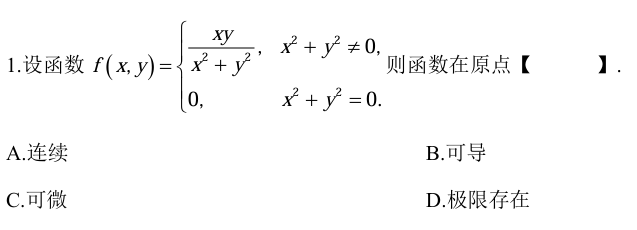

检验极限存在性 (选项 D)
要判断函数在原点的极限 $\lim_{(x, y) \to (0, 0)} f(x, y)$ 是否存在，我们可以尝试从不同路径趋近于原点。如果沿不同路径得到的极限值不同，则极限不存在。
路径1：沿直线 $y = kx$ 趋近于原点
当 $(x, y)$ 沿直线 $y=kx$ 趋近于 $(0, 0)$ 时（即 $x \to 0$），我们有：
$\lim_{x \to 0} f(x, kx) = \lim_{x \to 0} \frac{x(kx)}{x^2 + (kx)^2} = \lim_{x \to 0} \frac{kx^2}{x^2(1 + k^2)} = \frac{k}{1 + k^2}$
这个极限值依赖于 $k$ 的取值。
例如，如果沿 x 轴（$k=0$），极限为 0。
如果沿直线 $y=x$（$k=1$），极限为 $\frac{1}{1+1^2} = \frac{1}{2}$。
如果沿直线 $y=2x$（$k=2$），极限为 $\frac{2}{1+2^2} = \frac{2}{5}$。
因为沿不同路径趋近原点时，函数有不同的极限值，所以函数在原点的极限不存在。
因此，选项 D (极限存在) 是错误的。

检验连续性 (选项 A)
函数在一点连续的定义是：在该点的极限值等于函数值。即 $\lim_{(x, y) \to (0, 0)} f(x, y) = f(0, 0)$。
我们已经知道 $f(0, 0) = 0$。
但我们在上一步证明了 $\lim_{(x, y) \to (0, 0)} f(x, y)$ 不存在。
因为极限不存在，所以函数在原点不满足连续的条件。
因此，选项 A (连续) 是错误的。

检验可微性 (选项 C)
一个重要的定理是：如果一个函数在某一点可微，那么它在该点一定连续。
我们已经证明了函数 $f(x, y)$ 在原点不连续。
根据上述定理的逆否命题（不连续则一定不可微），我们可以直接得出结论：函数 $f(x, y)$ 在原点不可微。
因此，选项 C (可微) 是错误的。

检验偏导数存在性 (选项 B)
“可导”在多元函数中通常指偏导数存在。我们来根据偏导数的定义计算函数在原点的偏导数。
对 x 的偏导数 $f_x(0, 0)$
$f_x(0, 0) = \lim_{\Delta x \to 0} \frac{f(0 + \Delta x, 0) - f(0, 0)}{\Delta x}$
$= \lim_{\Delta x \to 0} \frac{f(\Delta x, 0) - 0}{\Delta x}$
$= \lim_{\Delta x \to 0} \frac{\frac{(\Delta x)(0)}{(\Delta x)^2 + 0^2}}{\Delta x}$
$= \lim_{\Delta x \to 0} \frac{0}{\Delta x} = \lim_{\Delta x \to 0} 0 = 0$
所以，$f_x(0, 0)$ 存在且等于 0。
对 y 的偏导数 $f_y(0, 0)$
$f_y(0, 0) = \lim_{\Delta y \to 0} \frac{f(0, 0 + \Delta y) - f(0, 0)}{\Delta y}$
$= \lim_{\Delta y \to 0} \frac{f(0, \Delta y) - 0}{\Delta y}$
$= \lim_{\Delta y \to 0} \frac{\frac{(0)(\Delta y)}{0^2 + (\Delta y)^2}}{\Delta y}$
$= \lim_{\Delta y \to 0} \frac{0}{\Delta y} = \lim_{\Delta y \to 0} 0 = 0$
所以，$f_y(0, 0)$ 存在且等于 0。
因为函数在原点对 x 和对 y 的偏导数都存在，所以函数在原点是“可导”的（即偏导数存在）。
因此，选项 B (可导) 是正确的。

### 例题2

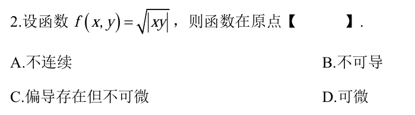

检验连续性
函数在一点连续，需要满足 $\lim_{(x, y) \to (a, b)} f(x, y) = f(a, b)$。我们检验原点 `$(0, 0)``。
计算函数值：
$f(0, 0) = \sqrt{|0 \cdot 0|} = 0$
计算极限值：
我们要计算 $\lim_{(x, y) \to (0, 0)} \sqrt{|xy|}$。
我们可以使用夹逼定理（Squeeze Theorem）。
我们知道不等式 $0 \le |x| \le \sqrt{x^2+y^2}$ 和 $0 \le |y| \le \sqrt{x^2+y^2}$。
因此，$0 \le |xy| = |x||y| \le (\sqrt{x^2+y^2})^2 = x^2+y^2$。
两边开方，得到：
$0 \le \sqrt{|xy|} \le \sqrt{x^2+y^2}$
当 $(x, y) \to (0, 0)$ 时，$\lim_{(x, y) \to (0, 0)} \sqrt{x^2+y^2} = 0$。
根据夹逼定理，我们有：
$\lim_{(x, y) \to (0, 0)} \sqrt{|xy|} = 0$
比较极限值与函数值：
因为 $\lim_{(x, y) \to (0, 0)} f(x, y) = 0 = f(0, 0)$，所以函数在原点是连续的。
因此，选项 A (不连续) 是错误的。

检验偏导数存在性
我们根据偏导数的定义来计算 $f_x(0, 0)$ 和 $f_y(0, 0)$。
对 x 的偏导数 $f_x(0, 0)$
$f_x(0, 0) = \lim_{\Delta x \to 0} \frac{f(0 + \Delta x, 0) - f(0, 0)}{\Delta x}$
$= \lim_{\Delta x \to 0} \frac{\sqrt{|\Delta x \cdot 0|} - 0}{\Delta x}$
$= \lim_{\Delta x \to 0} \frac{0}{\Delta x} = \lim_{\Delta x \to 0} 0 = 0$
所以，$f_x(0, 0)$ 存在且等于 0。
对 y 的偏导数 $f_y(0, 0)$
$f_y(0, 0) = \lim_{\Delta y \to 0} \frac{f(0, 0 + \Delta y) - f(0, 0)}{\Delta y}$
$= \lim_{\Delta y \to 0} \frac{\sqrt{|0 \cdot \Delta y|} - 0}{\Delta y}$
$= \lim_{\Delta y \to 0} \frac{0}{\Delta y} = \lim_{\Delta y \to 0} 0 = 0$
所以，$f_y(0, 0)$ 存在且等于 0。
结论：函数在原点的两个偏导数都存在且为 0。

检验可微性
函数在一点可微的定义是，其全增量可以表示为线性主部和高阶无穷小的和。具体来说，我们需要检验以下极限是否为 0：
$\lim_{(x, y) \to (0, 0)} \frac{f(x, y) - f(0, 0) - f_x(0, 0)x - f_y(0, 0)y}{\sqrt{x^2 + y^2}} = 0$
将我们已经求得的值代入：
$f(0, 0) = 0$, $f_x(0, 0) = 0$, $f_y(0, 0) = 0$
需要检验的极限是：
$\lim_{(x, y) \to (0, 0)} \frac{\sqrt{|xy|} - 0 - 0 \cdot x - 0 \cdot y}{\sqrt{x^2 + y^2}} = \lim_{(x, y) \to (0, 0)} \frac{\sqrt{|xy|}}{\sqrt{x^2 + y^2}}$
我们再次使用路径法来检验这个极限。
路径：沿直线 $y = kx$ 趋近于原点
$\lim_{x \to 0} \frac{\sqrt{|x \cdot kx|}}{\sqrt{x^2 + (kx)^2}} = \lim_{x \to 0} \frac{\sqrt{|k|x^2}}{\sqrt{x^2(1+k^2)}} = \lim_{x \to 0} \frac{\sqrt{|k|}|x|}{|x|\sqrt{1+k^2}} = \frac{\sqrt{|k|}}{\sqrt{1+k^2}}$
这个极限值依赖于 $k$。例如：
当 $k=1$ (沿 $y=x$ 路径) 时，极限为 $\frac{\sqrt{1}}{\sqrt{1+1}} = \frac{1}{\sqrt{2}}$。
当 $k=2$ (沿 $y=2x$ 路径) 时，极限为 $\frac{\sqrt{2}}{\sqrt{1+4}} = \sqrt{\frac{2}{5}}$。
因为极限值不唯一，所以 $\lim_{(x, y) \to (0, 0)} \frac{\sqrt{|xy|}}{\sqrt{x^2 + y^2}}$ 不存在，更不等于 0。
因此，函数在原点是不可微的。
所以，选项 D (可微) 是错误的。
最终结论
综合我们的分析：
函数在原点连续。
函数在原点的偏导数 $f_x(0,0) 和 `$f_y(0,0)`` 都存在。
函数在原点不可微。
现在我们来评估选项：
A. 不连续：错误。
B. 不可导：正确，因为不可微就是一种不可导。
C. 偏导存在但不可微：正确，并且比 B 选项更精确地描述了函数的性质。
D. 可微：错误。
在多项选择题中，我们应选择最全面、最准确的描述。选项 C “偏导存在但不可微” 完美地总结了我们的分析结果，比选项 B “不可导” 提供了更多的信息。
所以，正确的选项是 C。

# 重积分
## 例题

### 格林公式
若函数 $P(x,y)$ 和 $Q(x,y)$ 在xy平面上的一个单连通闭区域 $D$ 上具有一阶连续偏导数，$L$ 是 $D$ 的分段光滑的边界曲线，取逆时针方向为正方向，则有：
$\oint_L Pdx + Qdy = \iint_D (\frac{\partial Q}{\partial x} - \frac{\partial P}{\partial y}) dA$
其中 $dA$ 是区域 $D$ 上的面积微元，在直角坐标系下通常写作 $dxdy$。
这个公式的强大之处在于，它允许我们在计算复杂的线积分和相对简单的二重积分之间进行选择。

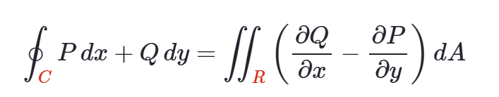

顺时针闭合路径则上式右边取负号

https://zh.khanacademy.org/math/multivariable-calculus/greens-theorem-and-stokes-theorem/greens-theorem-articles/a/greens-theorem-examples

### 例题1

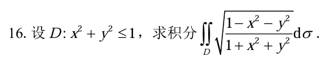

极坐标：
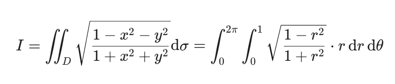

换元有理化：

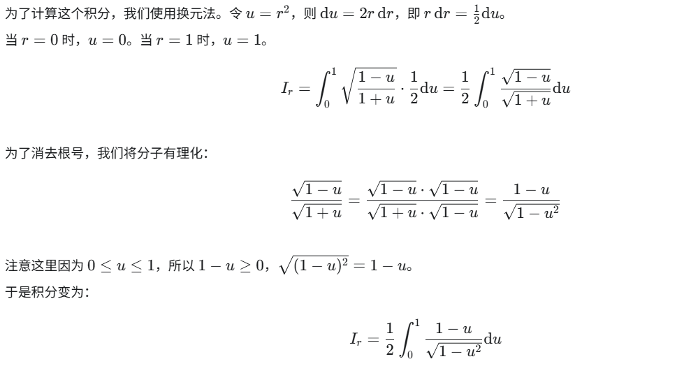

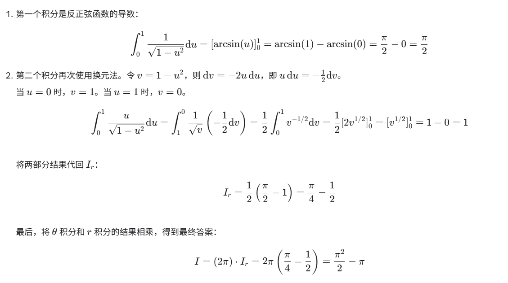

### 例题2
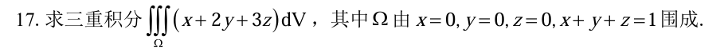

找到x，y，z的范围然后一个个的积分

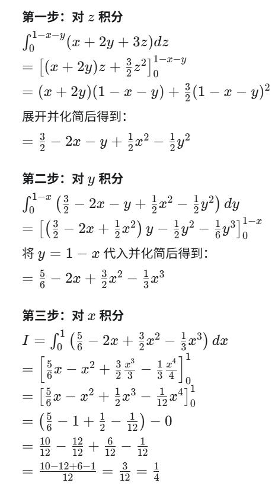

### 例题3

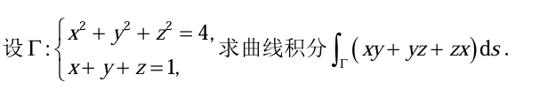

在计算曲线积分时，一个非常重要的技巧是观察被积函数$f(x, y, z)$是否能通过积分路径$\Gamma$的方程进行化简。
观察积分路径$\Gamma$的方程：
方程一：$x^2 + y^2 + z^2 = 4$
方程二：$x + y + z = 1$
观察被积函数：
$f(x, y, z) = xy + yz + zx$
建立联系：
我们注意到被积函数$xy + yz + zx$和$x^2 + y^2 + z^2$都是完全平方公式$(x+y+z)^2$的组成部分。
完全平方公式为：$(x + y + z)^2 = x^2 + y^2 + z^2 + 2(xy + yz + zx)$。
代入化简：
对于曲线上任意一点$(x, y, z)$，它都同时满足$\Gamma$的两个方程。因此，我们可以将这两个方程代入到完全平方公式中：
将$x + y + z = 1$代入左边，得到$1^2 = 1$。
将$x^2 + y^2 + z^2 = 4$代入右边。
于是我们得到：
$1^2 = 4 + 2(xy + yz + zx)$
$1 = 4 + 2(xy + yz + zx)$
解出被积函数的值：
从上式中解出$xy + yz + zx$：
$2(xy + yz + zx) = 1 - 4 = -3$
$xy + yz + zx = -3/2$

代入常数值：
$\int_{\Gamma} (xy + yz + zx)ds = \int_{\Gamma} (-3/2)ds$
提出常数：
$= -3/2 \int_{\Gamma} ds$
理解$\int_{\Gamma} ds$的含义：
第一类曲线积分$\int_{\Gamma} ds$的几何意义是曲线$\Gamma$的弧长。我们记$\Gamma$的弧长为$L$，则$L = \int_{\Gamma} ds$。
因此，原问题转化为了求$-3/2 \times L$，即我们需要先求出曲线$\Gamma$的长度。

分析$\Gamma$的几何形状：
$x^2 + y^2 + z^2 = 4$代表一个以原点$O(0, 0, 0)$为球心，半径$R=2$的球面。
$x + y + z = 1$代表一个平面。
一个球面与一个平面相交，其交线是一个圆（在特殊情况下也可能是一个点或不存在）。
计算交线圆的半径$r$：
为了求圆的周长（即弧长$L$），我们需要知道这个圆的半径$r$。我们可以利用球心、平面和交线圆心构成的直角三角形关系来求解。
球的半径$R$: 已知$R=2$。
球心到平面的距离$d$: 球心是$O(0, 0, 0)$，平面方程是$x + y + z - 1 = 0$。点到平面的距离公式为$d = \frac{|Ax_0 + By_0 + Cz_0 + D|}{\sqrt{A^2 + B^2 + C^2}}$。
代入数值：$d = \frac{|1 \cdot 0 + 1 \cdot 0 + 1 \cdot 0 - 1|}{\sqrt{1^2 + 1^2 + 1^2}} = \frac{|-1|}{\sqrt{3}} = \frac{1}{\sqrt{3}}$。
勾股定理： 球的半径$R$、球心到平面的距离$d$和交线圆的半径$r$构成一个直角三角形，其中$R$是斜边。它们满足关系：$R^2 = d^2 + r^2$。
$2^2 = (\frac{1}{\sqrt{3}})^2 + r^2$
$4 = 1/3 + r^2$
$r^2 = 4 - 1/3 = 11/3$
所以，交线圆的半径为$r = \sqrt{11/3}$。

计算弧长$L$：
曲线$\Gamma$是半径为$r$的圆，其弧长就是这个圆的周长。
$L = 2\pi r = 2\pi \sqrt{11/3}$。

现在我们已经求出了弧长$L$，可以代回到第二步的表达式中。
$\int_{\Gamma} (xy + yz + zx)ds = -3/2 \times L$
$= -3/2 \times (2\pi \sqrt{11/3})$
$= -3\pi \sqrt{11/3}$
为了美化结果，可以进一步化简：
$-3\pi \frac{\sqrt{11}}{\sqrt{3}} = -\frac{3\pi\sqrt{11}\sqrt{3}}{3} = -\pi\sqrt{11}\sqrt{3} = -\pi\sqrt{33}$
最终答案： $-\pi\sqrt{33}$

# 无穷级数

## 级数的收敛与性质
一个无穷级数 $\sum_{n=1}^{\infty} a_n = a_1 + a_2 + a_3 + \dots$ 如果它的部分和序列 $\{S_N\}$ 收敛到一个有限的极限 S，那么我们称这个级数是收敛的，并且称 S 为这个级数的和。如果部分和序列不收敛（即极限不存在或为无穷大），那么我们称这个级数是发散的。

例：考虑几何级数 $\sum_{n=0}^{\infty} \left(\frac{1}{2}\right)^n$。

前 N+1 项的部分和是：
$S_N = \left(\frac{1}{2}\right)^0 + \left(\frac{1}{2}\right)^1 + \dots + \left(\frac{1}{2}\right)^N = 1 + \frac{1}{2} + \dots + \frac{1}{2^N}$

根据几何级数求和公式 $\frac{a(1-r^{N+1})}{1-r}$ (其中 a=1, r=1/2)：
$S_N = \frac{1 \cdot (1 - (1/2)^{N+1})}{1 - 1/2} = \frac{1 - (1/2)^{N+1}}{1/2} = 2(1 - (1/2)^{N+1}) = 2 - \frac{1}{2^N}$

现在我们计算部分和的极限：
$\lim_{N \to \infty} S_N = \lim_{N \to \infty} \left(2 - \frac{1}{2^N}\right) = 2 - 0 = 2$

因为极限存在且为有限值 2，所以级数 $\sum_{n=0}^{\infty} \left(\frac{1}{2}\right)^n$ 收敛，其和为 2。

例：考虑几何级数 $\sum_{n=0}^{\infty} 2^n$。
这里的通项是 $a_n = 2^n$。

前 N+1 项的部分和是：
$S_N = 2^0 + 2^1 + \dots + 2^N = 1 + 2 + \dots + 2^N$

根据几何级数求和公式：
$S_N = \frac{1 \cdot (1 - 2^{N+1})}{1 - 2} = \frac{1 - 2^{N+1}}{-1} = 2^{N+1} - 1$

现在我们计算部分和的极限：
$\lim_{N \to \infty} S_N = \lim_{N \to \infty} (2^{N+1} - 1) = \infty$
因为极限为无穷大，所以级数 $\sum_{n=0}^{\infty} 2^n$ 发散。

例：线性性质的应用

已知 $\sum_{n=1}^{\infty} \frac{1}{2^n} = 1$ (因为 $\sum_{n=0}^{\infty} (1/2)^n = 2$, 所以 $\sum_{n=1}^{\infty} (1/2)^n = 2 - (1/2)^0 = 2-1 = 1$)，且 $\sum_{n=1}^{\infty} \frac{1}{3^n} = \frac{1/3}{1-1/3} = \frac{1/3}{2/3} = \frac{1}{2}$。

计算级数 $\sum_{n=1}^{\infty} \left(\frac{5}{2^n} - \frac{2}{3^n}\right)$。

根据线性性质：
$\sum_{n=1}^{\infty} \left(\frac{5}{2^n} - \frac{2}{3^n}\right) = 5 \sum_{n=1}^{\infty} \frac{1}{2^n} - 2 \sum_{n=1}^{\infty} \frac{1}{3^n}$
$= 5 \cdot (1) - 2 \cdot \left(\frac{1}{2}\right)$
$= 5 - 1 = 4$
所以，级数 $\sum_{n=1}^{\infty} \left(\frac{5}{2^n} - \frac{2}{3^n}\right)$ 收敛到 4。

例：使用必要条件判断发散

判断级数 $\sum_{n=1}^{\infty} \frac{n}{2n+1}$ 的敛散性。
首先计算通项的极限：
$\lim_{n \to \infty} a_n = \lim_{n \to \infty} \frac{n}{2n+1}$
将分子分母同除以 n：
$= \lim_{n \to \infty} \frac{1}{2 + 1/n} = \frac{1}{2 + 0} = \frac{1}{2}$
因为 $\lim_{n \to \infty} a_n = \frac{1}{2} \neq 0$，根据收敛的必要条件（如果级数 $\sum_{n=1}^{\infty} a_n$ 收敛，那么其通项的极限必定为 0：
$\lim_{n \to \infty} a_n = 0$），级数 $\sum_{n=1}^{\infty} \frac{n}{2n+1}$ 发散。

例：必要条件不充分的例子 (调和级数)

考虑调和级数 $\sum_{n=1}^{\infty} \frac{1}{n}$。
首先计算通项的极限：
$\lim_{n \to \infty} a_n = \lim_{n \to \infty} \frac{1}{n} = 0$
虽然通项的极限为 0，但调和级数是著名的发散级数。这说明 $\lim_{n \to \infty} a_n = 0$ 只是收敛的必要条件，而不是充分条件。

例：增减有限项

我们知道 $\sum_{n=1}^{\infty} \frac{1}{2^n} = 1$ 是收敛的。
考虑级数 $\sum_{n=100}^{\infty} \frac{1}{2^n}$。
这个级数是原级数去掉了前 99 项。既然原级数收敛，那么这个级数也必定收敛。
它的和是 $\sum_{n=1}^{\infty} \frac{1}{2^n} - \sum_{n=1}^{99} \frac{1}{2^n}$。
同样，如果一个级数 $\sum_{n=1}^{\infty} a_n$ 发散，那么 $\sum_{n=K}^{\infty} a_n$ 也发散，反之亦然。

一个p-级数是形如 $\sum_{n=1}^{\infty} \frac{1}{n^p}$ 的级数，其中 p 是一个正实数常数。p>1，级数收敛

例：收敛的p-级数

判断级数 $\sum_{n=1}^{\infty} \frac{1}{n^2}$ 的敛散性。
这里 p = 2。由于 p = 2 > 1，根据p-级数判别法，级数 $\sum_{n=1}^{\infty} \frac{1}{n^2}$ 收敛。
补充知识：虽然我们知道它收敛，但计算其和是一个著名的数学问题，其和为 $\frac{\pi^2}{6}$ (巴塞尔问题)。

一个几何级数是形如 $\sum_{n=0}^{\infty} ar^n$ 或 $\sum_{n=1}^{\infty} ar^{n-1}$ 的级数，其中 a 是首项 ($a \neq 0$)，r 是公比。你提到的 q^n 形式可以看作是 a=1 的特例，或者将 q 视为公比 r。我们通常使用 r 来表示公比。

如果 |r| < 1 (即 -1 < r < 1)，则几何级数 收敛。其和为 $\frac{a}{1-r}$ (当 n 从 0 开始时)。
如果 $|r| \ge 1$，则几何级数发散。

例：收敛的几何级数

判断级数 $\sum_{n=1}^{\infty} \frac{3}{5^n}$ 的敛散性，如果收敛，计算其和。

我们可以将它写成 $\sum_{n=1}^{\infty} 3 \left(\frac{1}{5}\right)^n$。
这里 a 可以看作 3/5 (当 n=1 时，首项是 3/5)，公比 r = 1/5。
由于 |r| = |1/5| = 1/5 < 1，所以级数 收敛。

计算其和：
当 n 从 1 开始时，使用公式 $\frac{a_1}{1-r}$，其中 $a_1$ 是第一项。
$a_1 = 3 \cdot (1/5)^1 = 3/5$
$S = \frac{3/5}{1 - 1/5} = \frac{3/5}{4/5} = \frac{3}{4}$

## 正项级数与审敛法
一个级数 $\sum_{n=1}^{\infty} a_n$ 如果它的每一项 $\boldsymbol{a_n}$ 都大于或等于零（即 $\boldsymbol{a_n \ge 0}$），那么这个级数就称为正项级数。

核心性质：
正项级数有一个非常重要的性质：它的部分和序列 $\boldsymbol{S_N = \sum_{n=1}^{N} a_n}$ 是一个单调不减的序列。这意味着部分和要么趋于一个有限值（收敛），要么趋于无穷大（发散）。因此，对于正项级数，我们只需要判断它的部分和是否有上界即可确定其收敛性。如果有上界，则收敛；如果没有上界，则发散。

比较判别法：假设 $\sum_{n=1}^{\infty} a_n$ 和 $\sum_{n=1}^{\infty} b_n$ 都是正项级数。
如果存在正整数 $\boldsymbol{N}$，使得当 $\boldsymbol{n > N}$ 时，有 $\boldsymbol{a_n \le b_n}$：
若 $\sum_{n=1}^{\infty} b_n$ 收敛，则 $\sum_{n=1}^{\infty} a_n$ 也收敛。
若 $\sum_{n=1}^{\infty} a_n$ 发散，则 $\sum_{n=1}^{\infty} b_n$ 也发散。
如果存在正整数 $\boldsymbol{N}$，使得当 $\boldsymbol{n > N}$ 时，有 $\boldsymbol{a_n \ge b_n}$：
若 $\sum_{n=1}^{\infty} b_n$ 发散，则 $\sum_{n=1}^{\infty} a_n$ 也发散。
若 $\sum_{n=1}^{\infty} a_n$ 收敛，则 $\sum_{n=1}^{\infty} b_n$ 也收敛。

例：判断级数 $\sum_{n=1}^{\infty} \frac{1}{n^2+1}$ 的敛散性。

我们知道级数 $\sum_{n=1}^{\infty} \frac{1}{n^2}$ 是一个 p-级数，且 $\boldsymbol{p=2 > 1}$，因此它收敛。
对于待判级数，当 $\boldsymbol{n \ge 1}$ 时，有 $\boldsymbol{n^2+1 > n^2}$，所以 $\boldsymbol{\frac{1}{n^2+1} < \frac{1}{n^2}}$。
由于 $\sum_{n=1}^{\infty} \frac{1}{n^2}$ 收敛，根据比较审敛法，级数 $\sum_{n=1}^{\infty} \frac{1}{n^2+1}$ 也收敛。

比值法：假设 $\sum_{n=1}^{\infty} a_n$ 和 $\sum_{n=1}^{\infty} b_n$ 都是正项级数。
如果 $\lim_{n \to \infty} \frac{a_n}{b_n} = L$，其中 $\boldsymbol{L}$ 是一个有限的正数（即 $\boldsymbol{0 < L < \infty}$），那么 $\sum_{n=1}^{\infty} a_n$ 和 $\sum_{n=1}^{\infty} b_n$ 要么同时收敛，要么同时发散。

例：判断级数 $\sum_{n=1}^{\infty} \frac{2n+1}{3n^3-n}$ 的敛散性。

当 $\boldsymbol{n}$ 很大时，$\boldsymbol{a_n = \frac{2n+1}{3n^3-n}}$ 大致等价于 $\boldsymbol{\frac{2n}{3n^3} = \frac{2}{3n^2}}$。
因此，我们选择已知收敛的 p-级数 $\sum_{n=1}^{\infty} \frac{1}{n^2}$ 作为比较对象，令 $\boldsymbol{b_n = \frac{1}{n^2}}$。
计算极限：
$\lim_{n \to \infty} \frac{a_n}{b_n} = \lim_{n \to \infty} \frac{\frac{2n+1}{3n^3-n}}{\frac{1}{n^2}} = \lim_{n \to \infty} \frac{n^2(2n+1)}{3n^3-n} = \lim_{n \to \infty} \frac{2n^3+n^2}{3n^3-n}$
$= \lim_{n \to \infty} \frac{2 + \frac{1}{n}}{3 - \frac{1}{n^2}} = \frac{2}{3}$
由于 $\boldsymbol{L = \frac{2}{3}}$ 是一个有限且大于零的数，且 $\sum_{n=1}^{\infty} \frac{1}{n^2}$ 收敛，根据极限形式的比较审敛法，级数 $\sum_{n=1}^{\infty} \frac{2n+1}{3n^3-n}$ 也收敛。

相邻比值法：假设 $\sum_{n=1}^{\infty} a_n$ 是正项级数。
计算 $\lim_{n \to \infty} \frac{a_{n+1}}{a_n} = L$。
如果 $\boldsymbol{L < 1}$，则级数收敛。
如果 $\boldsymbol{L > 1}$ 或 $\boldsymbol{L = \infty}$，则级数发散。
如果 $\boldsymbol{L = 1}$，则比值审敛法失效，需要使用其他方法判断。

例：判断级数 $\sum_{n=1}^{\infty} \frac{n^2}{2^n}$ 的敛散性。

设 $\boldsymbol{a_n = \frac{n^2}{2^n}}$，则 $\boldsymbol{a_{n+1} = \frac{(n+1)^2}{2^{n+1}}}$。

计算极限：
$\lim_{n \to \infty} \frac{a_{n+1}}{a_n} = \lim_{n \to \infty} \frac{\frac{(n+1)^2}{2^{n+1}}}{\frac{n^2}{2^n}} = \lim_{n \to \infty} \frac{(n+1)^2}{2^{n+1}} \cdot \frac{2^n}{n^2}$
$= \lim_{n \to \infty} \frac{(n+1)^2}{2n^2} = \lim_{n \to \infty} \frac{n^2+2n+1}{2n^2} = \lim_{n \to \infty} \left( \frac{1}{2} + \frac{1}{n} + \frac{1}{2n^2} \right) = \frac{1}{2}$
由于 $\boldsymbol{L = \frac{1}{2} < 1}$，根据比值审敛法，级数 $\sum_{n=1}^{\infty} \frac{n^2}{2^n}$ 收敛。

根值法：假设 $\sum_{n=1}^{\infty} a_n$ 是正项级数。
计算 $\lim_{n \to \infty} \sqrt[n]{a_n} = L$。
如果 $\boldsymbol{L < 1}$，则级数收敛。
如果 $\boldsymbol{L > 1}$ 或 $\boldsymbol{L = \infty}$，则级数发散。
如果 $\boldsymbol{L = 1}$，则根值审敛法失效，需要使用其他方法判断。

例：判断级数 $\sum_{n=1}^{\infty} \left( \frac{n}{2n+1} \right)^n$ 的敛散性。

设 $\boldsymbol{a_n = \left( \frac{n}{2n+1} \right)^n}$。
计算极限：
$\lim_{n \to \infty} \sqrt[n]{a_n} = \lim_{n \to \infty} \sqrt[n]{\left( \frac{n}{2n+1} \right)^n} = \lim_{n \to \infty} \frac{n}{2n+1}$
$= \lim_{n \to \infty} \frac{1}{2 + \frac{1}{n}} = \frac{1}{2}$
由于 $\boldsymbol{L = \frac{1}{2} < 1}$，根据根值审敛法，级数 $\sum_{n=1}^{\infty} \left( \frac{n}{2n+1} \right)^n$ 收敛。

积分判别法：假设 $\boldsymbol{f(x)}$ 是一个在 $\boldsymbol{[1, \infty)}$ 上正的、连续的、单调递减的函数，且当 $\boldsymbol{n}$ 是正整数时，$\boldsymbol{a_n = f(n)}$。
那么级数 $\sum_{n=1}^{\infty} a_n$ 与广义积分 $\int_{1}^{\infty} f(x) \, dx$ 要么同时收敛，要么同时发散。

例：判断 p-级数 $\sum_{n=1}^{\infty} \frac{1}{n^p}$ 的敛散性（其中 $\boldsymbol{p}$ 为常数）。

令 $\boldsymbol{f(x) = \frac{1}{x^p}}$。当 $\boldsymbol{x \ge 1}$ 时，如果 $\boldsymbol{p > 0}$，$\boldsymbol{f(x)}$ 是正的、连续的、单调递减的函数。
我们需要判断广义积分 $\int_{1}^{\infty} \frac{1}{x^p} \, dx$ 的敛散性。

情况1：$\boldsymbol{p = 1}$，
$\int_{1}^{\infty} \frac{1}{x} \, dx = \lim_{b \to \infty} [\ln|x|]_{1}^{b} = \lim_{b \to \infty} (\ln b - \ln 1) = \infty$
积分发散，所以级数 $\sum_{n=1}^{\infty} \frac{1}{n}$ (调和级数) 发散。

情况2：$\boldsymbol{p \ne 1}$，
$\int_{1}^{\infty} x^{-p} \, dx = \lim_{b \to \infty} \left[ \frac{x^{-p+1}}{-p+1} \right]_{1}^{b} = \lim_{b \to \infty} \frac{1}{1-p} (b^{1-p} - 1)$
如果 $\boldsymbol{1-p < 0}$（即 $\boldsymbol{p > 1}$），那么 $\boldsymbol{\lim_{b \to \infty} b^{1-p} = 0}$。
此时积分 $\boldsymbol{= \frac{1}{1-p} (-1) = \frac{1}{p-1}}$，积分收敛。
所以当 $\boldsymbol{p > 1}$ 时，级数 $\sum_{n=1}^{\infty} \frac{1}{n^p}$ 收敛。
如果 $\boldsymbol{1-p > 0}$（即 $\boldsymbol{p < 1}$），那么 $\boldsymbol{\lim_{b \to \infty} b^{1-p} = \infty}$。
此时积分发散。
所以当 $\boldsymbol{p < 1}$ 时，级数 $\sum_{n=1}^{\infty} \frac{1}{n^p}$ 发散。

## 交错级数与收敛法
交错级数是指数项符号交替出现的无穷级数。换句话说，它的每一项的符号与其前一项的符号相反。

一个交错级数通常可以写成以下两种形式之一，其中 a_n > 0 对于所有的 n 都成立：
$\sum_{n=1}^{\infty} (-1)^{n+1} a_n = a_1 - a_2 + a_3 - a_4 + \dots$

$\sum_{n=1}^{\infty} (-1)^{n} a_n = -a_1 + a_2 - a_3 + a_4 - \dots$

莱布尼茨判别法：对于一个交错级数 $\sum_{n=1}^{\infty} (-1)^{n+1} a_n$ 或 $\sum_{n=1}^{\infty} (-1)^{n} a_n$ （其中 a_n > 0），如果满足以下两个条件：

单调递减性： 序列 $\{a_n\}$ 是单调不增的，即对于所有 n (或至少对于足够大的 n)，有 $a_{n+1} \le a_n$。

极限为零： 序列 $\{a_n\}$ 的极限为零，即 $\lim_{n \to \infty} a_n = 0$。

结论：
如果以上两个条件都满足，那么该交错级数是收敛的。

这个测试只告诉我们级数是否收敛，但不能告诉我们它收敛到哪个值，也不能判断它是绝对收敛还是条件收敛。

例：判断级数 $\sum_{n=1}^{\infty} (-1)^{n+1} \frac{1}{n}$ 是否收敛。

这个级数是著名的交错调和级数。
识别 a_n： 在这个级数中，$a_n= \frac{1}{n}$。显然 a_n > 0。

检查单调递减性：
对于$n \ge 1$，我们有 $\frac{1}{n+1} \le \frac{1}{n}$。因此，序列 $\{a_n\}$ 是单调递减的。

检查极限为零：
计算 $\lim_{n \to \infty} a_n = \lim_{n \to \infty} \frac{1}{n} = 0$。
结论：
由于两个条件都满足，根据交错级数收敛法，级数 $\sum_{n=1}^{\infty} (-1)^{n+1} \frac{1}{n}$ 是收敛的。

## 绝对收敛性
对于一个无穷级数 $\sum_{n=1}^{\infty} a_n$ (其中 $a_n$ 可以是正数、负数或复数)，如果由其各项的绝对值所构成的级数 $\sum_{n=1}^{\infty} |a_n|$ 收敛，那么我们称原级数 $\sum_{n=1}^{\infty} a_n$ 是绝对收敛的。

重要定理：绝对收敛的级数必定收敛。
即，如果 $\sum_{n=1}^{\infty} |a_n|$ 收敛，那么 $\sum_{n=1}^{\infty} a_n$ 也一定收敛。

性质1 (收敛性)： 如上所述，绝对收敛的级数必定收敛。这是最重要的性质。

性质2 (重排不变性/任意重排级数收敛且和不变)： 如果级数 $\sum_{n=1}^{\infty} a_n$ 绝对收敛，那么无论如何改变级数中各项的顺序（即任意重排），得到的新级数仍然绝对收敛，并且其和与原级数的和相同。
例如，如果 $\sum_{n=1}^{\infty} a_n = S$ 且绝对收敛，设 $\sigma(n)$ 是自然数集 $\{1, 2, 3, \dots\}$ 的一个排列 (bijection)，那么级数 $\sum_{n=1}^{\infty} a_{\sigma(n)}$ 也绝对收敛且其和也为 $S$。

对比： 条件收敛的级数（如交错调和级数）在重排后可以收敛到任意指定的实数，甚至发散（黎曼重排定理）。

性质3 (和差的绝对收敛性)： 如果级数 $\sum_{n=1}^{\infty} a_n$ 和 $\sum_{n=1}^{\infty} b_n$ 都绝对收敛，那么它们的和级数 $\sum_{n=1}^{\infty} (a_n + b_n)$ 与差级数 $\sum_{n=1}^{\infty} (a_n - b_n)$也都绝对收敛。
这是因为 $|a_n + b_n| \le |a_n| + |b_n|$ 和 $|a_n - b_n| \le |a_n| + |b_n|$，然后使用比较判别法。

性质4 (数乘的绝对收敛性)： 如果级数 $\sum_{n=1}^{\infty} a_n$ 绝对收敛，$c$ 为任意常数，那么级数 $\sum_{n=1}^{\infty} (c \cdot a_n)$ 也绝对收敛。
这是因为 $\sum_{n=1}^{\infty} |c \cdot a_n| = \sum_{n=1}^{\infty} |c| \cdot |a_n| = |c| \sum_{n=1}^{\infty} |a_n|$。如果 $\sum |a_n|$ 收敛，则 $|c| \sum |a_n|$ 也收敛 (除非 $c=0$，此时级数为0)。

性质5 (柯西乘积/级数乘法)： 如果级数 $\sum_{n=0}^{\infty} a_n = A$ 和 $\sum_{n=0}^{\infty} b_n = B$ 都绝对收敛，那么它们的柯西乘积级数 $\sum_{n=0}^{\infty} c_n$，其中 $c_n = \sum_{k=0}^{n} a_k b_{n-k}$，也绝对收敛，并且其和为 $A \cdot B$。
即 $(\sum_{n=0}^{\infty} a_n) \cdot (\sum_{n=0}^{\infty} b_n) = \sum_{n=0}^{\infty} (\sum_{k=0}^{n} a_k b_{n-k})$。

注意： 如果两个级数仅为条件收敛，它们的柯西乘积可能发散。

与绝对收敛相对的概念是条件收敛 (Conditional Convergence)。如果级数 $\sum_{n=1}^{\infty} a_n$ 收敛，但级数 $\sum_{n=1}^{\infty} |a_n|$ 发散，则称原级数 $\sum_{n=1}^{\infty} a_n$ 是条件收敛的。

例：判断级数 $\sum_{n=1}^{\infty} \frac{(-1)^{n+1}}{n^2}$ 的收敛性。

我们首先考察其绝对值构成的级数：
$\sum_{n=1}^{\infty} \left| \frac{(-1)^{n+1}}{n^2} \right| = \sum_{n=1}^{\infty} \frac{1}{n^2}$
这是一个p-级数 (p-series)，形式为 $\sum_{n=1}^{\infty} \frac{1}{n^p}$。在这里 $p=2$。
因为 $p=2 > 1$，所以p-级数 $\sum_{n=1}^{\infty} \frac{1}{n^2}$ 收敛。
由于绝对值级数收敛，根据绝对收敛的定义，原级数 $\sum_{n=1}^{\infty} \frac{(-1)^{n+1}}{n^2}$ 绝对收敛。
又因为绝对收敛的级数必定收敛，所以原级数 $\sum_{n=1}^{\infty} \frac{(-1)^{n+1}}{n^2}$ 收敛。

例：判断级数 $\sum_{n=1}^{\infty} \frac{\sin(n)}{n^3}$ 的收敛性。

我们考察其绝对值构成的级数：
$\sum_{n=1}^{\infty} \left| \frac{\sin(n)}{n^3} \right| = \sum_{n=1}^{\infty} \frac{|\sin(n)|}{n^3}$
我们知道，对于任意的 $n$，$0 \le |\sin(n)| \le 1$。
因此，$0 \le \frac{|\sin(n)|}{n^3} \le \frac{1}{n^3}$。
级数 $\sum_{n=1}^{\infty} \frac{1}{n^3}$ 是一个p-级数，其中 $p=3$。因为 $p=3 > 1$，所以级数 $\sum_{n=1}^{\infty} \frac{1}{n^3}$ 收敛。
根据比较判别法 (Comparison Test)，既然较大的级数 $\sum_{n=1}^{\infty} \frac{1}{n^3}$ 收敛，且 $\frac{|\sin(n)|}{n^3} \ge 0$，那么较小的级数 $\sum_{n=1}^{\infty} \frac{|\sin(n)|}{n^3}$ 也收敛。
所以，级数 $\sum_{n=1}^{\infty} \left| \frac{\sin(n)}{n^3} \right|$ 收敛。
因此，原级数 $\sum_{n=1}^{\infty} \frac{\sin(n)}{n^3}$ 绝对收敛，从而也收敛。

例：已知级数 $\sum_{n=1}^{\infty} a_n$ 和 $\sum_{n=1}^{\infty} b_n$ 都绝对收敛。证明级数 $\sum_{n=1}^{\infty} (3a_n - 2b_n)$ 也绝对收敛。

因为 $\sum_{n=1}^{\infty} a_n$ 绝对收敛，所以 $\sum_{n=1}^{\infty} |a_n|$ 收敛。
根据绝对收敛级数的性质4 (数乘)，级数 $\sum_{n=1}^{\infty} (3a_n)$ 绝对收敛，即 $\sum_{n=1}^{\infty} |3a_n| = 3 \sum_{n=1}^{\infty} |a_n|$ 收敛。
同理，因为 $\sum_{n=1}^{\infty} b_n$ 绝对收敛，所以 $\sum_{n=1}^{\infty} |b_n|$ 收敛。
级数 $\sum_{n=1}^{\infty} (-2b_n)$ 绝对收敛，即 $\sum_{n=1}^{\infty} |-2b_n| = 2 \sum_{n=1}^{\infty} |b_n|$ 收敛。
现在我们考虑级数 $\sum_{n=1}^{\infty} (3a_n - 2b_n)$。它的各项绝对值为 $|3a_n - 2b_n|$。
根据三角不等式，$|3a_n - 2b_n| \le |3a_n| + |-2b_n| = 3|a_n| + 2|b_n|$。
由于 $\sum_{n=1}^{\infty} 3|a_n|$ 收敛且 $\sum_{n=1}^{\infty} 2|b_n|$ 收敛，那么它们的和级数 $\sum_{n=1}^{\infty} (3|a_n| + 2|b_n|)$ 也收敛。
根据比较判别法，由于 $0 \le |3a_n - 2b_n| \le 3|a_n| + 2|b_n|$ 且级数 $\sum_{n=1}^{\infty} (3|a_n| + 2|b_n|)$ 收敛，
所以级数 $\sum_{n=1}^{\infty} |3a_n - 2b_n|$ 收敛。
因此，级数 $\sum_{n=1}^{\infty} (3a_n - 2b_n)$ 绝对收敛。
(或者直接使用性质3：由于 $\sum 3a_n$ 和 $\sum 2b_n$ 都绝对收敛，它们的差 $\sum (3a_n - 2b_n)$ 也绝对收敛。)

## 幂级数与收敛域
形如 $\sum_{n=0}^{\infty} c_n (x-a)^n = c_0 + c_1(x-a) + c_2(x-a)^2 + \dots$ 的级数称为在点 $a$ 处展开的幂级数 (Power Series)。

$c_n$ 是常数，称为级数的系数 (coefficients)。
$x$ 是变量。
$a$ 是常数，称为级数的中心 (center)。
一个特殊且常见的情况是当 $a=0$ 时，幂级数的形式为 $\sum_{n=0}^{\infty} c_n x^n = c_0 + c_1 x + c_2 x^2 + \dots$。

对于一个幂级数 $\sum_{n=0}^{\infty} c_n (x-a)^n$，存在一个非负数 $R$ (可以是 $0$，正数，或 $\infty$)，称为 收敛半径 (Radius of Convergence)，使得：
当 $|x-a| < R$ 时，级数绝对收敛。
当 $|x-a| > R$ 时，级数发散。
当 $|x-a| = R$ 时 (即在端点 $x = a-R$ 和 $x = a+R$)，级数的敛散性需要单独判断。

收敛域 (Interval of Convergence) 是指所有使幂级数收敛的 $x$ 值的集合。根据 $R$ 的值，收敛域有以下几种情况：
如果 $R=0$，级数只在 $x=a$ 处收敛，收敛域为 {a}。
如果 $R=\infty$，级数对所有实数 $x$ 都收敛，收敛域为 $(-\infty, \infty)$。
如果 $0 < R < \infty$，级数在开区间 $(a-R, a+R)$ 内绝对收敛。端点 $x=a-R$ 和 $x=a+R$ 的敛散性需要单独检验，收敛域可能是 $(a-R, a+R)$、$[a-R, a+R)$、$(a-R, a+R]$ 或 $[a-R, a+R]$。

如何求收敛半径 $R$：
通常使用 比值判别法 (Ratio Test) 或 根值判别法 (Root Test)。

比值判别法：
设 $L = \lim_{n \to \infty} \left| \frac{c_{n+1}(x-a)^{n+1}}{c_n(x-a)^n} \right| = \lim_{n \to \infty} \left| \frac{c_{n+1}}{c_n} \right| |x-a|$。
级数收敛要求 $L < 1$，即 $|x-a| < \lim_{n \to \infty} \left| \frac{c_n}{c_{n+1}} \right|$。
因此，收敛半径 $R = \lim_{n \to \infty} \left| \frac{c_n}{c_{n+1}} \right|$ (如果该极限存在)。
如果 $\lim_{n \to \infty} \left| \frac{c_{n+1}}{c_n} \right| = 0$，则 $R=\infty$。
如果 $\lim_{n \to \infty} \left| \frac{c_{n+1}}{c_n} \right| = \infty$，则 $R=0$。

根值判别法：
设 $L = \lim_{n \to \infty} \sqrt[n]{|c_n(x-a)^n|} = \lim_{n \to \infty} \sqrt[n]{|c_n|} |x-a|$。
级数收敛要求 $L < 1$，即 $|x-a| < \frac{1}{\lim_{n \to \infty} \sqrt[n]{|c_n|}}$。
因此，收敛半径 $R = \frac{1}{\lim_{n \to \infty} \sqrt[n]{|c_n|}}$ (如果该极限存在且不为0)。
如果 $\lim_{n \to \infty} \sqrt[n]{|c_n|} = 0$，则 $R=\infty$。
如果 $\lim_{n \to \infty} \sqrt[n]{|c_n|} = \infty$，则 $R=0$。

例： 求幂级数 $\sum_{n=1}^{\infty} \frac{x^n}{n}$ 的收敛半径和收敛域。

这是一个中心为 $a=0$，系数为 $c_n = \frac{1}{n}$ 的幂级数。
使用比值判别法求收敛半径 $R$:
$R = \lim_{n \to \infty} \left| \frac{c_n}{c_{n+1}} \right| = \lim_{n \to \infty} \left| \frac{1/n}{1/(n+1)} \right| = \lim_{n \to \infty} \frac{n+1}{n} = \lim_{n \to \infty} \left(1 + \frac{1}{n}\right) = 1$
所以收敛半径 $R=1$。
级数在开区间 $(0-1, 0+1) = (-1, 1)$ 内收敛。
现在检验端点：
当 $x=1$ 时，级数变为 $\sum_{n=1}^{\infty} \frac{1^n}{n} = \sum_{n=1}^{\infty} \frac{1}{n}$。这是调和级数，发散。
当 $x=-1$ 时，级数变为 $\sum_{n=1}^{\infty} \frac{(-1)^n}{n}$。这是交错调和级数，根据交错级数判别法，它收敛。
因此，收敛域为 $[-1, 1)$。

例： 求幂级数 $\sum_{n=0}^{\infty} \frac{(x-2)^n}{n!}$ 的收敛半径和收敛域。

这是一个中心为 $a=2$，系数为 $c_n = \frac{1}{n!}$ 的幂级数。
使用比值判别法求收敛半径 $R$:
$R = \lim_{n \to \infty} \left| \frac{c_n}{c_{n+1}} \right| = \lim_{n \to \infty} \left| \frac{1/n!}{1/(n+1)!} \right| = \lim_{n \to \infty} \frac{(n+1)!}{n!} = \lim_{n \to \infty} (n+1) = \infty$
所以收敛半径 $R=\infty$。
这意味着级数对所有实数 $x$ 都收敛。
因此，收敛域为 $(-\infty, \infty)$。

例： 求幂级数 $\sum_{n=0}^{\infty} n! x^n$ 的收敛半径和收敛域。

这是一个中心为 $a=0$，系数为 $c_n = n!$ 的幂级数。
使用比值判别法求收敛半径 $R$:
$R = \lim_{n \to \infty} \left| \frac{c_n}{c_{n+1}} \right| = \lim_{n \to \infty} \left| \frac{n!}{(n+1)!} \right| = \lim_{n \to \infty} \frac{1}{n+1} = 0$
所以收敛半径 $R=0$。
这意味着级数只在中心点 $x=0$ 处收敛。
当 $x=0$ 时，级数为 $0! \cdot 0^0 + 1! \cdot 0^1 + \dots = 1 + 0 + 0 + \dots = 1$ (约定 $0^0=1$ 在幂级数中是常见的)。
因此，收敛域为 {0}。

例： 求幂级数 $\sum_{n=1}^{\infty} \frac{(x+1)^n}{n^2 3^n}$ 的收敛半径和收敛域。

这是一个中心为 $a=-1$，系数为 $c_n = \frac{1}{n^2 3^n}$ 的幂级数。
使用比值判别法求收敛半径 $R$:
$R = \lim_{n \to \infty} \left| \frac{c_n}{c_{n+1}} \right| = \lim_{n \to \infty} \left| \frac{1/(n^2 3^n)}{1/((n+1)^2 3^{n+1})} \right| = \lim_{n \to \infty} \frac{(n+1)^2 3^{n+1}}{n^2 3^n}$

$R = \lim_{n \to \infty} \left(\frac{n+1}{n}\right)^2 \cdot 3 = \lim_{n \to \infty} \left(1+\frac{1}{n}\right)^2 \cdot 3 = 1^2 \cdot 3 = 3$
所以收敛半径 $R=3$。

级数在开区间 $(-1-3, -1+3) = (-4, 2)$ 内收敛。
现在检验端点：
当 $x=2$ 时，$x+1 = 3$。级数变为 $\sum_{n=1}^{\infty} \frac{3^n}{n^2 3^n} = \sum_{n=1}^{\infty} \frac{1}{n^2}$。这是一个p-级数，其中 $p=2 > 1$，所以它收敛。
当 $x=-4$ 时，$x+1 = -3$。级数变为 $\sum_{n=1}^{\infty} \frac{(-3)^n}{n^2 3^n} = \sum_{n=1}^{\infty} \frac{(-1)^n 3^n}{n^2 3^n} = \sum_{n=1}^{\infty} \frac{(-1)^n}{n^2}$。
这是一个交错级数。考察其绝对值级数 $\sum_{n=1}^{\infty} \left|\frac{(-1)^n}{n^2}\right| = \sum_{n=1}^{\infty} \frac{1}{n^2}$，我们已经知道它收敛。
因此，原级数在 $x=-4$ 处绝对收敛，所以也收敛。
因此，收敛域为 $[-4, 2]$。

abel-假设幂级数 $S(x) = \sum_{n=0}^{\infty} a_n x^n$ 的收敛半径为 $R$ ($0 < R < \infty$)。
如果级数在右端点 $x=R$ 处收敛，那么和函数 $S(x)$ 在 $x=R$ 处是左连续的。即：
$$\lim_{x \to R^-} S(x) = \lim_{x \to R^-} \left( \sum_{n=0}^{\infty} a_n x^n \right) = \sum_{n=0}^{\infty} a_n R^n$$
如果级数在左端点 $x=-R$ 处收敛，那么和函数 $S(x)$ 在 $x=-R$ 处是右连续的。即：
$$\lim_{x \to -R^+} S(x) = \lim_{x \to -R^+} \left( \sum_{n=0}^{\infty} a_n x^n \right) = \sum_{n=0}^{\infty} a_n (-R)^n$$
核心思想：函数的极限可以和级数的和互换顺序，只要级数在端点收敛。这保证了和函数在收敛域（包括收敛的端点）上是连续的。

Abel定理最经典的应用就是用来求一些交错级数的精确和。我们通常从一个已知的函数展开式出发，利用Abel定理求出它在端点的值。

例题 1：求交错调和级数 $\sum_{n=1}^{\infty} \frac{(-1)^{n-1}}{n}$ 的和。

解题步骤：
构造相关的幂级数。
我们知道这个级数的形式很像某个函数积分后的结果。让我们考虑幂级数 $S(x) = \sum_{n=1}^{\infty} \frac{(-1)^{n-1} x^n}{n}$。我们想求的就是 $S(1)$ 的值。
找到该幂级数的和函数。
我们可以对 $S(x)$ 求导：
$$S'(x) = \frac{d}{dx} \left( \sum_{n=1}^{\infty} \frac{(-1)^{n-1} x^n}{n} \right) = \sum_{n=1}^{\infty} (-1)^{n-1} x^{n-1} = 1 - x + x^2 - x^3 + \dots$$
这是一个公比为 $-x$ 的几何级数，当 $|-x| < 1$，即 $|x| < 1$ 时，它收敛于：
$$S'(x) = \frac{1}{1 - (-x)} = \frac{1}{1+x}$$
现在，我们对 $S'(x)$ 积分来找回 $S(x)$：
$$S(x) = \int \frac{1}{1+x} dx = \ln(1+x) + C$$
因为 $S(0) = \sum_{n=1}^{\infty} \frac{(-1)^{n-1} 0^n}{n} = 0$，我们代入 $x=0$，得到 $\ln(1+0) + C = 0$，所以 $C=0$。
因此，在收敛区间内，和函数是 $S(x) = \ln(1+x)$。

确定收敛域并检验端点。
级数 $\sum_{n=1}^{\infty} \frac{(-1)^{n-1} x^n}{n}$
的收敛半径
$R=1$（可以用比值审敛法验证）。收敛区间是 
(−1,1)
(−1,1)
。
在右端点 $x=1$：级数变为 $\sum_{n=1}^{\infty} \frac{(-1)^{n-1}}{n} = 1 - \frac{1}{2} + \frac{1}{3} - \dots$，这是交错调和级数，根据莱布尼茨判别法，它收敛。
在左端点 $x=-1$：级数变为 $\sum_{n=1}^{\infty} \frac{(-1)^{n-1} (-1)^n}{n} = \sum_{n=1}^{\infty} \frac{-1}{n} = - (1 + \frac{1}{2} + \frac{1}{3} + \dots)$，这是发散的调和级数的相反数，因此发散。
应用Abel定理。
因为级数在端点 $x=1$ 处收敛，根据Abel定理，函数 $S(x) = \ln(1+x)$ 在 $x=1$ 处是左连续的。这意味着：
$$\sum_{n=1}^{\infty} \frac{(-1)^{n-1}}{n} = S(1) = \lim_{x \to 1^-} S(x) = \lim_{x \to 1^-} \ln(1+x) = \ln(1+1) = \ln(2)$$
结论： 交错调和级数的和是 $\ln(2)$。

例题 2：求级数 $1 - \frac{1}{3} + \frac{1}{5} - \frac{1}{7} + \dots = \sum_{n=0}^{\infty} \frac{(-1)^n}{2n+1}$ 的和。
解题步骤：
构造相关的幂级数。
考虑幂级数 $G(x) = \sum_{n=0}^{\infty} \frac{(-1)^n x^{2n+1}}{2n+1}$。我们想求的是 $G(1)$ 的值。
找到和函数。
对 $G(x)$ 求导：
$$G'(x) = \sum_{n=0}^{\infty} \frac{d}{dx} \left( \frac{(-1)^n x^{2n+1}}{2n+1} \right) = \sum_{n=0}^{\infty} (-1)^n x^{2n} = 1 - x^2 + x^4 - x^6 + \dots$$
这是一个公比为 $-x^2$ 的几何级数，当 $|-x^2| < 1$，即 $|x| < 1$ 时，它收敛于：
$$G'(x) = \frac{1}{1 - (-x^2)} = \frac{1}{1+x^2}$$
积分得到 $G(x)$：
$$G(x) = \int \frac{1}{1+x^2} dx = \arctan(x) + C$$
因为 $G(0) = 0$，所以 $\arctan(0) + C = 0$，得出 $C=0$。
因此，在收敛区间内，$G(x) = \arctan(x)$。
检验端点。
该幂级数的收敛半径仍为 $R=1$。我们检验端点 $x=1$：
级数变为 $\sum_{n=0}^{\infty} \frac{(-1)^n}{2n+1}$，根据莱布尼茨判别法，此交错级数收敛。
应用Abel定理。
因为级数在 $x=1$ 处收敛，根据Abel定理：
$$\sum_{n=0}^{\infty} \frac{(-1)^n}{2n+1} = G(1) = \lim_{x \to 1^-} G(x) = \lim_{x \to 1^-} \arctan(x) = \arctan(1) = \frac{\pi}{4}$$
结论： 这个级数是著名的莱布尼茨公式，其和为 $\frac{\pi}{4}$。

### 幂级数与求和函数

这个无穷级数前面没有用三级标题感觉还是太乱了，之后的复习得用上

对于一个幂级数，所有使其收敛的 $x$ 值的集合，称为它的 收敛域 (domain of convergence)。在收敛域内，级数的和是一个依赖于 $x$ 的值，我们可以将其定义为一个函数 $S(x)$。
$S(x) = \sum_{n=0}^{\infty} a_n x^n$

寻找和函数通常依赖于将给定的级数与一个已知的基本幂级数联系起来，最常用的就是 几何级数 (Geometric Series)：
$\sum_{n=0}^{\infty} u^n = \frac{1}{1-u}$，其收敛条件是 $|u| < 1$。

主要技巧包括：

代数变形：通过提取公因子、变量代换等方法，将原级数凑成几何级数的形式。

逐项积分 (Term-by-term Integration)：如果一个级数看起来像某个已知和函数的级数的积分，我们可以先求导，求出和函数后再积分回来。
若 $S(x) = \sum a_n x^n$，则 $\int_{x_0}^{x} S(t) dt = \sum \int_{x_0}^{x} a_n t^n dt$

逐项求导 (Term-by-term Differentiation)：如果一个级数看起来像某个已知和函数的级数的导数，我们可以先积分，求出和函数后再求导。
若 $S(x) = \sum a_n x^n$，则 $S'(x) = \sum (a_n x^n)'$

重要：逐项积分和逐项求导不改变幂级数的 收敛半径 (radius of convergence)，但可能会改变收敛区间端点的敛散性。

例题 1：基本的几何级数
求幂级数 $\sum_{n=0}^{\infty} (-1)^n x^{2n}$ 的和函数及收敛域。

解题思路：
变形：将级数写成标准几何级数 $\sum u^n$ 的形式。
$\sum_{n=0}^{\infty} (-1)^n x^{2n} = \sum_{n=0}^{\infty} (-x^2)^n$
识别：这是一个以 $u = -x^2$ 为公比的几何级数。

确定收敛域：根据几何级数的收敛条件 $|u| < 1$，我们有：
$|-x^2| < 1$

$x^2 < 1$

$-1 < x < 1$
所以收敛域是 $(-1, 1)$。
求和函数：套用几何级数求和公式 $\frac{1}{1-u}$。
$S(x) = \frac{1}{1 - (-x^2)} = \frac{1}{1+x^2}$

答案：和函数为 $S(x) = \frac{1}{1+x^2}$，收敛域为 $(-1, 1)$。

例题 2：利用逐项求导
求幂级数 $\sum_{n=1}^{\infty} \frac{x^n}{n}$ 的和函数及收敛域。

解题思路：
级数项 $\frac{x^n}{n}$ 的导数是 $x^{n-1}$，这让我们联想到几何级数。
设和函数：令 $S(x) = \sum_{n=1}^{\infty} \frac{x^n}{n}$。

逐项求导：
$S'(x) = \frac{d}{dx} (\sum_{n=1}^{\infty} \frac{x^n}{n}) = \sum_{n=1}^{\infty} \frac{d}{dx}(\frac{x^n}{n}) = \sum_{n=1}^{\infty} x^{n-1}$
变形并求和：
$S'(x) = x^0 + x^1 + x^2 + \dots = \sum_{k=0}^{\infty} x^k$
这是一个公比为 $x$ 的几何级数，其和为 $\frac{1}{1-x}$，收敛域为 $|x|<1$。

积分还原：现在我们有 $S'(x) = \frac{1}{1-x}$，通过积分找回 $S(x)$。
$S(x) = \int \frac{1}{1-x} dx = -\ln|1-x| + C$
确定常数 C：在收敛域 $(-1, 1)$ 内取一个方便的值，如 $x=0$，代入原级数和积分后的式子。
从原级数：$S(0) = \sum_{n=1}^{\infty} \frac{0^n}{n} = 0$
从积分结果：$S(0) = -\ln|1-0| + C = 0 + C = C$
因此，$C=0$。

最终和函数：$S(x) = -\ln(1-x)$。（在 $(-1, 1)$内 $1-x > 0$，所以可以去掉绝对值符号）。
检查端点：
当 $x=1$ 时，级数为 $\sum \frac{1}{n}$（调和级数），发散。
当 $x=-1$ 时，级数为 $\sum \frac{(-1)^n}{n}$（交错调和级数），根据莱布尼茨判别法，收敛。

所以完整的收敛域是 $[-1, 1)$。

答案：和函数为 $S(x) = -\ln(1-x)$，收敛域为 $[-1, 1)$。

## 例题

### 例题1
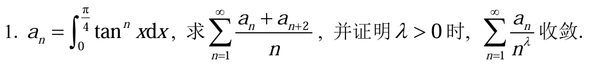

$a_n + a_{n+2} = \int_0^{\frac{4}{\pi}} (\tan^n x + \tan^{n+2} x) dx$

$a_n + a_{n+2} = \int_0^{\frac{\pi}{4}} \tan^n x (1 + \tan^2 x) dx$

$1 + \tan^2 x = \sec^2 x$

$a_n + a_{n+2} = \int_0^{\frac{\pi}{4}} \tan^n x \sec^2 x dx$

令 $u = \tan x$，那么微分 $du = \sec^2 x dx$

$a_n + a_{n+2} = \int_0^1 u^n du$

$\int_0^1 u^n du = [\frac{u^{n+1}}{n+1}]_0^1 = \frac{1^{n+1}}{n+1} - \frac{0^{n+1}}{n+1} = \frac{1}{n+1}$
所以我们得到了一个非常简洁的递推关系：
$a_n + a_{n+2} = \frac{1}{n+1}$

$\sum_{n=1}^{\infty} \frac{(a_n + a_{n+2})}{n} = \sum_{n=1}^{\infty} \frac{\frac{1}{n+1}}{n} = \sum_{n=1}^{\infty} \frac{1}{n(n+1)}$

列项相消求级数部分和得级数和为1

确定$a_n$的数量级，然后比较判别法

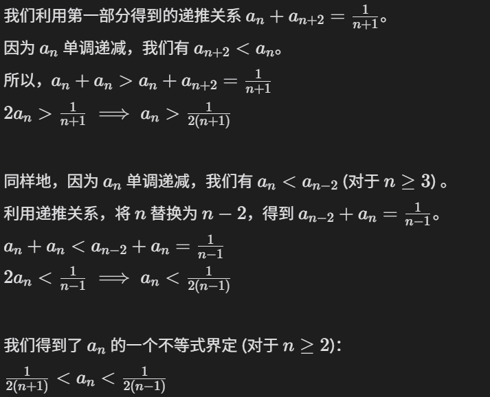

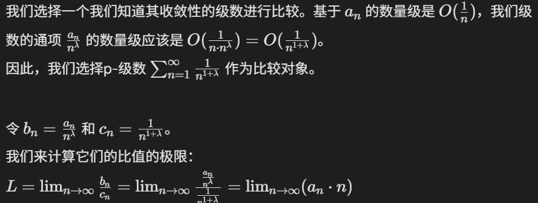

### 例题2

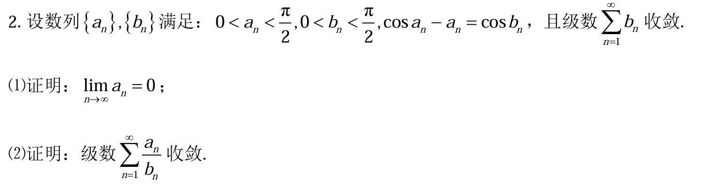

(1) 证明：$\lim_{n \to \infty} a_n = 0$

第一步：利用已知级数收敛的性质
我们已知级数 $\sum_{n=1}^{\infty} b_n$ 是一个正项级数（因为 $0 < b_n < \frac{\pi}{2}$），并且它收敛。
推理：根据级数收敛的必要条件，如果一个级数收敛，那么它的通项（一般项）必须趋向于0。
结论：因此，我们可以得出 $\lim_{n \to \infty} b_n = 0$。

第二步：利用函数连续性求极限
我们知道 $\cos(x)$ 函数在其定义域上是连续的。
推理：函数连续性的一个重要性质是，我们可以在函数内部取极限，即如果 $\lim_{n \to \infty} x_n = c$，那么 $\lim_{n \to \infty} f(x_n) = f(c)$。
应用：因为我们已经知道 $\lim_{n \to \infty} b_n = 0$，所以我们可以计算 $\cos b_n$ 的极限：
$\lim_{n \to \infty} \cos b_n = \cos(\lim_{n \to \infty} b_n) = \cos(0) = 1$。

第三步：对已知等式两边取极限
我们从题目给出的核心等式 $\cos a_n - a_n = \cos b_n$ 出发。
推理：既然等式右边的极限存在且为1，那么等式左边的极限也必须存在且为1。
应用：$\lim_{n \to \infty} (\cos a_n - a_n) = \lim_{n \to \infty} \cos b_n = 1$。

第四步：求解极限值
假设数列 $\{a_n\}$ 的极限存在，记为 L，即 $L = \lim_{n \to \infty} a_n$。由于 $0 < a_n < \frac{\pi}{2}$，所以 L 的取值范围是 $[0, \frac{\pi}{2}]$。
推理：将 $L$ 代入我们在上一步得到的极限等式中。
应用：$\lim_{n \to \infty} (\cos a_n - a_n) = \cos(L) - L$。
因此，我们得到方程： $\cos L - L = 1$。

第五步：证明极限值L只能为0
我们需要解方程 $\cos L = 1 + L$，其中 $L \in [0, \frac{\pi}{2}]$。
推理：我们可以通过分析函数性质来找到方程的解。考虑函数 $f(x) = \cos x - x - 1$。我们想找到这个函数在区间 $[0, \frac{\pi}{2}]$ 上的零点。
分析：
当 $x=0$ 时，$f(0) = \cos 0 - 0 - 1 = 1 - 0 - 1 = 0$。所以 $x=0$ 是一个解。
我们来考察这个函数在 $(0, \frac{\pi}{2}]$ 区间内的单调性。求导数：$f'(x) = -\sin x - 1$。
对于所有 $x \in (0, \frac{\pi}{2}]$，$\sin x > 0$。因此，$f'(x) = -(\sin x + 1) < -1$。
因为导数恒为负，所以函数 $f(x)$ 在 $[0, \frac{\pi}{2}]$ 上是严格单调递减的。

结论：一个严格单调的函数最多只有一个零点。既然我们已经找到了 $x=0$ 是一个零点，那么它就是唯一的零点。因此，$L=0$。

最终结论(1)：我们证明了如果极限存在，则极限必须为0。因此，$\lim_{n \to \infty} a_n = 0$。

(2) 证明：级数 $\sum_{n=1}^{\infty} \frac{a_n}{b_n}$ 收敛

第一步：选择合适的判别法
我们要判断级数 $\sum_{n=1}^{\infty} \frac{a_n}{b_n}$ 的敛散性。这是一个正项级数，因为 $a_n > 0$ 和 $b_n > 0$。
推理：对于正项级数，极限比较判别法是一个非常强大的工具。我们已知 $\sum_{n=1}^{\infty} b_n$ 收敛，所以一个很自然的想法是，将 $\sum_{n=1}^{\infty} \frac{a_n}{b_n}$ 与 $\sum_{n=1}^{\infty} b_n$ 进行比较。
应用：根据极限比较判别法，我们需要计算极限 $\lim_{n \to \infty} \frac{a_n/b_n}{b_n} = \lim_{n \to \infty} \frac{a_n}{b_n^2}$。如果这个极限是一个大于0的有限常数，那么这两个级数将同敛散。

第二步：利用中值定理建立$a_n$的表达式
为了求得上述极限，我们需要找到 $a_n$ 和 $b_n$ 之间更具体的关系。
我们对函数 $f(x) = \cos x - x$ 应用中值定理。
将原式变形为 $\cos a_n - a_n - 1 = \cos b_n - 1$。
注意到 $f(a_n) = \cos a_n - a_n$ 且 $f(0) = \cos 0 - 0 = 1$。
所以，$f(a_n) - f(0) = (\cos a_n - a_n) - 1 = \cos b_n - 1$。
根据拉格朗日中值定理，在区间 $[0, a_n]$ 上，存在一点 $\theta_n \in (0, a_n)$，使得：
$f(a_n) - f(0) = f'(\theta_n) (a_n - 0)$
我们已经计算过导数 $f'(x) = -\sin x - 1$。
所以 $\cos b_n - 1 = (-\sin \theta_n - 1) a_n$。
整理可得 $a_n$ 的表达式：
$a_n = \frac{\cos b_n - 1}{-\sin \theta_n - 1} = \frac{1 - \cos b_n}{1 + \sin \theta_n}$。
这个表达式非常有用。

第三步：计算关键极限
现在我们来计算在第一步中提出的极限 $\lim_{n \to \infty} \frac{a_n}{b_n^2}$。
推理：将我们刚刚推导出的 $a_n$ 的表达式代入。
应用：
$\lim_{n \to \infty} \frac{a_n}{b_n^2} = \lim_{n \to \infty} \frac{\frac{1 - \cos b_n}{1 + \sin \theta_n}}{b_n^2} = \lim_{n \to \infty} \left( \frac{1 - \cos b_n}{b_n^2} \cdot \frac{1}{1 + \sin \theta_n} \right)$
我们可以将这个极限分成两部分来计算：
$\lim_{n \to \infty} \frac{1 - \cos b_n}{b_n^2}$：这是一个重要的标准极限。当 $x \to 0$ 时，$\lim_{x \to 0} \frac{1 - \cos x}{x^2} = \frac{1}{2}$。因为 $b_n \to 0$，所以 $\lim_{n \to \infty} \frac{1 - \cos b_n}{b_n^2} = \frac{1}{2}$。
$\lim_{n \to \infty} \frac{1}{1 + \sin \theta_n}$：我们知道 $0 < \theta_n < a_n$。由第一部分的证明可知 $\lim_{n \to \infty} a_n = 0$。根据夹逼定理，$\lim_{n \to \infty} \theta_n = 0$。因此，$\lim_{n \to \infty} \sin \theta_n = \sin(0) = 0$。所以，$\lim_{n \to \infty} \frac{1}{1 + \sin \theta_n} = \frac{1}{1 + 0} = 1$。

结论：将两部分的结果相乘，我们得到：
$\lim_{n \to \infty} \frac{a_n}{b_n^2} = \frac{1}{2} \cdot 1 = \frac{1}{2}$。

第四步：得出最终结论
推理：我们已经计算出 $\lim_{n \to \infty} \frac{a_n/b_n}{b_n} = \frac{1}{2}$。
应用极限比较判别法：因为这个极限值是一个大于0的有限数（$0 < \frac{1}{2} < \infty$），所以级数 $\sum_{n=1}^{\infty} \frac{a_n}{b_n}$ 和级数 $\sum_{n=1}^{\infty} b_n$ 具有相同的敛散性（同收敛或同发散）。
最终结论(2)：题目已知 $\sum_{n=1}^{\infty} b_n$ 收敛，因此我们证明了级数 $\sum_{n=1}^{\infty} \frac{a_n}{b_n}$ 也收敛。

### 例题3

