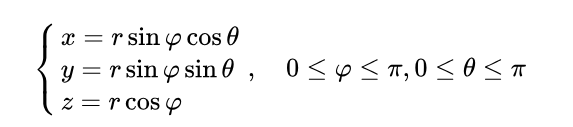
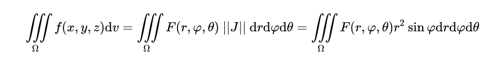
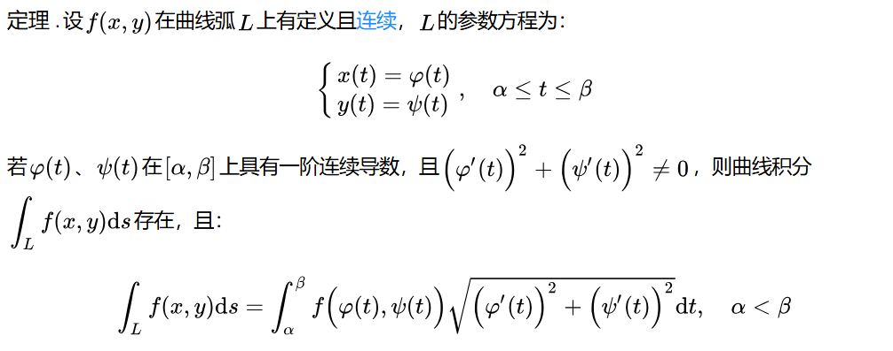
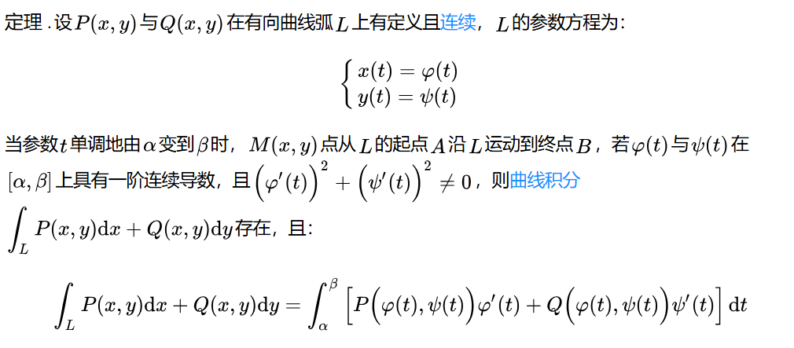
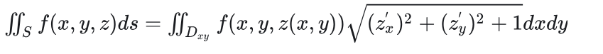
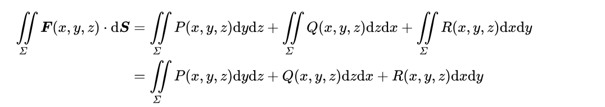

# 课程电子信息数学基础的笔记
简单的课选不上，只能修这种数学课，主要这还是算各种东西的数学课。学分又必须得修够，又没有足够多的专业选修课来给我们选，容易的课又不可能人人都选得上，最后一些课其实暗中成为了部分学生的必修课。

## 三重积分
切片法积分
积$\frac{x^2}{a^2}+\frac{y^2}{b^2}+\frac{z^2}{c^2}$

$x^2+y^2+z^2<=R^2$

球面坐标的三重积分
坐标变换

$x^2+y^2+z^2<=2az$

$x^2+y^2+z^2<=a^2$

求$\iiint_\Omega(x^2+y^2+z^2)dV$

$x^2+y^2+z^2<=2z,z>=1$

求$\iiint_\Omega(\frac{1}{x^2+y^2+z^2})dV$

凑微分？

## 曲线积分
对弧长的曲线积分：https://www.matongxue.com/parts/2601/

$x^2+y^2+z^2=2$

$x+y+z=0$

求$\int_\Gamma xyds$

若$x+y+z=0$变为$x+y+z=1$

求$\int_\Gamma xyds$

## 第二类曲线积分
https://www.matongxue.com/parts/2602/

用的不多，没讲例题，可能不考

## 第一类曲面积分
https://zhuanlan.zhihu.com/p/397567813

$x^2+y^2+z^2=R^2$, 上面根号部分为$\frac{R}{\sqrt{R^2-x^2-y^2}}$

$x^2+y^2=z^2$, 上面根号部分为$\sqrt{2}$

求$\iint_\Sigma(x+y)^2dS,\Sigma:x^2+y^2+z^2=R^2,z>=0$

## 第二类曲面积分
https://www.matongxue.com/parts/2555/

计算方法？

## 格林公式
封闭性，方向性，连续性，

## 期末考内容
考试范围：所有讲过的。第二类曲面积分只考格林公式

